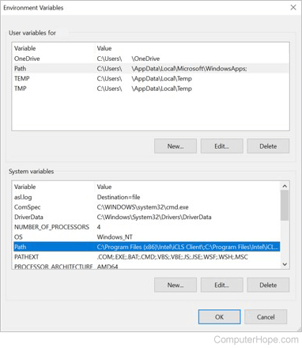
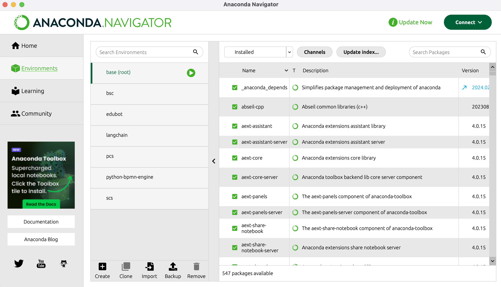
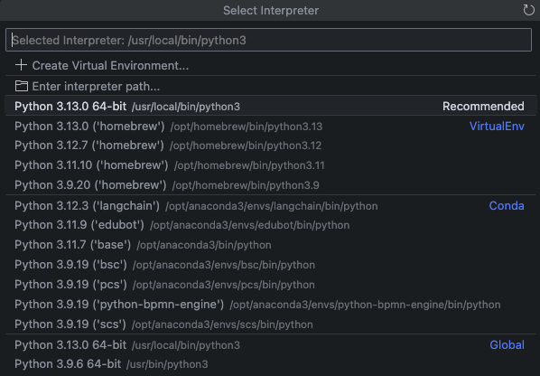

# Raspodijeljeni sustavi (RS)

**Nositelj**: doc. dr. sc. Nikola Tanković  
**Asistent**: Luka Blašković, mag. inf.

**Ustanova**: Sveučilište Jurja Dobrile u Puli, Fakultet informatike u Puli

</img>

# (1) Programski jezik Python

</img>

<div style="float: clear; margin-right:5px;">Raspodijeljeni sustav je svaki računalni sustav koji se sastoji od više povezanih autonomnih računala koji zajedno rade kao jedinstveni kohezivni sustav za postizanje zajedničkog cilja. Drugim riječima, raspodijeljeni sustavi su skupina nezavisnih računala (čvorova u mreži) koji međusobno komuniciraju i koordiniraju svoje radnje kako bi izvršili određeni zadatak. Na ovom kolegiju studenti će se upoznati s osnovama raspodijeljenih sustava i njihovim karakteristikima, tehnologijama i alatima koji se koriste u njihovom razvoju te naučiti kako razvijati aplikacije s naglaskom na distribuiranu arhitekturu.</div>
<br>

**🆙 Posljednje ažurirano: 25.10.2024.**

## Sadržaj

- [Raspodijeljeni sustavi (RS)](#raspodijeljeni-sustavi-rs)
- [(1) Programski jezik Python](#1-programski-jezik-python)
  - [Sadržaj](#sadržaj)
- [1. Uvod](#1-uvod)
- [2. Priprema Python okruženja](#2-priprema-python-okruženja)
  - [2.1 Instalacija Pythona](#21-instalacija-pythona)
  - [2.2 Priprema virtualnog okruženja](#22-priprema-virtualnog-okruženja)
    - [2.2.1 Instalacija `conda` alata](#221-instalacija-conda-alata)
- [3. Python osnove](#3-python-osnove)
  - [3.1 VS Code okruženje](#31-vs-code-okruženje)
  - [3.2 Osnove Python sintakse](#32-osnove-python-sintakse)
    - [3.2.1 Varijable](#321-varijable)
    - [3.2.2 Logički izrazi](#322-logički-izrazi)
        - [Aritmetički operatori (Arithmetic operators)](#aritmetički-operatori-arithmetic-operators)
        - [Operatori pridruživanja (Assignment operators)](#operatori-pridruživanja-assignment-operators)
        - [Operatori usporedbe (Comparison operators)](#operatori-usporedbe-comparison-operators)
        - [Logički operatori (Logical operators)](#logički-operatori-logical-operators)
        - [Operatori identiteta (Identity operators)](#operatori-identiteta-identity-operators)
        - [Operatori pripadnosti (Membership operators)](#operatori-pripadnosti-membership-operators)
    - [3.2.3 Upravljanje tokom izvođenja programa](#323-upravljanje-tokom-izvođenja-programa)
      - [Selekcije](#selekcije)
        - [Doseg varijabli](#doseg-varijabli)
      - [Iteracije (Petlje)](#iteracije-petlje)
        - [`while` petlja](#while-petlja)
        - [Vježba 1: Pogađanje broja sve dok nije pogođen](#vježba-1-pogađanje-broja-sve-dok-nije-pogođen)
        - [Vježba 2: Analiziraj sljedeće `while` petlje](#vježba-2-analiziraj-sljedeće-while-petlje)
        - [`for` petlja](#for-petlja)
        - [Vježba 3: Napišite program koji će izračunati faktorijel broja](#vježba-3-napišite-program-koji-će-izračunati-faktorijel-broja)
        - [Vježba 4: Analiziraj sljedeće `for` petlje](#vježba-4-analiziraj-sljedeće-for-petlje)
    - [3.2.4 Ugrađene strukture podataka](#324-ugrađene-strukture-podataka)
      - [N-torke (eng. Tuple)](#n-torke-eng-tuple)
      - [Lista (eng. List)](#lista-eng-list)
      - [Rječnik (eng. Dictionary)](#rječnik-eng-dictionary)
      - [Skup (eng. Set)](#skup-eng-set)
    - [3.2.5 Funkcije](#325-funkcije)
  - [3.3 Napredniji koncepti u Pythonu](#33-napredniji-koncepti-u-pythonu)
    - [3.3.1 `lambda` izrazi](#331-lambda-izrazi)
    - [3.3.2 Izrada kolekcija kroz `comprehensions` sintaksu](#332-izrada-kolekcija-kroz-comprehensions-sintaksu)
    - [3.3.3 Klase i objekti](#333-klase-i-objekti)
    - [3.3.4 Moduli i paketi](#334-moduli-i-paketi)

<br>

# 1. Uvod

Razvoj raspodijeljenih sustava postao je ključan za ostvarivanje **visoke dostupnosti**, **skalabilnosti** i **performansi** aplikacija u današnjem digitalnom svijetu. Raspodijeljeni sustavi omogućuju stvaranje složenih sustava sposobnih za obrade koje nadilaze mogućnosti pojedinačnih računala. Ovi sustavi pružaju brojne prednosti, uključujući učinkovitiju obradu podataka, bolju prilagodbu velikim opterećenjima (_eng. High server load_) te veću otpornost na kvarove (_eng. Fault tolerance_).

**Razvoj raspodijeljenih sustava prvenstveno** temelji se prvenstveno na **distribuiranoj arhitekturi (_eng. Distributed architecture_)** te razvoju manjih aplikacija koje često nazivamo i **mikroservisima (_eng. Microservices_)**, imajući na umu da je svaki mikroservis zasebna i nezavisna aplikacija koja se izvršava u vlastitom procesu i komunicira s drugim mikroservisima putem mreže.

S obzirom na to da većina studenata koji upisuju ovaj kolegij već ima temeljna znanja stečena na kolegijima **Programsko inženjerstvo** i **Web aplikacije**, ovaj kolegij će se usredotočiti na proširivanje njihovih postojećih znanja i vještina te njihovu primjenu u kontekstu razvoja raspodijeljenih sustava. Primjerice, na vježbama će se kao glavni protokol za komunikaciju koristiti i dalje **HTTP/HTTPS** te **NoSQL** baza podataka, a ponovit će se i izrada jednostavnog sučelja kroz **Vue.js**.

Iako postoje mnogi jezici koji su svojim performansama i mogućnostima pogodni za razvoj raspodijeljenih sustava, poput jezika **Go (Golang)** koji se popularno koristi za razvoj mikroservisa zbog svoje servise i ugrađene podrške za konkurentnost, ili pak **Jave** koja ima snažnu podršku za višedretvenost (_eng. Multithreading_), mi smo izabrali **Python** kao jezik za ovaj kolegij.

**Python** nam omogućuje jednostavnu integraciju s postojećim bibliotekama i alatima koji već nude implementirane funkcionalnosti specifične za distribuirane sustave. Ovaj pristup omogućuje brže razvijanje aplikacija i fokusiranje na višu razinu apstrakcije, bez potrebe za implementacijom niskorazinskih komponenti. Python je jezik koji bi svaki developer trebao znati završetkom studija, a njegova popularnost i sveprisutnost kako u industriji tako i u znanosti čine ga neizostavnim alatom za rješavanje kompleksnih problema i razvoj kvalitetnih aplikacija.

# 2. Priprema Python okruženja

## 2.1 Instalacija Pythona

Python možete preuzeti i instalirati na više načina, a najjednostavniji način je za većinu korisnika preuzimanje i pokretanje instalacijskog programa sa [službene stranice Pythona](https://www.python.org/downloads/). Preporuka je odabrati veriziju **Python 3.9** ili noviju.

Kada pokrenete installer, ključno je odabrati opciju **Add Python to PATH** kako bi Python bio dostupan iz naredbenog retka (_eng. Command Prompt_). Nakon što završite instalaciju, možete provjeriti je li Python uspješno instaliran pokretanjem naredbe `python --version` u naredbenom retku. Ako je Python uspješno instaliran, trebali biste vidjeti verziju Pythona koju ste instalirali.

> **PATH** je environment varijabla na operacijskim sustavima poput Unix, Linux i Windows koja sadrži listu direktorija u kojima se nalaze skripte i izvršne datoteke koje možete pokrenuti iz naredbenog retka.

Jednom kada ste uspješno instalirali Python, možete provjeriti instaliranu verziju sljedećom naredbom u terminalu:

```bash
python --version
```

Ako dobijete grešku `"Python is not recognized as an internal or external command"` to znači da Python nije dodan u PATH. U tom slučaju, najčešće rješenje je ponovo pokrenuti Python installer i odabrati opciju **Add Python to PATH**.

Ako imate problema postavljanjem Pythona u PATH, kratki vodič [ovdje](https://realpython.com/add-python-to-path/).

Ako koristite Windows OS, možete provjeriti `PATH` varijablu pokretanjem naredbe `$Env:Path` u **Powershell terminalu**. Na Windowsu je svakako preporuka koristiti **Powershell terminal** umjesto Command Prompt terminala budući da je izlaskom Windowsa 10 Powershell postao glavni terminal za Windows.

```powershell
$Env:Path
```

Možete provjeriti i putem grafičkog sučelja, otvorite Start i ukucajte `environment` te odaberite **Edit the system environment variables**. U prozoru koji se otvori, kliknite na **Environment Variables** i u listi System variables pronađite **Path**. Kliknite na **Edit** i provjerite je li putanja do Pythona dodana.



---

Ako koristite **Linux** ili **MacOS**, Python je najvjerojatnije već instaliran na vašem sustavu. Možete provjeriti verziju Pythona pokretanjem naredbe:

```bash
python3 --version
```

Ako je Python instaliran, dobit ćete verziju Pythona koju koristite. Ako Python nije instaliran, možete ga instalirati putem **apt** ili **brew** package managera, ali i preuzimanjem instalacijskog paketa s [Pythonove službene stranice](https://www.python.org/downloads/).

> **Napomena**: Na Linuxu i MacOS-u, Python 3 se pokreće s naredbom `python3` kako bi se izbjegla konfuzija s Python 2 koji je još uvijek prisutan na nekim starijim sustavima.

Kako biste provjerili koji je Python interpreter postavljen kao zadani, možete pokrenuti naredbu:

```bash
which python3
```

Ova naredba će vam reći putanju do Python interpretera koji se koristi kada pokrenete `python3` naredbu. Ako želite, možete dodati alias za vaš Python terminal tako da možete pokrenuti Python interpreter jednostavno pokretanjem naredbe `python` umjesto `python3`.

Za `bash` korisnike, možete otvoriti `~/.bashrc` datoteku kroz `nano` editor:

```bash
nano ~/.bash_profile
```

i dodati sljedeću liniju na dno datoteke:

```bash
alias python=python3
```

Za `zsh` korisnike, možete otvoriti `~/.zshrc` datoteku kroz `nano` editor:

```bash
nano ~/.zshrc
```

i dodati sljedeću liniju na dno datoteke:

```bash
alias python=python3
```

Spremite izmjene naredbom `Ctrl + O`, pritisnite `Enter` i izađite iz editora naredbom `Ctrl + X`. Zatim pokrenite sljedeću naredbu kako bi se promjene primijenile:

```bash
source ~/.bashrc
```

odnosno za `zsh` korisnike:

```bash
source ~/.zshrc
```

Pokrenite novu sesiju terminala. Sada možete pokrenuti Python interpreter jednostavno pokretanjem naredbe `python`. Također, možete provjeriti koji je Python interpreter postavljen kao zadani pokretanjem naredbe:

```bash
which python
```

Trebali biste dobiti: `python: aliased to python3`.

Kao i jednake rezultate za `python3` i `python`.

```bash
python --version # Python [instalirana_verzija]
python3 --version # Python [instalirana_verzija]
```

TLDR; Većina korisnika će koristiti `python3` za pokretanje Python interpretera na Linuxu i MacOS-u, dok će koristiti `python` na Windowsu. Međutim, ako hoćete, možete dodati alias `python` za `python3` kako bi se izbjegla konfuzija.

## 2.2 Priprema virtualnog okruženja

Virtualno okruženje (_eng. Virtual Environment_) je tehnologija koja omogućuje kreiranje izoliranog okruženja za naše Python projekte. Virtualno okruženje rješava mnogobrojne probleme koji se javljaju kada radimo na više projekata koji koriste različite verziej Pythona ili različite verzije paketa.

Postoji više alata za upravljanje virtualnim okruženjim, a najpoznatiji su `venv`, `virtualenv` i `conda`.

Slobodni ste koristiti bilo koji od navedenih alata, međutim mi ćemo u sklopu ovog kolegija koristiti `conda` alat.

### 2.2.1 Instalacija `conda` alata

`conda` je open-source paketni menadžer i okruženje za upravljanje paketima i njihovim ovisnostima. `conda` je dostupan za Windows, Linux i MacOS operacijske sustave.

`conda` je podskup `Anaconda` distribucije, koja dolazi s preinstaliranim paketima i alatima za znanstveno računanje i analizu podataka. Međutim, za potrebe ovog kolegija, dovoljno je instalirati `conda` paketni menadžer.

To možete učiniti kroz `Anaconda Navigator` aplikaciju ili preuzimanjem samo `conda` instalacijskog paketa sa [službene stranice](https://docs.conda.io/en/latest/miniconda.html). Jednostavno odaberite verziju koja odgovara vašem operacijskom sustavu i slijedite upute za instalaciju.

Nakon što ste uspješno instalirali `conda` alat, možete provjeriti je li `conda` uspješno instaliran pokretanjem naredbe:

```bash
conda --version
```

Nije loše instalirati i ukupnu Anaconda distribuciju, jer dolazi s mnogim korisnim alatima, uključujući i graifčko sučelje `Anaconda Navigator` koje olakšava upravljanje okruženjima i paketima.

Anaconda distribuciju možete preuzeti s [službene stranice](https://www.anaconda.com/products/distribution). Naravno, `conda` je uključena u ovoj distribuciji pa možete provjeriti na isti način prepoznaje li ju naredbeni redak.



> Izgled Anaconda Navigator aplikacije i pregled izrađenih okruženja i paketa.

To je to! Spremni smo za rad s Pythonom! 🐍

---

# 3. Python osnove

**Python** je visokorazinski (eng. high-level) programski jezik opće namjene (eng. general-purpose) koji svojom jednostavnom sintaksom i čitljivošću koda naglašava čitljivost i brzinu razvoja projekata. Python je također dinamički tipiziran jezik (eng. dynamically typed language) što znači da se tipovi varijabli određuju za vrijeme izvođenja, a ne za vrijeme kompilacije.

Popularan je i široko korišten u mnogim područjima, uključujući: web razvoj, data science i analiza podataka, matematika, strojno učenje i umjetna inteligencija itd.

I ono što nam je još važno za zapamatiti, Python je tzv. multi-paradigmatski jezik, što znači da podržava više stilova programiranja, uključujući proceduralno, objektno orijentirano i funkcijsko programiranje. Korisnik može odabrati stil programiranja koji najbolje odgovara problemu koji rješava, dakle moguće je kombinirati različite stilove programiranja što čini ovaj jezik vrlo fleksibilnim.

## 3.1 VS Code okruženje

Za rad s Pythonom preporučujemo korištenje **Visual Studio Code** editora. VS Code je besplatan, open-source IDE (eng. Integrated development environment) kojeg razvija Microsoft, a nudi bogat ekosustav ekstenzija i alata koji olakšavaju razvoj aplikacija u Pythonu. Naravno, možete koristiti IDE po želji, međutim mi ćemo na vježbama iz ovog kolegija koristiti VS Code.

VS Code možete preuzeti s [službene stranice](https://code.visualstudio.com/Download) i instalirati na vaš operacijski sustav. Nakon instalacije, možete pokrenuti VS Code i instalirati ekstenziju koja će vam olakšati rad s Pythonom.

[**Python** ekstenzija](https://marketplace.visualstudio.com/items?itemName=ms-python.python): nudi generalnu podršku za Python razvoj, uključujući IntelliSens, debugger (Python Debugger), formatiranje, linting, itd.

- ova ekstenzija instalirat će vam još i `Python Debugger` i `Pylance` ekstenzije koje upotpunjuju rad s Pythonom u VS Code-u.

Provjerite jesu li sve ekstenzije uspješno instalirane i aktivirane. Možete ih pronaći u **Extensions** panelu na lijevoj strani VS Code sučelja.

## 3.2 Osnove Python sintakse

Za početak nećemo raditi s bibliotekama i alatima, već ćemo se upoznati s osnovama Python sintakse, stoga nam za sada neće niti trebati virtualno okruženje.

Krenimo s izradom osnovne Python skripte. Kreirajte novu datoteku s ekstenzijom `.py`. Na primjer, nazovite datoteku `hello.py`.

U donjem desnom kutu VS Code sučelja primjetit ćete trenutni Python interpreter koji se koristi. Provjerite je li to Python interpreter koji ste instalirali i koji želite koristiti. Ako nije, možete promijeniti interpreter klikom na trenutni interpreter i odabirom željenog.



> Odabran je Python interpreter (Python 3.13.0 /usr/local/bin/python3) koji će se koristiti za izvršavanje Python skripte.

U pythonu možemo ispisivati poruke u konzolu koristeći naredbu `print()`. Na primjer, možemo ispisati poruku "Hello, World!" koristeći sljedeći kod:

```python
print("Hello, World!")
```

Spremite datoteku i pokrenite je klikom na gumb **Run** u gornjem desnom kutu datoteke ili pritiskom na `Ctrl + Alt + N` odnosno `Cmd + Alt + N` na MacOS-u.
Trebali biste vidjeti ispis "Hello, World!" u terminalu.

Drugi način je pokretanje skripte iz terminala. Otvorite terminal u VS Code-u klikom na **Terminal** > **New Terminal** i odaberite terminal po želji, preferabilno `bash` ili `zsh` terminal.

U terminalu se pozicionirajte u direktorij gdje se nalazi vaša Python skripta i pokrenite je naredbom:

```bash
python hello.py
```

Ili naredbom `python3` ako koristite Linux ili MacOS i niste dodali alias za `python`:

```bash
python3 hello.py
```

**Kratki podsjetnik za navigaciju u terminalu (Windows, Linux, macOS)**

- `cd [ime direktorija]` - promjena direktorija
- `cd ..` - povratak u prethodni direktorij
- `ls` - ispis sadržaja direktorija
- `pwd` - ispis trenutne putanje
- `cls` ili `clear` - brisanje sadržaja terminala

### 3.2.1 Varijable

Varijable u Pythonu se deklariraju na sljedeći način:

```python
a = 5

b = "Hello, World!"

c = 3.14
```

Dakle, primjetite da se ne navodi tip varijable prilikom deklaracije, već se Python sam brine o tipu varijable. Varijabla `a` je tipa `int`, varijabla `b` je tipa `str`, a varijabla `c` je tipa `float`.

Varijable u Pythonu su **dinamički tipizirane**, što znači da se tip varijable određuje za vrijeme izvođenja, a ne za vrijeme kompilacije.

Moguće je pregaziti vrijednost varijable:

```python
a = 5

a = 10

print(a) # 10
```

Varijablu možemo ispisati koristeći naredbu `print()`:

```python
a = 5
b = 10

print(a + b) # 15
```

```python
a = "Hello, "

b = "World!"

print(a + b) # Hello, World!
```

Osim što se mogu pregaziti vrijednostima, varijable se mogu i zamijeniti pregaziti tipom varijable:

```python
a = 5

a = "Hello, World!" # može i s jednostrukim navodnicima

print(a) # Hello, World!
```

Varijable u Pythonu mogu sadržavati slova, brojeve i znak `_`, ali ne smiju započinjati brojem.

```python

# Ovo je ispravno

my_variable = 5
myVariable = 10
myVariable2 = 15

# Ovo nije ispravno (SyntaxError)

2myVariable = 5 # ne može započinjati brojem
my-Variable = 10 # ne može sadržavati znak -
my Variable = 15 # ne može sadržavati razmak
```

Varijable u Pythonu su **case-sensitive**, što znači da se razlikuju velika i mala slova.

```python
my_variable = 5
My_Variable = 10
MY_VARIABLE = 15

print(my_variable) # 5
print(My_Variable) # 10
print(MY_VARIABLE) # 15
```

Jednolinijske komentare u Pythonu možemo pisati koristeći znak `#`:

```python
# Ovo je komentar

a = 5 # Ovo je komentar
```

Dok višelinijske komentare možemo pisati koristeći znakove `"""` ili `'''`:

```python
"""
Ovo
je
višelinijski
komentar
"""

# Ili

'''
Ovo
je
isto višelinijski
komentar
'''
```

Međutim, **moguće je** specificirati tip varijable koristeći tzv. [_Casting_](https://www.geeksforgeeks.org/type-casting-in-python/):

```python
a = 5
# ili
a = int(5)
```

Rezultat će biti isti, no ovime se naglašava tip varijable.

```python
x = str(3)
y = int(3)
z = float(3)
```

Što će biti pohranjeno u varijable `x`, `y` i `z`?

<details>
  <summary>Spoiler alert! Odgovor na pitanje</summary>
  x = "3"
  y = 3
  z = 3.0
</details>

<hr>

Ako se želimo uvjeriti, možemo uvijek provjeriti tip varijable koristeći funkciju `type()`:

```python
x = str(3)
y = int(3)
z = float(3)

print(type(x)) # <class 'str'>
print(type(y)) # <class 'int'>
print(type(z)) # <class 'float'>
```

Prilikom imenovanja varijabli s više riječi, može se koristiti tehnika po izboru, međutim u Pythonu je uobičajeno koristiti **Camel Case** ili **Snake Case** notaciju.

**Camel Case**

```python
myVariable = 5
```

**Pascal Case**

```python
MyVariable = 5
```

**Snake Case**

```python
my_variable = 5
```

Python dozvoljava i tzv. **Multiple Assignment**, odnosno dodjeljivanje više vrijednosti više varijablama u jednoj liniji koda:

Primjerice imamo varijable `a`, `b` i `c` i hoćemo im dodijeliti vrijednosti `5`, `10` i `15`:

```python
a, b, c = 5, 10, 15

print(a) # 5
print(b) # 10
print(c) # 15
```

Može se koristiti i s drugim tipovima varijabli:

```python
a, b, c = "Hello", 5, 3.14

print(a) # Hello
print(b) # 5
print(c) # 3.14
```

> **Napomena**: Broj varijabli mora odgovarati broju vrijednosti koje se dodjeljuju, inače će Python baciti grešku.

Moguće je i dodjeljivanje iste vrijednosti više varijablama:

```python
a = b = c = "same value"

print(a) # same value
print(b) # same value
print(c) # same value
```

Moguće je i ispisati vrijednosti varijabli u jednom redu koristeći `print()` funkciju:

```python
a = 5
b = 10
c = 15

print(a, b, c) # 5 10 15
```

Pa i izvršiti konkatenaciju varijabli:

```python
a = "Moje "
b = "ime "
c = "je "
d = "Pero"

print(a + b + c + d) # Moje ime je Pero
```

Primjetite da smo nakon svake varijable dodali razmak kako bi rezultat bio čitljiv. Nećemo to raditi, već ćemo navoditi varijable odvojene zarezom:

```python
a = "Moje"
b = "ime"
c = "je"
d = "Pero"

print(a, b, c, d) # Moje ime je Pero
```

Na ovaj način Python će automatski dodati razmak (`" "`) između varijabli. Ako želimo promijeniti separator, možemo to učiniti koristeći `sep` argument:

```python
a = "Moje"
b = "ime"
c = "je"
d = "Pero"

print(a, b, c, d, sep="-") # Moje-ime-je-Pero
```

`print` naredba vrlo je korisna i često se koristi za ispisivanje poruka u konzolu, ali njena upotreba je prvenstveno u svrhu debugiranja i testiranja. Međutim, u stvarnim projektima, koristit ćemo `logging` biblioteku koja pruža naprednije mogućnosti za upravljanje logovima.

### 3.2.2 Logički izrazi

Pri oblikovanju računskih postupaka često je potrebno usmjeriti tok izvođenja programa ovisno o nekom **uvjetu**. Uvjet može biti ispunjen ili ne, a ta dva ishoda se obično postovjećuju s vrijednostima istinotisti iz matematičke logike odnosno logike sudova:

- istinito (eng. true)
- neistinito (eng. false)

Python za prikaz vrijednosti istinitosti definira poseban ugrađeni tip podatka `bool`, čije su moguće vrijednosti `True` (istinito) i `False` (neistinito). Obratite pažnju na **velika početna slova** ovih ključnih riječi Pythona!

Logički izrazi se koriste za **usporedbu vrijednosti** i **provjeru određenog uvjeta**. Svaki logički izraz vraća vrijednost tipa `bool`.

Izraze možemo graditi koristeći operatore. U pythonu postoji 7 skupina operatora:

1. **Aritmetički operatori** (eng. Arithmetic operators)
2. **Operatori pridruživanja** (eng. Assignment operators)
3. **Operatori usporedbe** (eng. Comparison operators)
4. **Logički operatori** (eng. Logical operators)
5. **Operatori identiteta** (eng. Identity operators)
6. **Operatori pripadnosti** (eng. Membership operators)
7. **Operatori bitovnih operacija** (eng. Bitwise operators)

##### Aritmetički operatori (Arithmetic operators)

Aritmetički operatori se koriste za izvođenje matematičkih operacija na brojevima. U Pythonu postoje sljedeći aritmetički operatori:

| Operator | Opis                            | Primjer  | Rezultat |
| -------- | ------------------------------- | -------- | -------- |
| `+`      | Zbrajanje                       | `5 + 3`  | `8`      |
| `-`      | Oduzimanje                      | `5 - 3`  | `2`      |
| `*`      | Množenje                        | `5 * 3`  | `15`     |
| `/`      | Dijeljenje (float)              | `5 / 2`  | `2.5`    |
| `//`     | Cjelobrojno dijeljenje          | `5 // 2` | `2`      |
| `%`      | Ostatak pri dijeljenju (modulo) | `5 % 2`  | `1`      |
| `**`     | Potenciranje                    | `5 ** 3` | `125`    |

Pogledajmo nekoliko primjera aritmetičkih operacija:

```python
a = 5
b = 3

print(a + b) # 8
print(a - b) # 2
print(a * b) # 15
print(a / b) # 1.6666666666666667 (float)
print(a // b) # 1 (int)
print(a % b) # 2
print(a ** b) # 125
```

U Pythonu se realni brojevi prikazuju ugrađenim tipom `float`, dok se cijeli brojevi prikazuju tipom `int`. Kao što je i uobičajeno, možemo ih stvarati konverzijom objekata drugih tipova primjenom konstruktora `float`:

Što će biti ispisano u sljedećem primjeru?

```python
float(31), float(1 < 2) # konverzija brojeva
```

<details>
  <summary>Spoiler alert! Odgovor na pitanje</summary>
  (31.0, 1.0)
</details>

Pored toga, realni brojevi mogu nastati i kao rezultat dijeljenja cijelih brojeva:

```python
print(1/11) # 0.09090909090909091
```

Za vrlo velike ili vrlo male brojeve često je praktičnije koristiti tzv. znanstveni zapis (eng. scientific notation) kod kojega se red veličine broja izražava prikladnom potencijom broja 10. Pritom se eksponent označava malim ili velikim slovom `E`, a može biti i negativan. Na primjer:

```python
print(1.23e-4) # 0.000123
print(1.23e4) # 12300.0
```

Ako literal premaši najveću vrijednost koju može prikazati, Python će ga zapisati kao specijalnu vrijednost `inf` koja odgovra neizmjerno velikom broju (eng. infinity):

```python
print(1e309) # inf
```

Prilikom dijeljenja s nulom, Python će baciti grešku `ZeroDivisionError`:

```python
print(1/0) # ZeroDivisionError: division by zero
```

Što se tiče ugrađenih funkcija nad realnim brojevima, ima ih mnogo i možete ih pronaći vrlo lako na Internetu, za sada možemo spomenuti nekoliko njih koje se često koriste:

```python
print(abs(-5)) # 5 (apsolutna vrijednost)
print(round(3.14159, 2)) # 3.14 (zaokruživanje na n decimala)
print(max(1, 2, 3, 4, 5)) # 5 (maksimalna vrijednost)
print(min(1, 2, 3, 4, 5)) # 1 (minimalna vrijednost)
```

Iz `math` biblioteke možemo koristiti veliki broj funkcija koje primaju realne brojeve. Uključene su važnije matematičke funkcije, korisne konverzije, uobičajene trigonometrijske i hiperbolne funkcije, te neke specijalne funkcije i konstante:

```python
import math

print(math.sqrt(16)) # 4.0 (kvadratni korijen)
print(math.pow(2, 3)) # 8.0 (potenciranje))

print(math.exp(1)) # 2.718281828459045 (e^x)
print(math.log(10)) # 2.302585092994046 (ln(x))

print(math.trunc(3.14)) # 3 (odbacuje decimalni dio)
print(math.ceil(3.14)) # 4 (zaokružuje prema gore)
print(math.floor(3.14)) # 3 (zaokružuje prema dolje)
```

Nekoliko praktičnih funkcija za testiranje konačnosti realnih brojeva koje su dostupne u `math` biblioteci:

```python
import math

print(math.isfinite(1.0)) # True (je li broj konačan)
print(math.isinf(1.0)) # False (je li broj beskonačan tj. neizmjerno velik)

print(math.isnan(1.0)) # False (je li broj NaN, tj. Not a Number)
```

##### Operatori pridruživanja (Assignment operators)

Operatori pridruživanja se koriste za dodjeljivanje vrijednosti varijablama. U Pythonu postoje sljedeći operatori pridruživanja:

| Operator | Opis                            | Primjer   | Ekvivalent   |
| -------- | ------------------------------- | --------- | ------------ |
| `=`      | Pridruživanje                   | `x = 5`   | `x = 5`      |
| `+=`     | Dodaj i pridruži                | `x += 3`  | `x = x + 3`  |
| `-=`     | Oduzmi i pridruži               | `x -= 3`  | `x = x - 3`  |
| `*=`     | Pomnoži i pridruži              | `x *= 3`  | `x = x * 3`  |
| `/=`     | Podijeli i pridruži             | `x /= 3`  | `x = x / 3`  |
| `//=`    | Cjelobrojno podijeli i pridruži | `x //= 3` | `x = x // 3` |
| `%=`     | Modulo i pridruži               | `x %= 3`  | `x = x % 3`  |
| `**=`    | Potenciraj i pridruži           | `x **= 3` | `x = x ** 3` |

##### Operatori usporedbe (Comparison operators)

Operatori usporedbe se koriste za usporedbu dvije vrijednosti. U Pythonu postoje sljedeći operatori usporedbe:

| Operator | Opis                 | Primjer  | Rezultat |
| -------- | -------------------- | -------- | -------- |
| `==`     | Jednako              | `5 == 3` | `False`  |
| `!=`     | Nije jednako         | `5 != 3` | `True`   |
| `>`      | Veće od              | `5 > 3`  | `True`   |
| `<`      | Manje od             | `5 < 3`  | `False`  |
| `>=`     | Veće ili jednako od  | `5 >= 3` | `True`   |
| `<=`     | Manje ili jednako od | `5 <= 3` | `False`  |

Pogledajmo nekoliko usporedba cjelobrojnih podataka:

```python
a = 5
b = 10

print(a == b) # False
print(a != b) # True
print(a > b) # False
print(a < b) # True
print(a >= b) # False
print(a <= b) # True
```

**Napomena**: Treba biti oprezan prilikom uspoređivanja realnih brojeva zbog ograničenja u točnosti prikaza brojeva s pomičnim zarezom, odnosno zbog nepreciznosti njihova prikaza. Posebno se to odnosi na cjelobrojne razlomke i decimalne konstante jer nam njihov sažeti izvorni zapis može sugerirati jednaku sažetost njihovog internog prikaza u memoriji računala. Nikad ne smijemo smetnuti s uma da to gotovo nikada nije slučaj jer većina racionalnih brojeva u koje uvrštavamo i decimalne konstante nemjau konačan prikaz u binarnom brojevnom sustavu. Stoga, uvijek treba koristiti odgovarajuće funkcije za usporedbu realnih brojeva koje uzimaju u obzir određenu toleranciju.

Razmotrimo prvo dva razlomka čija bi razlika trebala biti točno 1, ali u praksi se to ne događa:

```python
print(5/3 == 1+2/3) # False
```

Jednako tako moramo biti oprezni i s decimalnim brojevima:

```python
print(0.1 + 0.2 == 0.3) # False
# ili
print(0.1 * 3 == 0.3) # False
```

U ovakvim slučajevima koristimo funkcije za usporedbu realnih brojeva koje uzimaju u obzir određenu toleranciju:

```python
import fractions

print(fractions.Fraction(5, 3) == 1 + fractions.Fraction(2, 3)) # True

import decimal

print(decimal.Decimal('0.1') * 3) == decimal.Decimal('0.3') # True
```

Operatore usporedbe moguće je primjenjivati i na većinu ostalih ugrađenih tipova podataka u Pythonu, kao i na korisničke tipove koji podržavaju odgovarajuće operatore, pri čemu će smisao usporedbi ovisiti od tipa do tipa.

Ono što je zanimljivo u Pythonu, i pomalo nekonvencionalno u odnosu na druge jezike, jest da se operatori usporedbe mogu ulančavati, kao matematički izrazi:

```python
a = 5
b = 10
c = 15

print(a < b < c) # True (5 < 10 < 15)
```

Moguće je graditi "lance" proizvoljne duljine, npr.

```python
print(0 < 3 < 5 < 100) # True
```

To naravno mogu biti bilo kakvi izrazi, ne samo "veće" i "manje" usporedbe:

```python
print(4 == 2*2 == 2**2) # True
```

Slično kao i u drugim jezicima, u Pythonu se određeni "non-boolean" izrazi tumače kao `True` ili `False` odnosno tzv. "truthy" i "falsy" vrijednosti. Na isti način kao što koristimo _Casting_ za promjenu ili definiranje tipa varijable (npr. `int()`, `str()`, `float()`), možemo koristiti i `bool()` konstruktor za pretvaranje vrijednosti u `bool` tip.

Vrijede uobičajena pravila:

```python
print(bool(0)) # False (0 se tumači kao False)
print(bool(1)) # True (svi brojevi osim 0 se tumače kao True)
print(bool(-1)) # True (pa i negativni brojevi)

print(bool("")) # False (prazan string se tumači kao False)
print(bool("cvrčak")) # True (svi stringovi osim praznog se tumače kao True)
print(bool(" ")) # True (čak i prazan string s razmakom se tumači kao True)
```

##### Logički operatori (Logical operators)

Logički operatori se koriste za kombiniranje logičkih izraza. Nad objektima logičkog tipa `bool` moguće je primjenjivati uobičajene operatore `and`, `or` i `not`.

| Operator | Opis                                                                  | Primjer          | Rezultat |
| -------- | --------------------------------------------------------------------- | ---------------- | -------- |
| `and`    | Konjukcija ili logičko "I" - `True` ako su oba izraza `True`          | `True and False` | `False`  |
| `or`     | Disjunkcija ili logičko "ILI - `True` ako je barem jedan izraz `True` | `True or False`  | `True`   |
| `not`    | Negacija ili logičko "NE"                                             | `not True`       | `False`  |

Izračunavanje logičkih operatora prestaje **čim konačna vrijednost izraza postane jasna**. Uzmimo za primjer izraze:

```python
False and x

True or x
```

Je li nam bitna vrijednost `x` u ovim izrazima?

<details>
  <summary>Spoiler alert! Odgovor na pitanje</summary>
  Ne, jer u prvom slučaju, ako je jedan od izraza `False`, cijeli izraz je `False`, a u drugom slučaju, ako je jedan od izraza `True`, cijeli izraz je `True`.
</details>

---

Sad kad smo uveli logičke, usporedne i aritmetičke operatore, možemo reći da se ulančani operatori usporedbe interpretiraju kao **konjukcija pojedinačnih binarnih usporedbi**. Primjerice, izraz `1 < x < 6` se interpretira poput: `1 < x and x < 6`. Pritom ssvaki od ugniježđenih operanada ovakvih izraza **izračunava samo jednom** , a vrijednost cijelog izraza postaje `False` čim neka od usporedbi ne bude zadovoljena - **naknadne usporedbe se u tom slučaju više neće provoditi**.

Primjer:

```python
1 < 2+3 < 6 # koliko će se usporedbi izvršiti?
```

<details>
  <summary>Spoiler alert! Odgovor na pitanje</summary>
  
  <p>Izraz se interpretira kao `1 < 2+3 and 2+3 <p 6`, dakle izvršit će se dvije usporedbe.</p>
  <p>Međutim, zbrajanje će se izvršiti samo jednom, budući da Python izračunava izraz (2+3) samo jednom, a onda primjenjuje dobivenu vrijednost na obe usporedbe.</p>
</details>

```python
1 < 4 < 3 < 6 # koliko će se usporedbi izvršiti?
```

<details>
  <summary>Spoiler alert! Odgovor na pitanje</summary>
  
  <p>Izraz se interpretira kao `1 < 4 and 4 < 3 and 3 < 6`.</p>
  <p>Prva usporedba je zadovoljena, ali druga nije, pa se izračunavanje prekida i cijeli izraz se tumači kao `False`.</p>
  <p>Drugim riječima, treća usporedba se neće uopće izvesti.</p>
</details>

<hr>

Logičke operatore možemo primijeniti i na podatke ostalih tipova. Operator `not` jednostavno vraća negiranu logičku vrijednost svog argumenta.

- Operator `and` vraća lijevi argument ako je njegova logička vrijednost `False`, inače vraća desni argument.
- Operator `or` vraća lijevi argument ako je njegova logička vrijednost `True`, a u protivnom vraća desni argument.

```python
print(not True) # False

print(5 and 3) # 3 - jer je 5 True, a 3 je zadnji argument

print(0 and 3) # 0 - jer je 0 False, a 3 se neće ni provjeravati

print(5 or 3) # 5 - jer je 5 True, a 3 se neće ni provjeravati

print(0 or 3) # 3 - jer je 0 False, a 3 je zadnji argument
```

OK, što će vratiti izraz `5 and 'cvrčak`?

<details>
  <summary>Spoiler alert! Odgovor na pitanje</summary>
  'cvrčak' - jer je 5 True, a 'cvrčak' je zadnji argument
</details>

A što će vratiti izraz `'' and 42`?

<details>
  <summary>Spoiler alert! Odgovor na pitanje</summary>
  '' - jer je '' False, a 42 se neće ni provjeravati
</details>

Iako je `bool` zasebni podatkovni tip, on je ujedno i podtip cijelih brojeva. Stoga se vrijednosti `True` i `False` mogu pojaviti i u aritmetičkom kontekstu, pri čemu se ponašaju kao brojevi 1, odnosno 0, kao što ilustriraju sljedeći primjeri:

```python
print(True + True) # 2

print(False + False) # 0

print (True + 1) # 2

print (False * 3) # 0
```

##### Operatori identiteta (Identity operators)

Postoje dva operatora identiteta: `is` i `is not`. Ovi operatori koriste se za usporedbu objekata, ne njihovih vrijednosti. Što to znači?

Objekti su pohranjeni u memoriji računala, a varijable su referenca na te objekte. Operator `is` vraća `True` ako su objekti jednaki odnosno ako se objekti nalaze na istoj memorijskoj lokaciji, odnosno `False` ako se objekti nalaze na različitim memorijskim lokacijama.

```python
a = [1, 2, 3]
b = [1, 2, 3]

print(a is b) # False (memorijske lokacije su različite i liste su promjenjive)

print (a == b) # True (vrijednosti su jednake)
```

Što se događa u sljedećem primjeru?

```python
a = [1, 2, 3]
b = a

print(a is b) # ?
print(a == b) # ?
```

<details>
  <summary>Spoiler alert! Odgovor na pitanje</summary>
  <p>a is b # True</p>
  <p>a == b # True</p>
</details>

A ovdje, što će biti?

```python
a = 10
b = 10

print(a is b) # ?
print(a == b) # ?
```

<details>
  <summary>Spoiler alert! Odgovor na pitanje</summary>
  <p>a is b # True</p>
  <p>a == b # True</p>
  
  Simple answer: Brojevi su pohranjeni na istoj memorijskoj lokaciji i nisu promijenjivi (eng. immutable)
</details>

Operator `is not` vraća `True` ako objekti nisu jednaki, odnosno ako se objekti ne nalaze na istoj memorijskoj lokaciji.

```python
a = 10
b = 20
print(a is not b) # True

str1 = "hello"
str2 = "hello"

print(str1 is not str2) # Nisu na istoj memorijskoj lokaciji, ali Python optimizira na jednak način kao i manje brojeve, dakle False
```

##### Operatori pripadnosti (Membership operators)

Sve kolekcije Pythona mogu ustanoviti pripadnost zadanog elementa operatorima `in` i `not in`. Ovi operatori koriste se za provjeru pripadnosti elementa kolekciji. Neki ih svrstavaju u logičke operatore ili operatore usporedbe jer kao rezultat daju logičku vrijednost. Operator `in` vraća `True` ako se određeni element nalazi u kolekciji, a `False` ako se ne nalazi. Operator `not in` radi obrnuto.

Ovi operatori često se koriste u Pythonu.

```python
a = [1, 2, 3, 4, 5]

print(1 in a) # True
print(6 in a) # False
print(1 not in a) # False
print(6 not in a) # True
```

```python
iks = 'x'
print (iks in 'cvrčak') # True

samoglasnici = 'aeiou'

print('a' in samoglasnici) # True
print('b' in samoglasnici) # False
```

```python
stabla = ['hrast', 'bukva', 'javor', 'bor']

print('bukva' in stabla) # True

print('jela' not in stabla) # True
```

TLDR:

- `in` vraća `True` ako se određeni element nalazi u kolekciji (npr. listi, stringu, setu, rječniku)
- `is` vraća `True` ako su objekti jednaki odnosno ako se objekti nalaze na istoj memorijskoj lokaciji
- `==` vraća `True` ako su objekti jednaki odnosno ako su im vrijednosti jednake

### 3.2.3 Upravljanje tokom izvođenja programa

Kontrola toka (_eng. flow control_) odnosi se na programske konstrukte koji omogućuju izvršavanje određenih dijelova koda ovisno o zadanim uvjetima. U Pythonu se, kao i u većini programskih jezika, kontrola toka postiže prvenstveno korištenjem selekcija (_eng. selection_) i iteracija (_eng. iteration_).

#### Selekcije

Selekcija se definira korištenjem `if`, `elif` i `else` naredbi.

Logička pravila su ista kao i u većini programskih jezika, međutim treba obratiti pažnju na specifičnosti Python sintakse kao što su indentacija koda.

Indentacija koda je **obavezna** u Pythonu i koristi se za označavanje blokova koda. Blok koda se označava uvlačenjem koda za **4 prazna mjesta** (ili 2 ovisno o postavkama) ili **jedan tabulator**. Python ne koristi vitičaste zagrade `{}` kao što je to slučaj u većini programskih jezika (C familija jezika, Java, JavaScript itd.), već koristi indentaciju koda za označavanje blokova koda.

`if` naredba u svojoj osnovnoj formi izgleda ovako:

```python
if <logički_uvjet>: # zaglavlje
  <blok_naredbi> # tijelo
```

Na primjer, možemo provjeriti je li broj paran ili neparan:

```python
a = 5

if a % 2 == 0:
  print("Broj je paran")
else:
  print("Broj je neparan")
```

Primjetite da je blok koda nakon `if` i `else` naredbi uvučen za 4 prazna mjesta. Ovo je obavezno i Python će baciti grešku ako se ne pridržavate ovog pravila.
Indentaciju želimo raditi koristeći **tabulator** - `Tab`.

Primjetite još dvije stvari u ovom primjeru:

- **nemamo zagrade oko uvjeta/logičkog izrada**, dakle ne pišemo `if (a % 2 == 0)`, već samo `if a % 2 == 0`
- **oznakom `:` označavamo kraj uvjeta/logičkog izrada** i početak bloka koda koji će se izvršiti ako je uvjet ispunjen

Ekvivalentan kod u C++ bi izgledao ovako:

```cpp
int a = 5;

if (a % 2 == 0) {
  cout << "Broj je paran" << endl;
} else {
  cout << "Broj je neparan" << endl;
}
```

ili u JavaScriptu:

```javascript
let a = 5;

if (a % 2 == 0) {
  console.log("Broj je paran");
} else {
  console.log("Broj je neparan");
}
```

Ukoliko imamo više od dva uvjeta, koristimo `elif` naredbu:

Sintaksa:

```python
if <logički_uvjet_1>:
  <blok_naredbi_1>
elif <logički_uvjet_2>:
  <blok_naredbi_2>
elif <logički_uvjet_3>:
  <blok_naredbi_3>
else:
  <blok_naredbi_else>
```

Primjer:

```python
a = 5

if a % 2 == 0:
  print("Broj je paran")
elif a % 2 == 1:
  print("Broj je neparan")
else:
  print("Broj nije ni paran ni neparan")
```

Od korisnika možemo zatražiti unos koristeći `input()` funkciju:

```python
a = input("Unesite broj: ")

if a % 2 == 0:
  print("Broj je paran")
elif a % 2 == 1:
  print("Broj je neparan")
else:
  print("Broj nije ni paran ni neparan")
```

Što se dešava ako korisnik unese "1"?

<details>
  <summary>Spoiler alert! Odgovor na pitanje</summary>
  Greška! Neče se izvršiti else blok budući da je a tipa string, dakle program javlja grešku prilikom prvog izraza a % 2 == 0
</details>

Uvjetne naredbe možemo gnijezditi, tj. staviti jednu unutar druge:

```python
tajni_broj = 42
broj = int(input("Pogodi broj! "))

if tajni_broj == broj:
  print("Bravo, pogodio si!")
else:
  if broj > tajni_broj:
    print("Manji je od tog broja!")
  else:
    print("Veći je od tog broja!")
print("Pokreni program ponovo za sljedeći pokušaj!")
```

##### Doseg varijabli

Kod većine popularnih programskih jezika (npr. C, C++, Java, JavaScript ili C#) tijela stavka složenih naredbi nisu određena uvlačenjem, nego se grupiranje naredbi provodi vitičastim zagradama ili nekim drugim eksplicitnim oznakama. U tim programskim jezicima naredbe je moguće grupirati i i izvan složenih naredbi, a uvlačenje je proizvoljno i služi isključivo za bolju čitljivost koda.

**Python ne dozvoljava "samostojeće" blokove naredbi**, što znači da naredbe ne smijemo uvlačiti izvan složenih naredbi. Ukoliko to pokušamo, Python će baciti grešku.

```python
  x = 5
  y = 10
  print(x + y) # Greška! Unexpected indent
```

```python
if True:
x = 5
y = 10
print(x + y) # Greška! expected an indented block after 'if' statement
```

Glavna prednost takvih pravila jest da smo **prisiljeni pisati uredniji kod**, ali moramo biti svjesni da ova sintaksa odstupa od uobičajenih pravila u većini programskih jezika.

Python ima još jedno svojstvo koje ga čini različitim od večine ostalih popularnih jezika. Naime, imena definirana unutar složenih naredbi (npr. `if`, `for`) su u većini programskih jezika vidljiva samo unutar tih naredbi, odnosno lokalnog su dosega (_eng. scope_). Kod Pythona imena uvedena unutar složene naredbe ostaju dostupna i nakon njenog okončanja. Zato u sljedećem primjeru možemo ispisati ime x koje je definirano unutar uvjetnog stavka naredbe `if` čak i ako to ime nije bilo definirano prije te naredbe. S druge strane, ne možemo ispisivati ime `y` jer mu se vrijednost dodjljuje unutar alternativnog stavka koji se, zbog istinite vrijednosti logičkog izraza, neće izvršiti.

```python
if True:
  x = 5
else:
  y = 6

print(x) # 5 (radi, ali u većini jezika bi bila greška)
print(y) # NameError: name 'y' is not defined
```

Što će ispisati sljedeći kod?

```python
if False:
  x = 5
else:
  y = 6

print(x, y) # ?
```

<details>
  <summary>Spoiler alert! Odgovor na pitanje</summary>
  Grešku, zato što je x definiran unutar if bloka, a tu deklaraciju neće izvršiti jer je uvjet False.
</details>

#### Iteracije (Petlje)

**Iteracije** se koriste za ponavljanje određenih dijelova koda. U Pythonu postoje dvije vrste petlji: `for` i `while`. Programske petlje su složene naredbe koje omogućavaju ponavljanje niza naredbi u tijelu petlje. Svako ponavljanje izvođenja tijela petlje odgovara **jednom prolazu kroz iterativni postupak**.

##### `while` petlja

Počet ćemo s `while` petljom budući da je jednostavnija. U **osnovnom** i **najčešćem** slučaju ta naredba se sastoji od samo jednog stavka.

Sintaksa:

```python
while <uvjetni_izraz>: # zaglavlje osnovnog stavka
  <naredbe> # tijelo osnovnog stavka
```

Python provjerava uvjet iz zaglavlja osnovnog retka. Ako je ta vrijednost `False`, tijelo stavka se preskače i izvođenje se nastavlja prvom naredbom iza složene naredbe `while` petlje. Drugim riječima, može se dogoditi da se tijelo petlje uopće ne izvrši.

Za razliku od `if` naredbe gdje se uvjetni izraz izvodi najviše jednom, u `while` petlji se uvjetni izraz izvodi **svaki put prije izvršavanja tijela petlje**. Ako je uvjetni izraz `True`, tijelo petlje se izvršava, a zatim se ponovno provjerava uvjetni izraz. Ovaj postupak se ponavlja sve dok uvjetni izraz ne postane `False`.

Ilustrirajmo jednostavnim programom koji ispisuje brojeve od 1 do 10 koristeći `while` petlju:

```python
# inicijaliziramo vrijednost broja koji ćemo kvadrirati
brojač = 1

# petlja se nastavlja sve dok je brojač manji od 11
while brojač < 11:
  print(brojač ** 2) # ispisujemo kvadrat broja
  brojač += 1 # povećavamo brojač za 1
print("Gotovo!")
```

Koliko puta će se izvršiti sljedeća petlja?

```python
brojač = 1

while brojač <= 10:
  print(brojač ** 2)
```

<details>
  <summary>Spoiler alert! Odgovor na pitanje</summary>
  Beskonačno, jer uvjetni izraz nikada neće postati False.
</details>

##### Vježba 1: Pogađanje broja sve dok nije pogođen

Implementirajte igru pogađanja broja u rasponu od 1 do 100. Svaki pokušaj pogađanja sastoji se od unosa pretpostavljenog broja te ispisa odgovora je li uneseni broj veći, manji ili jednak broju koji treba pogoditi. Igra se nastavlja sve dok korisnik ne pogodi broj.

Za izlazak iz igre koristite pomoćnu `bool` varijablu `broj_je_pogoden`.

Na kraju ispišite korisniku poruku: "Bravo, pogodio si u \_\_ pokušaja".

##### Vježba 2: Analiziraj sljedeće `while` petlje

Pokušajte pogoditi što će se ispisati tijekom izvođenja sljedeće petlje:

```python
broj = 0
while broj < 5:
  broj +=2
  print(broj)
```

Objasnite zašto se prikazana petlja beskonačna:

```python
broj = 0
while broj < 5:
  broj += 1
  print(broj)
  broj -= 1
```

Navedite što "ne valja" u sljedećoj petlji:

```python
broj = 10
while broj > 0:
  broj -= 1
  print(broj)
  if broj < 5:
    broj += 2
```

##### `for` petlja

Ako je broj ponavljanja poznat unaprijed, tada je petlju najpraktičnije izraziti složenom naredbom `for`, koju ćemo najčešće upotrebljavati u sprezi s raspnom `range`.

Raspon `range` je složeni tip podataka koji modelira slijed cijelih brojeva s konstantnim prirastom. Tako će sljedeća naredba ispisati slijed brojeva od 0 do 9:

```python
for i in range(10):
  print(i) # ispisuje brojeve od 0 do 9
```

Ukoliko želimo ispisati brojeve od 1 do 10, možemo koristiti sljedeći kod:

```python
for i in range(1, 11):
  print(i) # ispisuje brojeve od 1 do 10
```

Dakle, `range` funkcija prima tri argumenta: **početnu vrijednost**, **krajnju vrijednost** i **korak**. Ako korak nije naveden, pretpostavlja se da je 1. Ako je početna vrijednost izostavljena, pretpostavlja se da je `0`.

Početna vrijednost je uključena u raspon, a krajnja vrijednost nije. Dakle, `range(1, 11)` generira brojeve od 1 do 10.

Za objekt tipa `range` kažemo da je pobrojiv (ili iterabilan) jer je moguće uzastopno dohvaćati njegove elemente. U Pythonu, `for` petlja se koristi za iteriranje kroz pobrojive objekte. Raspone ćemo zato najčešće koristiti u petljama.

Naredba `for` prilikom svakog prolaza kroz petlju uzastopno dohvaća po jedan element zadanog pobrojivog objekta i pridružuje ga upravljačkom (ili _obilazećem_) imenu `i`.
Kao što vidimo, i pobrojivi objekt i upravljačko ime koje prima njegove elemente zadajemo u zaglavlju naredbe `for`.

```python
for `upravljacko_ime` in `pobrojivi_objekt`:
  <tijelo>
```

Primjer kako ćemo ispisati tablicu kavdarata brojeva od 1 do 10:

```python
for x in range(1, 11):
  print(x ** 2) # 1 4 9 16 25 36 49 64 81 100
```

Primjer kako ćemo ispisati svako slovo u riječi "cvrčak":

```python
for slovo in "cvrčak":
  print(slovo) # c v r č a k
```

Vidimo da je znakovni niz također pobrojiv objekt, pa se može koristiti u petlji na ovaj način.

Proslijedimo li konstruktoru raspona tri argumenta, tada će treći argument biti interpretiran kao prirast. Stoga će sljedeća petlja ispisati kvadrate neparnih broja od 1 do 9:

```python
for i in range(1, 10, 2):
  print(i ** 2) # 1 9 25 49 81
```

Petlje `while` i `for` se mogu gnijezditi, odnosno mogu se naći u tijelu drugih složenih naredbi. Na primjer, ako želimo ispisati tablicu množenja brojeva od 1 do 10, to možemo jednostavno napraviti dvjema ugniježđenim petljama:

```python
for redak in range(1, 11):
  ispisRetka = ""
  for stupac in range(1, 11):
    umnozak = redak * stupac
    ispisRetka += f"{umnozak:4}"
  print(ispisRetka)
```

U ovom primjeru koristimo f-stringove za formatiranje ispisa. `f-string` je moderna sintaksa za formatiranje znakovnih nizova u Pythonu. Ugrađuje vrijednosti varijabli u znakovni niz. Ugrađivanje se vrši pomoću `{}` oznaka unutar znakovnog niza. Ukoliko želimo dodatno formatirati vrijednost, možemo koristiti dvotočku i specifikator formata. U ovom primjeru koristimo specifikator formata `:4` kako bismo osigurali da svaki broj bude ispisivan na 4 mjesta.

Sintaksa:

```python
f"{varijabla:format_specifier}"
```

Primjer, kako ćemo ispisati brojeve od 1 do 10 s prefiksom "Broj: ":

```python
for i in range(1, 11):
  print(f"Broj: {i}")
```

##### Vježba 3: Napišite program koji će izračunati faktorijel broja

Program napišite na dva načina: koristeći `for` i `while` petlje.

##### Vježba 4: Analiziraj sljedeće `for` petlje

Pojasnite zašto sljedeća petlja nema (previše) smisla:

```python
for i in range(1, 2):
  print(i)
```

Što će ispisati sljedeća petlja?

```python
for i in range(1, 10, 2):
  print(i)
```

Što će ispisati sljedeća petlja?

```python
for i in range(10, 1, -1):
  print(i)
```

### 3.2.4 Ugrađene strukture podataka

Python nudi nekoliko ugrađenih struktura podataka koje omogućuju pohranu više podataka u jednoj varijabli. U ovom poglavlju upoznati ćemo se s osnovnim strukturama podataka koje su ugrađene u Python.

Strukture podataka u Pythonu se često u literaturi nazivaju i kolekcijama, a možemo ih podijeliti u dvije osnovne kategorije: **sekvencijalne** i **nesekvencijalne (neuređene)**.

Sekvencijalne kolekcija nazivamo sekvencijalnima jer njihovim elementima možemo u konstantom vremenu (`O(1)`) pristupiti **rednim brojem** ili **indeksom**. Redoslijed obilaska elemenata slijednih kolekcija određen je indeksima: prvo se obilazi nulti element, zatim prvi, i tako dalje sve do kraja kolekcije.

#### N-torke (eng. Tuple)

N-torke su jedna od dviju temeljnih slijednih kolekcija u Pythonu. N-torke su **nepromjenjive** (_eng. immutable_) kolekcije, što znači da se nakon što su kreirane ne mogu mijenjati. N-torke se u pravilu definiraju pomoću zagrada `()` i elemenata odvojenih zarezom, ali se mogu definirati i **bez zagrada**.

Primjer:

```python
tuple = (1, 2, 3, 4, 5)
print(tuple) # (1, 2, 3, 4, 5)
```

N-torke mogu sadržavati elemente različitih tipova:

```python
tuple = (1, "cvrčak", 3.14, True)
print(tuple) # (1, 'cvrčak', 3.14, True)
```

N-torke su, poput znakovnih nizova, **nepromjenjive**, dakle nije moguće dodavati ili brisati elemente, mijenjati poredak elemenata itd. Iako se na prvu čini kao nedostatak, nepromjenjivost može biti korisna kada želimo sačuvati integritet podataka predstavljenih n-torkom.

Indeksi u Pythonu počinju od 0, stoga prvi element n-torke ima indeks 0, drugi indeks 1, i tako dalje.

```python
sastojci = ("jaja", "mlijeko", "brašno", "šećer", "sol")

print(sastojci[0]) # jaja
print(sastojci[1]) # mlijeko
print(sastojci[-1]) # sol

sastojci[0] = "kvasac" # TypeError: 'tuple' object does not support item assignment - n-torke su nepromjenjive
```

N-torke se mogu indeksirati i rezati (_eng. slicing_) na isti način kao i znakovni nizovi.

```python
sastojci = ("jaja", "mlijeko", "brašno", "šećer", "sol")

print(sastojci[1:3]) # ('mlijeko', 'brašno') - dohvati elemente od indeksa 1 do indeksa 3 (ne uključujući indeks 3)
print(sastojci[:3]) # ('jaja', 'mlijeko', 'brašno') - dohvati elemente od početka do indeksa 3 (ne uključujući indeks 3)
print(sastojci[3:]) # ('šećer', 'sol') - dohvati elemente od indeksa 3 do kraja
```

Kako se radi o slijednoj kolekciji, n-torke se mogu iterirati pomoću petlje `for`:

```python
sastojci = ("jaja", "mlijeko", "brašno", "šećer", "sol")

for sastojak in sastojci:
  print(sastojak)
```

Ukratko, sljedeća tablica prikazuje osnovne karakteristike n-torki (_eng. tuples_):

| **N-torka (eng. tuple)**                | Primjer: `lokacija = (34.0522, -118.2437)` ili `lokacija = 34.0522, -118.2437`                         |
| --------------------------------------- | ------------------------------------------------------------------------------------------------------ |
| **_Karakteristika_**                    | **_Opis_**                                                                                             |
| **Nepromjenjivost (eng. Immutable)**    | N-torke nije moguće mijenjati nakon stvaranja (nema dodavanja, uklanjanja, mijenjanja redoslijeda)     |
| **Uređenost (eng. Ordered)**            | Elementi n-torke imaju definirani slijed koji se ne može promijeniti.                                  |
| **Indeksirani elementi (eng. Indexed)** | Elementima se može pristupiti preko indeksa (npr, `tuple[0]`).                                         |
| **Hashable**                            | N-torke se mogu koristiti kao ključevi riječnika (eng. Dictionary)                                     |
| **Fiksna veličina**                     | Veličina n-torke je fiksna i definira se prilikom izrade                                               |
| **Heterogeni elementi**                 | Može sadržavati različite elemente (npr, integers, strings, lists, itd.).                              |
| **Packing/Unpacking**                   | Korisno za pakiranje više vrijednosti u jednu varijablu i njihovo raspakiranje u pojedinačne varijable |

N-torke možemo definirati na mnogo načina:

- `()` - prazna n-torka
- `(1,)` - n-torka s jednim elementom
- `(1, 2, 3)` - n-torka s tri elementa
- `1, 2, 3` - n-torka s tri elementa (bez zagrada)
- `tuple()` - prazna n-torka
- `tuple([1, 2, 3])` - n-torka iz liste
- `tuple("cvrčak")` - n-torka iz znakovnog niza
- `tuple(range(1, 10))` - n-torka iz raspona
- `tuple((1, 2, 3))` - n-torka iz n-torke
- itd.

Veličinu n-torke možemo dobiti pomoću funkcije `len()`:

```python
sastojci = ("jaja", "mlijeko", "brašno", "šećer", "sol")

print(len(sastojci)) # 5
```

#### Lista (eng. List)

Lista je **promjenjiva** (_eng. mutable_) kolekcija koja omogućuje dodavanje, uklanjanje i mijenjanje elemenata. Liste se u pravilu definiraju pomoću uglatih zagrada `[]` i elemenata odvojenih zarezom. Za razliku od n-torki, liste se mogu mijenjati, npr. možemo naknadno dodati element, ukloniti element ili promijeniti vrijednost elementa na određenom indeksu.

Radi se o jednoj od najčešće korištenih struktura podataka u Pythonu, ali i u programiranju općenito.

Kao i n-torke, liste mogu sadržavati elemente različitih tipova:

```python
lista = [1, 2, 3, 4, 5]
raznovrsna_lista = [1, "cvrčak", 3.14, True]
print(lista) # [1, 'cvrčak', 3.14, True]
```

Indeksiranje radimo na isti način kao i kod n-torki:

```python
sastojci = ["jaja", "mlijeko", "brašno", "šećer", "sol"]

print(sastojci[0]) # jaja
print(sastojci[1]) # mlijeko
print(sastojci[-2]) # šećer
```

Međutim možemo mijenjati naše sastojke:

```python
sastojci = ["jaja", "mlijeko", "brašno", "šećer", "sol"]
sastojci[0] = "kvasac"
print(sastojci) # ['kvasac', 'mlijeko', 'brašno', 'šećer', 'sol']

sastojci[-1] = "papar"
print(sastojci) # ['kvasac', 'mlijeko', 'brašno', 'šećer', 'papar']
```

Našte liste mogu sadržavati i druge liste:

```python
matrica = [[1, 2, 3], [4, 5, 6], [7, 8, 9]]

print(matrica[0]) # [1, 2, 3]
print(matrica[1][1]) # 5
```

Ali i n-torke:

```python
sastojci = [("jaja", 2), ("mlijeko", 1), ("brašno", 3), ("šećer", 1), ("sol", 1)]

print(sastojci[0]) # ('jaja', 2)
print(sastojci[0][1]) # 2
```

Operacije nad listima najčešće uključuju dodavanje i uklanjanje elemenata. Dodavanje elemenata na kraj liste vršimo pomoću metode `append()`:

```python
sastojci = ["jaja", "mlijeko", "brašno", "šećer", "sol"]

sastojci.append("kvasac")

print(sastojci) # ['jaja', 'mlijeko', 'brašno', 'šećer', 'sol', 'kvasac']

# ili na određenu poziciju koristeći metodu insert()
sastojci.insert(2, "papar")

print(sastojci) # ['jaja', 'mlijeko', 'papar', 'brašno', 'šećer', 'sol', 'kvasac']
```

Uklanjanje elemenata iz liste vršimo pomoću metode `remove()` - uklanja prvi element s određenom **vrijednošću**:

```python
sastojci = ["jaja", "mlijeko", "brašno", "šećer", "sol"]

sastojci.remove("mlijeko")

print(sastojci) # ['jaja', 'brašno', 'šećer', 'sol']
```

Ili metode `pop()` - uklanja element s određenim **indeksom** ili posljednji element ako indeks nije naveden:

```python
sastojci = ["jaja", "mlijeko", "brašno", "šećer", "sol"]

sastojci.pop() # uklanja posljednji element iz liste, jednako kao i sastojci.pop(-1)

print(sastojci) # ['jaja', 'mlijeko', 'brašno', 'šećer']

sastojci.pop(1)

print(sastojci) # ['jaja', 'brašno', 'šećer']
```

Liste možemo jednostavno iterirati:

```python

sastojci = ["jaja", "mlijeko", "brašno", "šećer", "sol"]

for sastojak in sastojci:
  print(sastojak)

# ili koristeći enumerate() funkciju za ispisivanje indeksa
for indeks, sastojak in enumerate(sastojci):
  print(f"{indeks}: {sastojak}")
```

Listama možemo promijeniti redoslijed elemenata koristeći metodu `reverse()` pa i sortirati ih koristeći metodu `sort()`:

```python
sastojci = ["jaja", "mlijeko", "brašno", "šećer", "sol"]

sastojci.reverse()

print(sastojci) # ['sol', 'šećer', 'brašno', 'mlijeko', 'jaja']

sastojci.sort()

print(sastojci) # ['brašno', 'jaja', 'mlijeko', 'sol', 'šećer'] - sortira elemente u rastućem redoslijedu (abecedno)
```

| **Lista (eng. List)**                             |                                                                                                   |
| ------------------------------------------------- | ------------------------------------------------------------------------------------------------- |
| **_Karakteristika_**                              | **_Opis_**                                                                                        |
| **Promijenjivost (eng. Mutable)**                 | Liste je moguće mijenjati nakon izrade                                                            |
| **Uređenost (eng. Ordered)**                      | Elementi liste imaju definirani slijed koji se može mijenjati                                     |
| **Indeksirani elementi (eng. Indexed)**           | Elementima se može pristupiti preko indeksa (npr, `list[0]`).                                     |
| **Hashable**                                      | N-torke se mogu koristiti kao ključevi riječnika (eng. Dictionary)                                |
| **Dinamička alokacija (eng. Dynamic allocation)** | Liste se dinamički mijenjaju dodavanjem/oduzimanjem elemenata                                     |
| **Heterogeni elementi**                           | Može sadržavati različite elemente (npr, integers, strings, lists, tuple itd.).                   |
| **Fleksibilnost**                                 | Fleksibilne strukture koje mogu sadržavati duplikate, različite tipove, ugnježđene strukture itd. |

Liste jednako kao i n-torke možemo stvarati na različite načine:

- `[]` - prazna lista
- `[1]` - lista s jednim elementom
- `[1, 2, 3]` - lista s tri elementa
- `list()` - prazna lista
- `list((1, 2, 3))` - lista iz n-torke
- `list("cvrčak")` - lista iz znakovnog niza
- `list(range(1, 10))` - lista iz raspona
- `list([1, 2, 3])` - lista iz liste
- itd.

#### Rječnik (eng. Dictionary)

Rječnik je **promjenjiva** (_eng. mutable_) kolekcija koja omogućuje pohranu parova ključ-vrijednost (_eng. key-value pairs_). Ključevi su jedinstveni, dok vrijednosti mogu biti bilo koji objekt. Rječnici se u pravilu definiraju pomoću vitičastih zagrada `{}` i parova ključ-vrijednost odvojenih zarezom.

**Riječnici nisu uređeni**, što znači da redoslijed elemenata nije definiran. To znači da se elementi rječnika ne mogu indeksirati, već se pristupa elementima pomoću ključeva. Dakle ove strukture podataka **nisu sekvencijalne**, **već su asocijativne**.

**Asocijativne** strukture podataka su one strukture koje spremaju svoje elemente u obliku parova ključ-vrijednost. Ključ je jedinstven i služi za identifikaciju vrijednosti. Ključevi su obično znakovni nizovi, ali mogu biti i bilo koji drugi nepromjenjivi objekt (npr. n-torka).

Rječnik najjednostavnije definiramo na sljedeći način:

```python
rjecnik = {"ime": "Ivan", "prezime": "Ivić", "dob": 25}
print(rjecnik) # {'ime': 'Ivan', 'prezime': 'Ivić', 'dob': 25}
```

Pojedinim elementima rječnika pristupamo pomoću ključa:

```python
rjecnik = {"ime": "Ivan", "prezime": "Ivić", "dob": 25}

print(rjecnik["ime"]) # Ivan
print(rjecnik["dob"]) # 25

print(rijecnik[1]) # KeyError: 1 - ključ 1 ne postoji u rječniku
```

Ključevi rječnika moraju biti jedinstveni, ali vrijednosti ne moraju biti:

```python
rjecnik = {"ime": "Ivan", "prezime": "Ivić", "dob": 25, "ime": "Marko"}

print(rjecnik) # {'ime': 'Marko', 'prezime': 'Ivić', 'dob': 25} - ključ "ime" s vrijednošću "Ivan" je zamijenjen s "Marko"
```

U pravilu ne želimo mijenjati ključeve riječnika, ali možemo dodavati nove ključeve i mijenjati vrijednosti postojećih ključeva:

```python
rjecnik = {"ime": "Ivan", "prezime": "Ivić", "dob": 25}

rjecnik["adresa"] = "Zagreb"

print(rjecnik) # {'ime': 'Ivan', 'prezime': 'Ivić', 'dob': 25, 'adresa': 'Zagreb'}

rjecnik["dob"] = 26

print(rjecnik) # {'ime': 'Ivan', 'prezime': 'Ivić', 'dob': 26, 'adresa': 'Zagreb'}
```

Riječnike možemo iterirati pomoću petlje `for`:

```python
rjecnik = {"ime": "Ivan", "prezime": "Ivić", "dob": 25}

for kljuc in rjecnik: # automatski koristi metodu keys()
  print(kljuc, rjecnik[kljuc]) # ime Ivan, prezime Ivić, dob 25
```

Ključeve i vrijednosti rječnika možemo dohvatiti pomoću metoda `keys()` i `values()`, dok metodom `items()` možemo dohvatiti parove ključ-vrijednost:

```python
rjecnik = {"ime": "Ivan", "prezime": "Ivić", "dob": 25}

print(rjecnik.keys()) # dict_keys(['ime', 'prezime', 'dob'])
print(rjecnik.values()) # dict_values(['Ivan', 'Ivić', 25])

# dohvaćanje ključeva i vrijednosti pomoću metode items()
for kljuc, vrijednost in rjecnik.items():
  print(kljuc, vrijednost) # ime Ivan, prezime Ivić, dob 25
```

Riječnik možemo definirati na mnogo načina:

- `{}` - prazan rječnik
- `{"ime": "Ivan", "prezime": "Ivić", "dob": 25}` - rječnik s tri ključ-vrijednost para
- `dict()` - prazan rječnik
- `dict(ime="Ivan", prezime="Ivić", dob=25)` - rječnik s tri ključ-vrijednost para

U pravilu, rječnike možemo, osim navođenjem izraza u vitičastim zagradama, stvarati i u pozivom konstruktora `dict()` nad pobrojivim argumentom koji sadrži parove ključ-vrijednost:

```python
tablica = dict([("rajčica", "povrće"), ("jabuka", "voće")])

print(tablica) # {'rajčica': 'povrće', 'jabuka': 'voće'}
```

Literale malih riječnika je praktično stvarati navođenjem imenovih argumenata konstruktoru `dict()`:

```python
cjenik = dict(ćevapi = 10, pivo = 15, kava = 7)

print(cjenik) # {'ćevapi': 10, 'pivo': 15, 'kava': 7}
```

Uobičajeno je da rječnici sadrže i druge rječnike, ali i liste kao **vrijednosti**:

```python
namirnice = {"čokolada": ["smeđe", "ukusno", "zdravo"], "kelj": ["zeleno", "gorko", "zdravo"], "luk": ["bijelo", "smrdljivo", "zdravo"], "špek": ["crveno", "slano", "nezdravo"]}

print(namirnice["čokolada"]) # ['smeđe', 'ukusno', 'zdravo']

print(type(namirnice)) # <class 'dict'>
# ali
print(type(namirnice["čokolada"])) # <class 'list'>
```

Rekli smo da sve ključeve rječnika možemo dohvatiti pomoću metode `keys()`.

```python
namirnice = {"čokolada": ["smeđe", "ukusno", "zdravo"], "kelj": ["zeleno", "gorko", "zdravo"], "luk": ["bijelo", "smrdljivo", "zdravo"], "špek": ["crveno", "slano", "nezdravo"]}

print(namirnice.keys()) # dict_keys(['čokolada', 'kelj', 'luk', 'špek'])

for kljuc in namirnice.keys():
  print(kljuc) # čokolada, kelj, luk, špek
```

Međutim, kako možemo dohvatiti samo zdrave namirnice ako nam je poznato da sadrže vrijednost `"zdravo"` unutar liste vrijednosti?

```python
for kljuc, vrijednost in namirnice.items(): # koristimo metodu items() za dohvaćanje ključeva i vrijednosti (parovi)
  if "zdravo" in vrijednost: # provjeravamo nalazi li se "zdravo" u listi vrijednosti
    print(kljuc) # čokolada, kelj, luk
```

| **Rječnik (eng. Dictionary)**                      |                                                                                                              |
| -------------------------------------------------- | ------------------------------------------------------------------------------------------------------------ |
| **_Karakteristika_**                               | **_Opis_**                                                                                                   |
| **Promijenjivost (eng. mutable)**                  | Rječnike je moguće mijenjati nakon izrade                                                                    |
| **Neuređenost (_eng. unordered_) (Python < 3.7)**  | Prije Pythona 3.7, rječnici nisu održavali redoslijed umetanja.                                              |
| **Uređenost (_eng. ordered_) (Python ≥3.7)**       | Nakon Pythona 3.7, rječnici čuvaju redoslijed umetanja elemenata                                             |
| **Ključ-vrijednost parovi (eng. key-value pairs)** | Asocijativna struktura - podaci se spremaju u obliku ključ-vrijednost parova                                 |
| **Ključevi moraju biti _Hashable_**                | Ključevi moraju biti _hashable_ (npr. strings, numbers, tuples), vrijednosti mogu biti bilo koja vrijednost. |
| **Jedinstveni ključevi**                           | Svaki ključ je jedinstven, dupli ključevi se overwritaju                                                     |
| **Učinkovito pretraživanje po ključu**             | Omogućuje brz pristup vrijednostima pomoću ključeva, prikladan za pretraživanje i dohvaćanje                 |
| **Fleksibilnost i heterogenost**                   | Fleksibilne strukture koje mogu sadržavati duple vrijednosti, različite tipove, ugnježđene strukture itd.    |

#### Skup (eng. Set)

Posljednja vrsta ugrađenih kolekcija koju ćemo spomenuti su skupovi (_eng. Set_). Skup je asocijativna kolekcija u kojoj su vrijednosti ujedno i ključevi. Skupovi su **neuređeni** (_eng. unordered_) skupovi jedinstvenih elemenata (matematički skupovi također ne dozvoljavaju duplikate).

Na skupove u pravilu ne primjenjujemo indeksiranje, već koristimo skupovne operacije poput **ispitivanja pripadnosti**, **unije**, **presjeka**, **razlike** i dr.

Python nudi dvije vrste skupova: **set** i **frozenset**. **Set** je promjenjiv skup, dok je **frozenset** nepromjenjiv skup. Drugih razlika između ova dva tipa skupova nema.

Skupovi jesu **nepromjenjivi**, ali se mogu mijenjati dodavanjem i uklanjanjem elemenata 🙂. Skupovi se u pravilu definiraju pomoću vitičastih zagrada `{}` i elemenata odvojenih zarezom. **Skupovi nemaju ključ-vrijednost parove!**

```python
skup = {1, 2, 3, 4, 5}

print(skup) # {1, 2, 3, 4, 5}

skup_2 = {"banana", "jabuka", "kruška"}

print(skup_2) # {'banana', 'jabuka', 'kruška'}
```

Jednom kad smo skupove definirali, nije moguće mijenjati elemente, ali je moguće dodavati i uklanjati elemente:

```python
skup = {1, 2, 3, 4, 5}
skup.add(6)
print(skup) # {1, 2, 3, 4, 5, 6}

skup.remove(3)
print(skup) # {1, 2, 4, 5, 6}
skup.add(1) # duplikat se neće dodati, skup ostaje nepromijenjen
```

Kao i kod ostalih kolekcija i pobrojivih tipova, tako i sve elemente željenog skupa možemo obići standardnom iteracijom na sljedeći način:

```python
skup = {1, 2, 3, 4, 5}

for element in skup:
  print(element)

# jednako tako možemo i koristiti operator `in` za ispitivanje pripadnosti

print(1 in skup) # True
print(6 in skup) # False
```

Metodama `add()` i `remove()` možemo dodavati i uklanjati elemente iz skupa. Metoda `discard()` također uklanja element iz skupa, ali neće baciti iznimku ako element ne postoji u skupu.

```python
skup = {1, 2, 3, 4, 5}
skup.discard(3)
print(skup) # {1, 2, 4, 5}

skup.discard(6) # neće baciti iznimku
print(skup) # {1, 2, 4, 5}

skup.remove(6) # KeyError: 6 - element 6 ne postoji u skupu
```

Metoda `union()` vraća uniju dva skupa, metoda `intersection()` vraća presjek dva skupa, dok metoda `difference()` vraća razliku dva skupa:

```python
voce = {"🍎", "🍌", "🍐", "🍊"}

povrce = {"🍅", "🥒", "🧅", "🥬"}

print(voce.union(povrce)) # {'🍎', '🍌', '🍐', '🍊', '🍅', '🥒', '🧅', '🥬'}

print(voce.intersection(povrce)) # set() - prazan skup, jer voće i povrće nemaju zajedničkih elemenata
```

Neki botaničari tvrde da rajčica 🍅 pripada voću, a ne povrću. For fun, idemo ju dodati u skup voća.

```python
voce.add("🍅")

print(voce.intersection(povrce)) # {'🍅'} - rajčica je voće i povrće (presjek dvaju skupova)

print(voce.difference(povrce)) # {'🍎', '🍌', '🍐', '🍊'} - voće koje nije povrće

print(povrce.difference(voce)) # {'🥒', '🧅', '🥬'} - povrće koje nije voće
```

| **Skup (_eng. Set_)**                             |                                                                                                   |
| ------------------------------------------------- | ------------------------------------------------------------------------------------------------- |
| **_Karakteristika_**                              | **_Opis_**                                                                                        |
| **Promijenjivost (eng. mutable)**                 | Možemo dodavati i brisati elemente nakon izrade (kod frozenset ne možemo)                         |
| **Neuređenost (_eng. unordered_)**                | Skupovi, poput matematičkih skupova, ne poznaju redoslijed elemenata                              |
| **Jedinstveni elementi**                          | Skupovi pohranjuju samo jednistnveni elementi, duplikati se brišu automatski                      |
| **Neindeksirani elementi (eng. Unindexed)**       | Elementi se ne mogu dohvaćati putem indeksa, samim time niti _sliceat_                            |
| **Dinamička alokacija (eng. Dynamic allocation)** | Skupovi se dinamički mijenjaju dodavanjem/oduzimanjem elemenata                                   |
| **Hashable**                                      | Elementi u skupu moraju biti hashable (npr. nizovi, brojevi, torke), ali skupovi su promjenjivi.  |
| **Podržava operacije nad skupvima**               | Skupovi podržavaju matematičke operacije kao što su unija, presjek, razlika i simetrična razlika. |

Skupove možemo stvarati na različite načine:

- `{}` - prazan skup
- `{1, 2, 3}` - skup s tri elementa
- `set()` - prazan skup
- `set([1, 2, 3])` - skup iz liste
- `set("cvrčak")` - skup iz znakovnog niza - {'k', 'č', 'r', 'a', 'v', 'c'} - primjetite da elementi nisu uređeni
- `set(range(1, 10))` - skup iz raspona
- `set((1, 2, 3))` - skup iz n-torke
- itd.

### 3.2.5 Funkcije

## 3.3 Napredniji koncepti u Pythonu

### 3.3.1 `lambda` izrazi

### 3.3.2 Izrada kolekcija kroz `comprehensions` sintaksu

### 3.3.3 Klase i objekti

### 3.3.4 Moduli i paketi
