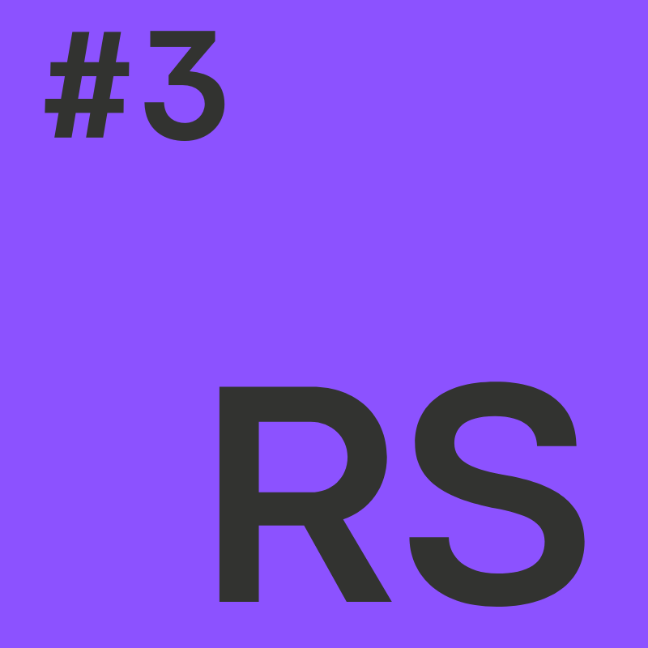

# Raspodijeljeni sustavi (RS)

**Nositelj**: doc. dr. sc. Nikola Tanković  
**Asistent**: Luka Blašković, mag. inf.

**Ustanova**: Sveučilište Jurja Dobrile u Puli, Fakultet informatike u Puli

</img>

# (3) Asinkroni Python

</img>

U ovoj skripti fokusirat ćemo se na naprednije aspekte programskog jezika Python, koji će vam biti korisni kako za jednostavniju implementaciju rješenja u okviru ovog kolegija, tako i za općenito učinkovitiji rad s Pythonom. Konkretno, naučit ćemo kako koristiti anonimne lambda funkcije, raditi s funkcijama višeg reda, koristiti module, pisati comprehension sintaksu za bržu izgradnju struktura podataka te kako raditi s klasama i objektima.

 

**🆙 Posljednje ažurirano: 10.11.2024.**

## Sadržaj
