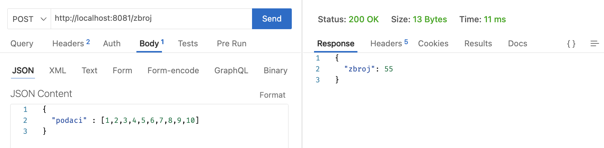

# Raspodijeljeni sustavi (RS)

**Nositelj**: doc. dr. sc. Nikola Tanković  
**Asistent**: Luka Blašković, mag. inf.

**Ustanova**: Sveučilište Jurja Dobrile u Puli, Fakultet informatike u Puli

</img>

# (5) Mikroservisna arhitektura

</img>

<div style="float: clear; margin-right:5px;">
Mikroservisna arhitektura predstavlja suvremeni pristup dizajnu softvera, gdje se aplikacija gradi kao skup manjih, samostalnih servisa koji međusobno komuniciraju putem mreže. Svaki od tih servisa može se promatrati kao zasebna jedinica koja obavlja jednu specifičnu funkciju, pri čemu komunikacija najčešće koristi standardizirane protokole poput HTTP-a. Za razliku od tradicionalne monolitne arhitekture, u kojoj su svi dijelovi aplikacije objedinjeni u jednoj cjelini, mikroservisna arhitektura razdvaja ključne funkcionalnosti poput poslovne logike, baza podataka, autentifikacije i drugih komponenti u odvojene servise.

Ovakav pristup donosi brojne prednosti: omogućuje veću skalabilnost i pouzdanost sustava, olakšava organizaciju velikih razvojnih timova te ubrzava proces implementacije i unapređenja rješenja. Mikroservisi tako postaju temelj fleksibilnog, održivog i modernog razvoja softvera.

</div>
<br>

**🆙 Posljednje ažurirano: 7.12.2024.**

## Sadržaj

- [Raspodijeljeni sustavi (RS)](#raspodijeljeni-sustavi-rs)
- [(5) Mikroservisna arhitektura](#5-mikroservisna-arhitektura)
  - [Sadržaj](#sadržaj)
- [1. Što je mikroservisna arhitektura?](#1-što-je-mikroservisna-arhitektura)
  - [1.1 Monolitna arhitektura](#11-monolitna-arhitektura)
- [2. Definiranje poslužitelja koristeći `aiohttp`](#2-definiranje-poslužitelja-koristeći-aiohttp)
  - [2.1 Ponavljanje: `aiohttp` klijentska sesija](#21-ponavljanje-aiohttp-klijentska-sesija)
  - [2.2 `aiohttp.web` modul](#22-aiohttpweb-modul)
  - [2.3 Definiranje poslužiteljskih ruta](#23-definiranje-poslužiteljskih-ruta)
    - [2.3.1 GET ruta](#231-get-ruta)
    - [2.3.2 Automatsko ponovno pokretanje poslužitelja (hot/live reloading)](#232-automatsko-ponovno-pokretanje-poslužitelja-hotlive-reloading)
    - [2.3.3 GET - slanje `JSON` odgovora](#233-get---slanje-json-odgovora)
    - [2.3.4 POST ruta](#234-post-ruta)
  - [2.4 Zadaci za vježbu: Definiranje jednostavnih aiohttp poslužitelja](#24-zadaci-za-vježbu-definiranje-jednostavnih-aiohttp-poslužitelja)
    - [Zadatak 1: `GET /proizvodi`](#zadatak-1-get-proizvodi)
    - [Zadatak 2: `POST /proizvodi`](#zadatak-2-post-proizvodi)
    - [Zadatak 3: `GET /punoljetni`](#zadatak-3-get-punoljetni)
- [3. Klijent-Poslužitelj komunikacija koristeći `aiohttp`](#3-klijent-poslužitelj-komunikacija-koristeći-aiohttp)
  - [3.1 `AppRunner` klasa](#31-apprunner-klasa)
  - [3.2 GET ruta s URL parametrima](#32-get-ruta-s-url-parametrima)
  - [3.3 Zadaci za vježbu: Interna Klijent-Poslužitelj komunikacija](#33-zadaci-za-vježbu-interna-klijent-poslužitelj-komunikacija)
    - [Zadatak 4: Dohvaćanje proizvoda](#zadatak-4-dohvaćanje-proizvoda)
    - [Zadatak 5: Proizvodi i ruta za narudžbe](#zadatak-5-proizvodi-i-ruta-za-narudžbe)
- [4. Podjela u više datoteka](#4-podjela-u-više-datoteka)
  - [4.1 Jednostavna simulacija mikroservisne arhitekture](#41-jednostavna-simulacija-mikroservisne-arhitekture)
    - [4.1.1 Pokretanje mikroservisa](#411-pokretanje-mikroservisa)
    - [4.1.2 Konkurentno slanje zahtjeva](#412-konkurentno-slanje-zahtjeva)
  - [4.2 Simulacija mikroservisne arhitekture: Računske operacije](#42-simulacija-mikroservisne-arhitekture-računske-operacije)
    - [4.2.1 Sekvencijalna obrada podataka](#421-sekvencijalna-obrada-podataka)
    - [4.2.2 Konkurentna obrada podataka](#422-konkurentna-obrada-podataka)
- [5. Zadaci za vježbu: Mikroservisna arhitektura](#5-zadaci-za-vježbu-mikroservisna-arhitektura)
  - [Zadatak 6: Jednostavna komunikacija](#zadatak-6-jednostavna-komunikacija)
  - [Zadatak 7: Računske operacije](#zadatak-7-računske-operacije)
  - [Zadatak 8: Mikroservisna obrada - CatFacts API](#zadatak-8-mikroservisna-obrada---catfacts-api)

<div style="page-break-after: always; break-after: page;"></div>

# 1. Što je mikroservisna arhitektura?

U softverskom inženjerstvu, **mikroservisna arhitektura** (_eng. microservice architecture_) predstavlja arhitekturalni stil u kojem se aplikacija sastoji od više manjih granularnih servisa, koji komuniciraju putem određenih protokola. Arhitektura bazirana na mikroservisima omogućava razvojnim timovima da razvijaju i održavaju servise neovisno jedan o drugome, čime se smanjuje interna složenost aplikacije i ovisnost između različitih komponenti, a time i povećava skalabilnost i modularnost sustava.

Ne postoji jedinstvena definicija mikroservisne arhitekture, međutim s vremenom je došlo do uspostavljanja konvencija i dobrih praksi koje se primjenjuju u većini slučajeva. Tako možemo definirati nekoliko **ključnih karakteristika mikroservisne arhitekture**:

- U mikroservisnoj arhitekturi, servisi se obično implementiraju kao **odvojeni procesi** koji međusobno komuniciraju putem mreže, za razliku od klasičnih biblioteka ili modula unutar jednog procesa.
- Servisi su osmišljeni tako da se organiziraju oko **poslovnih funkcionalnosti** ili **domenskih entiteta**. Na primjer, možemo imati zasebne servise za korisnike, proizvode ili narudžbe, pri čemu svaki servis pokriva određeni aspekt poslovanja.
- Glavna ideja mikroservisa je omogućiti njihovu **neovisnu implementaciju i razvoj**. To znači da svaki servis može koristiti različite tehnologije, programske jezike ili baze podataka, ovisno o tome što najbolje odgovara njegovim specifičnim potrebama.
- **Mikroservisi su obično kompaktni**, kako po broju linija koda, tako i po resursima koje koriste. Razvijaju se i **autonomno isporučuju kroz automatizirane procese**, poput sustava za kontinuiranu integraciju i isporuku ([CI/CD](https://en.wikipedia.org/wiki/CI/CD)), što omogućava bržu i fleksibilniju iteraciju.

</img>

> Ilustracija podjele sustava na distribuiranu mikroservisnu arhitekturu

Kao i svaki arhitekturalni stil, mikroservisna arhitektura ima svoje prednosti i nedostatke, samim tim **nije uvijek najbolje rješenje za svaki problem**. Razvoj aplikacije oko mikroservisa često zahtijeva dodatne **inicijalne troškove** i napore u postavljanju infrastrukture, automatizaciji te upravljanju servisima (ali i ljudskim resursima koji stoje iza razvoja).

> Kada se mikroservisna arhitektura ne koristi na učinkovit način, može doći do nepotrebne složenosti i povećanja kompleksnosti sustava (samim tim i financijskih troškova). Ne tako davni slučaj Elona Muska i Twittera, o kojem se raspravlja u [članku na Netokraciji](https://www.netokracija.com/mikroservisi-elon-musk-twitter-202582), pruža izvrstan kontekst za razumijevanje kako loša implementacija mikroservisa može rezultirati pretjeranom složenošću, većim troškovima i smanjenom produktivnošću razvojnog tima.

**Monolitna arhitektura**, kao klasična alternativa mikroservisnom pristupu, predstavlja način razvoja aplikacije kao jedinstvene, povezane cjeline, obično objedinjene u jednom procesu ili aplikaciji. Ovaj pristup nudi brojne prednosti, uključujući jednostavnost u razvoju, održavanju i testiranju. Ipak, kako aplikacija postaje sve složenija zbog povećanja funkcionalnosti i broja korisnika, mogu se javiti izazovi povezani sa skalabilnošću i prilagodljivošću.

## 1.1 Monolitna arhitektura

**Monolitna arhitektura** (eng. _monolithic architecture_) je stil arhitekture u kojem je cijela aplikacija dizajnirana kao "jedinstvena" povezana cjelina. To znači da su svi moduli i komponente aplikacije, poput korisničkog sučelja, poslovne logike, pristupa podacima, postojani u unutar jedne aplikacije. Monolitna aplikacija se obično implementira kao jedan veliki "programski paket" ili proces koji se izvozi i pokreće samostalno.

Softverska rješenja koja ste do sad razvijali na kolegijima [Programsko inženjerstvo](https://fipu.unipu.hr/fipu/predmet/proinz_a) i [Web aplikacije](https://fipu.unipu.hr/fipu/predmet/webapl), mogla bi se opisati kao monolitne aplikacije, iako ona to nisu u pravom smislu definicije. Naime, monolitna arhitektura je često povezana s klasičnim _desktop_ aplikacijama, gdje se cijela aplikacija izvršava na korisnikovom računalu, bez potrebe za dodatnim komponentama ili servisima.

Kako smo na **Programskom inženjerstvu** aplikaciju razvijali u okviru jednog razvojnog okvira (Vue.js), koristeći jedan programski jezik (JavaScript) te koristili Firebase kao servis za autentifikaciju i bazu podataka na način da smo ga integrirali direktno u aplikaciju, možemo argumentirati da smo razvijali aplikaciju u monolitnoj arhitekturi. Međutim, **Firebase je PaaS** (_Platform-as-a-Service_) **usluga**, odnosno platforma u oblaku koja omogućava korištenje udaljenih poslužitelja i nudi razne funkcionalnosti kroz skup mikroservisa. Njegova glavna prednost je što eliminira potrebu za brigom o infrastrukturi, upravljanju bazama podataka, skalabilnosti i sličnim tehničkim aspektima, jer sve to rješava sama platforma. Stoga se može reći da ste, na određeni način, svoju aplikaciju razvijali u okviru mikroservisne arhitekture, ali na višem nivou apstrakcije.

Što se tiče **Web aplikacija**, kolegij obuhvaća razvoj klijentske i **poslužiteljske strane aplikacije**. Poslužiteljska strana aplikacije razvijana je prema monolitnoj arhitekturi budući da je sadržavala sve komponente potrebne za uspješan rad aplikacije (poslovnu logiku, pristup podacima, korisničko sučelje) unutar jednog backend sustava (npr. Express.js).

Izazovi povezani s ovakvim pristupom već su prethodno spomenuti: skalabilnost, održavanje, testiranje, razvoj i sl.

- Što ako broj korisnika aplikacije naglo poraste?
- Kako se učinkovito nositi s velikom količinom podataka u bazi?
- Kako brzo i sigurno isporučiti nove verzije aplikacije korisnicima?
- Kako testirati pojedine dijelove aplikacije neovisno jedan o drugome, bez narušavanja korisničkog iskustva?
- Što ako mi "padne" cijeli poslužitelj zbog greške u poslovnoj logici jednog dijela aplikacije - korisnici se više ne mogu niti prijaviti?..

i tako dalje...

</img>

> Monolitna vs. mikroservisna arhitektura razvoja aplikacija

Među poznatijim tvrtkama koje uspješno koriste mikroservisnu arhitekturu ističu se **Netflix**, **Amazon**, **Spotify**, **Uber** i **Airbnb**.

**Amazon** je nekoliko svojih ključnih proizvoda, poput Amazon Primea, prebacio na mikroservisnu arhitekturu, dok je za neke druge proizvode zadržao monolitnu arhitekturu. Kroz vlastiti razvoj i uspon mikroservisnih tehnologija, Amazon prepoznaje poslovnu priliku u pružanju mikroservisne arhitekture kao usluge drugim tvrtkama, što rezultira razvojem platforme AWS (Amazon Web Services). Danas je [AWS vodeći globalni pružatelj cloud usluga](https://en.wikipedia.org/wiki/Amazon_Web_Services) i jedan od najvećih izvora prihoda Amazon grupe. S druge strane, **Netflix** je [potpuno migrirao na mikroservisnu arhitekturu](https://netflixtechblog.com/tagged/microservices) i danas je jedan od najvećih korisnika AWS-a, ističući se kao primjer uspješne transformacije s monolitne na mikroservisnu arhitekturu. Navodi se da Netflix ima preko 1000 aktivnih mikroservisa koji se izvršavaju u oblaku.

</img>

> Ilustracija mikroservisne arhitekture Netflixa, izvor: [zdnet.com](https://www.zdnet.com/article/to-be-a-microservice-how-smaller-parts-of-bigger-applications-could-remake-it/)

<div style="page-break-after: always; break-after: page;"></div>

# 2. Definiranje poslužitelja koristeći `aiohttp`

## 2.1 Ponavljanje: `aiohttp` klijentska sesija

Do sada smo koristili `aiohttp` biblioteku prvenstveno kroz `ClientSession` klasu za slanje asinkronih HTTP zahtjeva prema vanjskim servisima. Ovdje smo na neki način **definirali klijenta unutar Pythona koji komunicira s vanjskim servisom**.

Međutim, `aiohttp` je također odličan alat za izgradnju vlastitih HTTP poslužitelja, direktno unutar Python aplikacije, to radimo kroz tzv. [Server API](https://docs.aiohttp.org/en/stable/web.html).

Prisjetimo se kako definiramo klijentsku sesiju u `aiohttp`:

```python
import asyncio
import aiohttp

async def main():
  async with aiohttp.ClientSession() as session: # Otvaramo HTTP klijentsku sesiju
    response = await session.get(URL)
    print(response.status) # 200
asyncio.run(main())
```

Rekli smo da koristimo _context manager_ `with` kada radimo s resursima koji se moraju zatvoriti nakon upotrebe. U ovom slučaju, `ClientSession` je resurs koji se mora zatvoriti nakon što završimo s radom.

Nakon toga, zaključili smo da je praktično pokrenuti glavnu korutinu pomoću `asyncio.run(main())`, a zatim unutar te korutine pozivati druge korutine koje obavljaju asinkrone operacije. Konkurentno slanje više zahtjeva i agregaciju rezultata možemo postići kroz `asyncio.gather()`, kao što smo vidjeli u primjeru slanja konkurentnih zahtjeva na **CatFact API**.

_Primjer slanja 5 konkurentnih zahtjeva koristeći_ `asyncio.Task` i `asyncio.gather`:

```python
import asyncio
import aiohttp

async def fetch_fact(session):
  print("Šaljem zahtjev...")
  rezultat = await session.get("https://catfact.ninja/fact")
  return (await rezultat.json())["fact"] # Deserijalizacija JSON odgovora

async def main():
  async with aiohttp.ClientSession() as session:
    cat_tasks = [asyncio.create_task(fetch_fact(session)) for _ in range(5)] # Pohranjujemo Task objekte u listu
    facts = await asyncio.gather(*cat_tasks) # Listu raspakiravamo koristeći * operator, čekamo na rezultat izvršavanja svih Taskova
    print(facts)

asyncio.run(main())
```

U nastavku ćemo vidjeti kako definirati **HTTP poslužitelj** koristeći `aiohttp` biblioteku.

## 2.2 `aiohttp.web` modul

Kako bi implementirali **poslužitelj** (_eng. Server_) koristeći `aiohttp`, koristimo `aiohttp.web` modul. Ovaj modul pruža sve potrebne alate za definiranje ruta (_endpointa_), obradu zahtjeva i slanje odgovora kroz HTTP protokol.

Modul nije potrebno naknadno instalirati, već je uključen u `aiohttp` paketu.

```python
from aiohttp import web
```

Ključna komponenta `aiohttp.web` modula je `Application` klasa, koja definira glavnu aplikaciju (**poslužitelj**).

```python
app = web.Application() # u varijablu app pohranjujemo instancu Application klase
```

Da bi pokrenuli poslužitelj, nije dovoljno samo pokrenuti Python skriptu, već moramo definirati na kojoj **adresi (host)** i **portu** će poslužitelj slušati.

Poslužitelj pokrećemo pozivom metode `web.run_app()`:

```python
web.run_app(app, host, port)
```

- `app` - instanca `Application` klase koju želimo pokrenuti
- `host` - adresa na kojoj će poslužitelj slušati (default: `'localhost'`)
- `port` - port na kojem će poslužitelj slušati (npr. `8080`)

_Primjer pokretanja poslužitelja na adresi_ `localhost` i portu `8080`:

```python
from aiohttp import web

app = web.Application()

web.run_app(app, host='localhost', port=8080)

# ili kraće
web.run_app(app, port=8080)
```

Ako je sve ispravno konfigurirano, poslužitelj će se pokrenuti i vidjet ćete ispis u terminalu:

```
======== Running on http://localhost:8080 ========
(Press CTRL+C to quit)
```

Možete otvoriti web preglednik i posjetiti adresu `http://localhost:8080` kako biste provjerili je li poslužitelj uspješno pokrenut ili poslati zahtjev koristeći neki od HTTP klijenata.

> Za **HTTP klijent unutar terminala** preporuka je koristiti [curl](https://curl.se/).
> Kao **Desktop** ili **Web aplikaciju** preporuka je koristiti [Postman](https://www.postman.com/) ili [Insomnia](https://insomnia.rest/), međutim ima ih još mnogo.
> Praktično je i preporuka koristiti neku od **VS Code HTTP klijent ekstenzija**, primjerice [Thunder Client](https://www.thunderclient.com/).

Koristeći jedan od alata, pošaljite zahtjev na adresu `http://localhost:8080` i provjerite je li poslužitelj uspješno pokrenut.

<div style="page-break-after: always; break-after: page;"></div>

## 2.3 Definiranje poslužiteljskih ruta

Kako bi poslužitelj bio koristan, odnosno mogao obrađivati nadolazeće zahtjeve, potrebno je definirati **rute** (_eng. route/endpoint_) koje će poslužitelj opsluživati (_eng. serve_). Ruta predstavlja URL putanju koja se koristi za pristup određenom resursu ili funkcionalnosti. Ako još niste, preporuka je da se prisjetite HTTP protokola (skripta `RS4`) kako biste mogli razumjeti gradivo koje slijedi.

### 2.3.1 GET ruta

U `aiohttp.web` modulu, rute možete definirati na više načina. Primjerice, ako želite dodati jednostavnu GET rutu koja predstavlja HTTP zahtjev s GET metodom, koristite metodu `add_get()` na objektu `router`:

```python
app.router.add_get(path, handler_function) # Dodajemo GET rutu na određenu putanju
```

- `path` - URL putanja na koju će se ruta primjenjivati (npr. `'/'`, `'/korisnici'`, `'/proizvodi'`)
- `handler_function` - funkcija koja će se pozvati kada se zahtjev uputi na određenu rutu

**Handler funkcija** (U JavaScriptu ekvivalent je `callback` funkcija) je funkcija koja će se izvršiti kada se zahtjev uputi na definiranu rutu. _Handler_ funkcija može biti **sinkrona** ili **asinkrona** (**korutina**), međutim u praksi je preporučljivo koristiti asinkrone funkcije kako bi se izbjeglo blokiranje glavne dretve.

_Handler_ funkcija prima **ulazni parametar** `request` koji predstavlja HTTP zahtjev koji je klijent napravio prema poslužitelju. Ovaj objekt sadrži sve informacije o zahtjevu, poput: URL putanje, HTTP metode, zaglavlja, tijela zahtjeva i sl.

```python
def handler_function(request) # Sinkrona handler funkcija koja prima request objekt
```

Prikazat ćemo podatke o zahtjevu koji su pohranjeni unutar objekta `request`:

```python
from aiohttp import web

def handler_function(request):
  print(request.method)
  print(request.path)
  print(request.headers)

app = web.Application()

app.router.add_get('/', handler_function) # Čitaj: Dodajemo GET rutu na putanju '/' koja poziva handler funkciju

web.run_app(app, host='localhost', port=8080)
```

- Ispisuje: GET metodu, URL putanju (`/`), zaglavlja zahtjeva:

```
GET
/
<CIMultiDictProxy('Host': '0.0.0.0:8080', 'User-Agent': 'curl/8.7.1', 'Accept': '*/*')>
```

Vidjet ćete da smo uz ispis dobili i grešku. To je zato jer **nismo poslali HTTP odgovor natrag klijentu**. Ukoliko _handler_ funkcija ne vrati odgovor, poslužitelj će vratiti grešku `500 Internal Server Error`. Da bismo to ispravili, moramo vratiti odgovor koristeći `web.Response` objekt:

```python
def handler_function(request):
  return web.Response() # Vraćamo prazan HTTP odgovor
```

Nema više greške! Međutim, odgovor je prazan. Klasa `web.Response` omogućava nam da precizno definiramo HTTP odgovor koji će poslužitelj vratiti klijentu. Na primjer, možemo postaviti statusni kod, zaglavlja i tijelo odgovora.

Sintaksa `web.Response` konstruktora:

```python
aiohttp.web.Response(
    body=None,
    status=200,
    reason=None,
    text=None,
    headers=None,
    content_type=None,
    charset=None
)
```

- `body` - tijelo odgovora (npr. `HTML`, `JSON`)
- `status` - statusni kod odgovora (npr. `200`, `404`, `500`)
- `reason` - tekstualni opis statusnog koda (npr. `'OK'`, `'Not Found'`, `'Internal Server Error'`)
- `text` - tekstualno tijelo odgovora (npr. `'Hello, world!'`)
- `headers` - zaglavlja odgovora (npr. `{'Content-Type': 'application/json'}`)
- `content_type` - oblik sadržaja odgovora (npr. `'text/html'`, `'application/json'`)
- `charset` - karakterna enkodiranje odgovora (gotovo uvijek: `'utf-8'`)

_Primjer vraćanja jednostavnog HTML odgovora koji vraća tekst_ `'Pozdrav Raspodijeljeni sustavi!'`:

```python
def handler_function(request):
  return web.Response(text='Pozdrav Raspodijeljeni sustavi!')
```

- Otvorite web preglednik i posjetite adresu `http://localhost:8080` kako biste vidjeli rezultat, odnosno pošaljite zahtjev koristeći HTTP klijent.

Pomoću naredbe `curl` možete poslati HTTP zahtjev direktno iz terminala:

```bash
curl http://localhost:8080

# ili s naglašavanjem HTTP metode opcijom -X

curl -X GET http://localhost:8080
```

Nakon svake promjene u kodu poslužitelja potrebno je ponovno pokrenuti skriptu kako bi se promjene primijenile. To je zato što jednom kad se skripta pokrene, unutar terminala se pokreće proces koji sluša na definiranoj adresi i portu. Svakom izmjenom poslužitelja, potrebno je prekinuti trenutačni proces (npr. pritiskom `Ctrl/CMD + C`) i ponovno pokrenuti skriptu.

<div style="page-break-after: always; break-after: page;"></div>

### 2.3.2 Automatsko ponovno pokretanje poslužitelja (hot/live reloading)

Tijekom razvoja, ovo brzo postaje nepraktično i zamorno, pa je topla preporuka instalirati jedan od alata koji omogućuju **automatsko ponovno pokretanje poslužitelja nakon promjena u kodu**, tzv. _hot/live reloading_.

U tu svrhu, možete instalirati neki od sljedećih alata:

1. [Nodemon](https://nodemon.io/) - prvenstveno za Node.js aplikacije, ali može se koristiti i za Python. Nodemon se instalira u globalnom okruženju i pokreće se iz terminala. Naravno, potrebno je instalirati i [Node.js runtime](https://nodejs.org/en).

```bash
npm install -g nodemon
```

- ako ne radi, provjerite je li dodan u PATH globalnu varijablu i ponovno pokrenite VS Code/terminal

Pokretanje:

```bash
nodemon --exec python index.py
```

2. [aiohttp-devtools](https://github.com/aio-libs/aiohttp-devtools) - specifično za `aiohttp` aplikacije. Instalacija:

```bash
pip install aiohttp-devtools
```

Pokretanje:

```bash
adev runserver index.py
```

3. [watchdog](https://github.com/gorakhargosh/watchdog) - općeniti alat za praćenje promjena u datotekama. Kompleksniji za postavljanje budući da je, osim instalacije, potrebno napisati skriptu koja će pokrenuti poslužitelj.

> Preporuka je koristiti `aiohttp-devtools` ili `nodemon` jer su jednostavniji za postavljanje i korištenje.

<div style="page-break-after: always; break-after: page;"></div>

### 2.3.3 GET - slanje `JSON` odgovora

Jednom kad ste uspješno podesili _hot-reload_ funkcionalnost, možemo se vratiti na razvoj poslužitelja. U praksi, često ćete (gotovo uvijek) se susresti s potrebom slanja `JSON` odgovora iz poslužitelja, budući da je `JSON` format najčešće korišten za razmjenu podataka između klijenta i poslužitelja.

Rekli smo da format odgovora možemo definirati kroz `web.Response` objekt:

```python
def handler_function(request):
  return web.Response(text='Pozdrav Raspodijeljeni sustavi!') # Ovo vraća tekstualni odgovor
```

Ako želimo poslati `JSON` odgovor, stvari su nešto kompliciranije jer moramo odraditi serijalizaciju podataka u `JSON` format prije samog slanja.

Podsjetnik:

- **Serijalizacija** - pretvaranje Python objekta u `JSON` format
- **Deserijalizacija** - pretvaranje `JSON` formata u Python objekt

Za pretvaranja Python objekta u `JSON` format, možemo upotrijebiti ugrađeni modul `json`:

Za samu serijalizaciju koristimo metodu `dumps()`:

```python
import json

data = {'ime': 'Ivo', 'prezime': 'Ivić', 'godine': 25}

json_data = json.dumps(data)

# JSON format je tipa string
print(type(json_data)) # <class 'str'>
```

U `web.Response` moramo precizirati da se radi o `JSON` formatu kako bi klijent znao kako interpretirati odgovor. To radimo kroz parametar `content_type`:

```python
def handler_function(request):
  data = {'ime': 'Ivo', 'prezime': 'Ivić', 'godine': 25}
  return web.Response(text=json.dumps(data), content_type='application/json')
```

**Drugi i preporučeni način** je korištenje metode `json_response()` koja automatski serijalizira Python objekt u `JSON` format:

```python
def handler_function(request):
  data = {'ime': 'Ivo', 'prezime': 'Ivić', 'godine': 25}
  return web.json_response(data) # Automatska serijalizacija u JSON format, preporučeno
```

Ovdje ne koristimo generičku `web.Response` klasu, već specijaliziranu `web.json_response()` funkciju koja automatski serijalizira Python objekt u `JSON` format i **postavlja odgovarajuće zaglavlje**.

> U praksi, preporučuje se koristiti `web.json_response()` funkciju jer je kod kraći i čitljiviji

---

> **Kratki rezime**

Do sad smo definirali sljedeće dijelove `aiohttp` poslužitelja:

1. `Application` instanca koja predstavlja glavnu aplikaciju

```python
app = web.Application()

web.run_app(app, port=8080) # Pokretanje poslužitelja
```

2. GET ruta na putanju `'/'` koja poziva handler funkciju

```python
app.router.add_get(path, handler_function)
```

3. handler funkcija koja obrađuje zahtjev i vraća odgovor, može biti sinkrona ili asinkrona (korutina)

```python
def handler_function(request):
  return web.json_response(data) # Automatska serijalizacija u JSON format

def handler_function(request):
  return web.Response(text='Pozdrav Raspodijeljeni sustavi!') # Vraćanje tekstualnog odgovora kroz standardni web.Response objekt
```

### 2.3.4 POST ruta

Za razliku od GET metode koja se koristi za dohvaćanje podataka, **POST metoda** se koristi za **slanje podataka prema poslužitelju**.

Kod web aplikacija, podaci koji se šalju POST metodom najčešće su iz forme koju je korisnik popunio. Na primjer: prilikom registracije korisnika, unos korisničkog imena, lozinke i e-mail adrese šalje se prema poslužitelju POST metodom. Takvi podaci najčešće se šalju u `JSON` formatu.

U `aiohttp.web` modulu, POST rutu definiramo kroz metodu `add_post()` na objektu `router`:

```python
app.router.add_post(path, handler_function)
```

**Handler funkcija** koja obrađuje POST zahtjev prima dodatni parametar `request` jednako kao kod GET metode. Međutim, POST metoda omogućava pristup tijelu zahtjeva (eng. _request body_) koje sadrži podatke koje je klijent poslao prema poslužitelju.

> U nastavku ćemo _handler_ funkcije definirati kao **korutine** kako bismo mogli asinkrono obrađivati zahtjeve.

**Deserijalizaciju podataka** iz `JSON` formata u Python objekt možemo obaviti kroz metodu `json()` objekta `request`, na isti način kao što smo to radili prilikom slanja zahtjeva prema vanjskim servisima kod klijentske sesije. **Uočite**, ne koristimo `json` modul kao kod serijalizacije, već **metodu** `json()` objekta `request`.

```python
data = await request.json()
```

_Primjer definiranja POST rute koja prima `JSON` podatke i vraća odgovor:_

```python
from aiohttp import web

async def post_handler(request):
  data = await request.json() # Deserijalizacija JSON podataka
  print(data) # Ispis podataka u terminal
  return web.json_response(data) # Vraćanje istih podataka kao odgovor

app = web.Application()

app.router.add_post('/', post_handler) # Dodajemo POST rutu na putanju '/' koja poziva post_handler korutinu

web.run_app(app, host='localhost', port=8080)
```

Podatke pošaljite kroz neki od **HTTP klijenata** ili `curl` (`-H` opcija za postavljanje zaglavlja, `-d` opcija za definiranje HTTP tijela):

```bash
curl -X POST -H "Content-Type: application/json" -d '{"ime": "Ivo", "prezime": "Ivić", "godine": 25}' http://localhost:8080
```

Očekivani odgovor (isti podaci kao u zahtjevu):

```
{'ime': 'Ivo', 'prezime': 'Ivić', 'godine': 25}
```

Puno jednostavnije je poslati kroz HTTP klijent jer ne morate eksplicitno navoditi zaglavlja:

</img>

> Primjer slanja POST zahtjeva s JSON tijelom na `http://localhost:8080` kroz Thunder Client ekstenziju

---

Za dodavanje preostalih HTTP metoda (PUT, DELETE, PATCH) koristimo odgovarajuće ekvivalente na objektu `router`:

- `router.add_put()` - dodavanje PUT rute
- `router.add_patch()` - dodavanje PATCH rute
- `router.add_delete()` - dodavanje DELETE rute

Ali možemo koristiti i generičku metodu `router.add_routes()` koja prima **listu ruta koje želimo dodati**.

_Primjer, definirat ćemo poslužitelj s dvije rute_: `GET /korisnici` i `POST /korisnici`:

```python
from aiohttp import web

async def get_users(request): # korutina za GET zahtjev
  return web.json_response({'korisnici': ['Ivo', 'Ana', 'Marko']})

async def add_users(request): # korutina za POST zahtjev
  data = await request.json()
  return web.json_response(data) # Vraćamo isti podatak, bez ikakve obrade

app = web.Application()

app.router.add_routes([
  web.get('/korisnici', get_users), # GET /korisnici
  web.post('/korisnici', add_users) # POST /korisnici
])

web.run_app(app, port=8080)
```

</img>

> Primjer slanja GET zahtjeva na `http://localhost:8080/korisnici` kroz Thunder Client ekstenziju, odgovor je lista korisnika

> Rute možemo definirati na još načina, o tome više u nastavku...

<div style="page-break-after: always; break-after: page;"></div>

## 2.4 Zadaci za vježbu: Definiranje jednostavnih aiohttp poslužitelja

### Zadatak 1: `GET /proizvodi`

Definirajte `aiohttp` poslužitelj koji radi na portu `8081` koji na putanji `/proizvodi` vraća listu proizvoda u JSON formatu. Svaki proizvod je rječnik koji sadrži ključeve `naziv`, `cijena` i `količina`. Pošaljite zahtjev na adresu `http://localhost:8080/proizvodi` koristeći neki od HTTP klijenata ili `curl` i provjerite odgovor.

### Zadatak 2: `POST /proizvodi`

Nadogradite poslužitelj iz prethodnog zadatka na način da na istoj putanji `/proizvodi` prima POST zahtjeve s podacima o proizvodu. Podaci se šalju u JSON formatu i sadrže ključeve `naziv`, `cijena` i `količina`. _Handler_ funkcija treba ispisati primljene podatke u terminalu, dodati novi proizvod u listu proizvoda i vratiti **odgovor s novom listom proizvoda** u JSON formatu.

### Zadatak 3: `GET /punoljetni`

Definirajte poslužitelj koji sluša na portu `8082` i na putanji `/punoljetni` vraća listu korisnika starijih od 18 godina. Svaki korisnik je rječnik koji sadrži ključeve `ime` i `godine`. Pošaljite zahtjev na adresu `http://localhost:8082/punoljetni` i provjerite odgovor. Novu listu korisnika definirajte koristeći funkciju `filter` ili `list comprehension`.

```python

korisnici = [
  {'ime': 'Ivo', 'godine': 25},
  {'ime': 'Ana', 'godine': 17},
  {'ime': 'Marko', 'godine': 19},
  {'ime': 'Maja', 'godine': 16},
  {'ime': 'Iva', 'godine': 22}
]
```

<div style="page-break-after: always; break-after: page;"></div>

# 3. Klijent-Poslužitelj komunikacija koristeći `aiohttp`

U prethodnom poglavlju smo definirali `aiohttp` pozlužitelj koji sluša na definiranoj adresi i portu te obrađuje dolazne zahtjeve, dok smo u skripti `RS4` vidjeli kako se koristi `aiohttp` klijentska sesija za slanje asinkronih i konkurentnih HTTP zahtjeva koristeći `ClientSession` klasu.

U ovom dijelu ćemo spojiti ta dva koncepta i pokazati **kako unutar Python koda možemo simulirati komunikaciju između klijenta i poslužitelja** koristeći `aiohttp` klijentsku sesiju i poslužitelj definiran kroz `aiohttp.web` modul.

**Krenut ćemo od definicije jednostavnog poslužitelja** koji sluša na adresi `localhost` i portu `8080` te na putanji `/korisnici` vraća listu korisnika u JSON formatu:

```python
from aiohttp import web

async def get_users(request):
  return web.json_response({'korisnici': ['Ivo', 'Ana', 'Marko', 'Maja', 'Iva', 'Ivan']}) #hardkodirani podaci

app = web.Application()

app.router.add_get('/korisnici', get_users)

web.run_app(app, host='localhost', port=8080)
```

Klijentsku sesiju smo dosad otvarali unutar `main` korutine koristeći _context manager_ pa ćemo to i ovdje učiniti:

```python
import asyncio

async def main():
  async with aiohttp.ClientSession() as session:
    pass

asyncio.run(main())
```

Ako spojimo kod, dobivamo sljedeće:

```python
from aiohttp import web
import asyncio, aiohttp

async def get_users(request):
  return web.json_response({'korisnici': ['Ivo', 'Ana', 'Marko', 'Maja', 'Iva', 'Ivan']})

app = web.Application()

app.router.add_get('/korisnici', get_users)
web.run_app(app, host='localhost', port=8080)

async def main():
  async with aiohttp.ClientSession() as session:
    print("Klijentska sesija otvorena")
asyncio.run(main())
```

Koji problem uočavate?

<details>
  <summary>Spoiler alert! Odgovor na pitanje</summary>
  <p>Kad pokrenemo skriptu, pokrenut će se poslužitelj i <b>blokirati izvođenje ostatka koda</b>. <b>Klijentska sesija nikada neće biti otvorena jer se kod nikada neće izvršiti</b>.</p>
  <p>Međutim, ako pokrenemo prvo poslužitelj u jednom terminalu, a zatim skriptu u drugom, problem ostaje jer poslužitelj već radi i ne možemo ga ponovno pokrenuti na istom portu.</p>
</details>

---

Dakle, problem je što **ako pokrenemo poslužitelj, on će blokirati izvođenje ostatka koda**, uključujući otvaranje klijentske sesije.

Možemo iskoristiti specijalnu Python varijablu `__name__` koja uvijek sadrži naziv trenutačnog modula. Ako pokrenemo skriptu direktno, `__name__` će biti postavljen na `'__main__'`, dok će uvođenjem skripte u drugi modul, `__name__` biti postavljen na naziv modula tog modula.

Preciznije, možemo koristiti `if __name__ == '__main__':` uvjetnu izjavu kako bismo **osigurali da se kod unutar bloka izvršava samo ako je skripta pokrenuta direktno**, a ne uvezena kao modul.

```python
if __name__ == '__main__':
  # Blok koda koji se izvršava samo ako skriptu pokrenemo direktno (python index.py)
```

- isto će raditi za pokretanje kroz `nodemon` ili `aiohttp-devtools`

_Primjerice, možemo definirati pokretanje poslužitelja unutar ovog bloka_:

```python
if __name__ == '__main__':
  print("Pokrećem samo poslužitelj")
  web.run_app(app, host='localhost', port=8080)
```

Ukupan kod:

```python
from aiohttp import web
import asyncio, aiohttp

async def get_users(request):
  return web.json_response({'korisnici': ['Ivo', 'Ana', 'Marko', 'Maja', 'Iva', 'Ivan']})

app = web.Application()

app.router.add_get('/korisnici', get_users)

async def main():
  async with aiohttp.ClientSession() as session:
    print("Klijentska sesija otvorena")
asyncio.run(main()) # pokreće klijentsku sesiju

if __name__ == '__main__':
  print("Direktno pokrenuta skripta...")
  web.run_app(app, host='localhost', port=8080) # pokreće poslužitelj
```

Kod iznad će svakako prvo otvoriti klijentsku sesiju, obzirom da se `asyncio.run` poziva prije pokretanja poslužitelja. Ako ne bi htjeli pokrenuti poslužitelj, možemo samo zakomentirati liniju `web.run_app(app, host='localhost', port=8080)`.

Međutim je li moguće na ovaj način pokrenuti poslužitelj, **a nakon toga** pozvati `main` korutinu koja otvara klijentsku sesiju? **Više nam ima smisla prvo pokrenuti poslužitelj, a onda slati na njega zahtjeve**.

```python
from aiohttp import web
import asyncio, aiohttp

async def get_users(request):
  return web.json_response({'korisnici': ['Ivo', 'Ana', 'Marko', 'Maja', 'Iva', 'Ivan']})

app = web.Application()

app.router.add_get('/korisnici', get_users)

async def main():
  async with aiohttp.ClientSession() as session:
    print("Klijentska sesija otvorena")
    pass

if __name__ == '__main__':
  print("Direktno pokrenuta skripta...")
  web.run_app(app, host='localhost', port=8080) # pokreće poslužitelj
  asyncio.run(main()) # hoće li se pokrenuti?
```

<details>
  <summary>Spoiler alert! Odgovor na pitanje</summary>
  <p>Neće se pokrenuti jer će se izvršenje koda blokirati na liniji <code>web.run_app(app, host='localhost', port=8080)</code> i nikada neće doći do linije <code>asyncio.run(main())</code>.</p>
  <p>Dakle, problem ostaje i dalje.</p>
</details>

<div style="page-break-after: always; break-after: page;"></div>

## 3.1 `AppRunner` klasa

`AppRunner` klasu koristimo kada nam treba više kontrole nad poslužiteljem, kao što je pokretanje poslužitelja u drugom threadu ili procesu, pokretanje više poslužitelja na različitim adresama i portovima, ili pokretanje poslužitelja na različitim sučeljima.

Glavna prednost `AppRunner` klase je što, za razliku od `web.run_app()` funkcije, **ne blokira izvođenje ostatka koda**, odnosno pruža _non-blocking_ način pokretanja poslužitelja, što je ključno kod razvoja raspodijeljenih sustava.

`AppRunner` klasu uključite iz `aiohttp.web` modula:

```python
from aiohttp.web import AppRunner
```

Kako bismo pokrenuli poslužitelj koristeći `AppRunner` klasu, prvo moramo stvoriti instancu `AppRunner` klase i **registrirati poslužitelj koji želimo pokrenuti**:

```python
runner = AppRunner(app)
```

**Postupak je sljedeći**:

1. Definiraj `AppRunner` instancu
2. Pokreni `AppRunner` instancu
3. Registriraj poslužitelj
4. Pokreni poslužitelj

Ako je naš poslužitelj definiran lokalno, na portu `8080`, postupak iznad preveden u kod izgleda ovako:

```python
from aiohttp.web import AppRunner

runner = AppRunner(app) # 1. Definiraj AppRunner instancu
await runner.setup() # 2. Pokreni AppRunner instancu
site = web.TCPSite(runner, 'localhost', 8080) # 3. Registriraj poslužitelj na adresi localhost i portu 8080
await site.start() # 4. Pokreni poslužitelj
```

_Sintaksa:_

```python
runner = AppRunner(app)
await runner.setup()
site = web.TCPSite(runner, host, port)
await site.start()
```

> Ova 4 koraka gotovo uvijek će se ponavljati pa ih je praktično spakirati u zasebnu korutinu `start_server` ili `run_server`

```python
async def start_server():
  runner = AppRunner(app)
  await runner.setup()
  site = web.TCPSite(runner, "localhost", 8080)
  await site.start()

await start_server() # Hoće li se pokrenuti?
```

Sada imamo dvije korutine, `main` i `start_server`, koje želimo pokrenuti. Međutim, rekli smo da s `asyncio.run` možemo pokrenuti samo jednu korutinu.

> Možemo pozvati korutinu `start_server` unutar `main` korutine

```python
async def main():
  await start_server()
  ...

asyncio.run(main())
```

Ukupan kod:

```python
from aiohttp import web
from aiohttp.web import AppRunner
import asyncio, aiohttp

async def get_users(request):
  return web.json_response({'korisnici': ['Ivo', 'Ana', 'Marko', 'Maja', 'Iva', 'Ivan']})

app = web.Application()

app.router.add_get('/korisnici', get_users)

async def start_server():
  runner = AppRunner(app)
  await runner.setup()
  site = web.TCPSite(runner, 'localhost', 8080)
  await site.start()
  print("Poslužitelj sluša na http://localhost:8080")

async def main():
  await start_server() # Prvo pokreni poslužitelj
  async with aiohttp.ClientSession() as session: # Zatim otvori klijentsku sesiju
    print("Klijentska sesija otvorena")
    pass

asyncio.run(main()) # Pokreni main korutinu
```

Ispisuje:

```
Poslužitelj sluša na http://localhost:8080
Klijentska sesija otvorena
```

**Kako ćemo sada napokon poslati zahtjev na ovaj poslužitelj koristeći klijentsku sesiju?**

<details>
  <summary>Spoiler alert! Odgovor na pitanje</summary>
  <p>Na isti način kao što smo to radili u skripti <code>RS4</code>, koristeći <code>session.get()</code> metodu.</p>
  <p>Jedino što je drugačije, je što je poslužitelj pokrenut lokalno, na adresi <code>http://localhost:8080</code>.</p>
</details>

---

```python
async def main():
  await start_server() # Prvo pokreni poslužitelj
  async with aiohttp.ClientSession() as session: # Zatim otvori klijentsku sesiju
    rezultat = await session.get('http://localhost:8080/korisnici') # Pošalji GET zahtjev na lokalni poslužitelj
    print(await rezultat.text()) # Ispis odgovora
```

Kad pokrenemo kod, prvo će se pokrenuti poslužitelj, a zatim klijentska sesija koja će poslati zahtjev na adresu `http://localhost:8080/korisnici` i ispisati odgovor.

Dobivamo ispis odmah nakon pokretanja skripte:

```
Poslužitelj sluša na http://localhost:8080
{"korisnici": ["Ivo", "Ana", "Marko", "Maja", "Iva", "Ivan"]}
```

**Važno!** Ako pokušate ponovno poslati zahtjev direktno iz terminala ili kroz HTTP klijent, dobit ćete grešku zato što poslužitelj više ne radi (jednom kad se završi main korutina, poslužitelj se gasi). Moguće je stvari riješiti beskonačnim petljama ako bi to baš htjeli, ali to **nije preporučeno**.

> Puno bolji pristup je, odvojiti poslužitelja i klijentsku sesiju u zasebne skripte, no o tome više u nastavku...

<div style="page-break-after: always; break-after: page;"></div>

## 3.2 GET ruta s URL parametrima

Kroz nekoliko primjera ćemo pokazati sve što smo do sad naučili, preciznije, vidjet ćemo kako konkurentno slati HTTP zahtjeve definiranjem klijentskih sesija na interne poslužitelje.

Do sad smo definirali jedan poslužitelj, međutim moguće ih je unutar jedne skripte definirati i više.

Uobičajeno je kada šaljemo HTTP odgovor unutar _handler funkcije_, koristiti `web.json_response()` funkciju te definirati statusni kod odgovora `status`.

```python
async def get_users(request):
  korisnici = [
    {"ime": "Ivo", "godine": 25},
    {"ime": "Ana", "godine": 22},
    {"ime": "Marko", "godine": 19}
  ]
  return web.json_response(korisnici, status=200)
```

GET rutu koja dohvaća točno jednog korisnika, npr. po ID-u, definiramo koristeći HTTP route parametre. U ovom slučaju, parametar rute bi bio `id` korisnika.

Parametre rute iz zahtjeva možemo dohvatiti kroz `request.match_info` rječnik:

```python
async def get_users(request):
  user_id = request.match_info['id']

  korisnici = [
    {"id": 1, "ime": "Ivo", "godine": 25},
    {"id": 2, "ime": "Ana", "godine": 22},
    {"id": 3, "ime": "Marko", "godine": 19},
    {"id": 4, "ime": "Maja", "godine": 21},
    {"id": 5, "ime": "Iva", "godine": 40}
  ]

  for korisnik in korisnici:
    if korisnik['id'] == int(user_id):
      return web.json_response(korisnik, status=200)
```

Ako sad pokrenemo kod dobit ćemo error `500`: `KeyError: 'id'`.

To je zato što nismo definirali:

- route parameter `id` u definiciji rute
- slučaj kad korisnik s traženim ID-em ne postoji
- slučaj kad se `id` ne proslijedi u zahtjevu

Dodajemo još jednu definiciju GET rute, ovaj put s route parametrom `id`:

```python
app.router.add_get('/korisnici/{id}', get_users) # Sada očekujemo route parametar 'id'
```

Možemo upotrijebiti `get()` metodu rječnika kako bismo izbjegli `KeyError`:

> `get()` metoda vraća `None` ako ključ ne postoji, a možemo definirati i zadani rezultat ako ključ ne postoji
>
> Dakle ekvivalentno je: `request.match_info['id']` -> `request.match_info.get('id')`, ali `get()` metoda je sigurnija

```python
async def get_users(request):
  user_id = request.match_info.get('id') # Koristimo get() metodu kako bismo izbjegli KeyError

  korisnici = [
    {"id": 1, "ime": "Ivo", "godine": 25},
    {"id": 2, "ime": "Ana", "godine": 22},
    {"id": 3, "ime": "Marko", "godine": 19},
    {"id": 4, "ime": "Maja", "godine": 21},
    {"id": 5, "ime": "Iva", "godine": 40}
  ]

  if user_id is None:
    return web.json_response(korisnici, status=200)

  for korisnik in korisnici:
    if korisnik['id'] == int(user_id):
      return web.json_response(korisnik, status=200)

  return web.json_response({'error': 'Korisnik s traženim ID-em ne postoji'}, status=404)
```

_Primjer slanja zahtjeva:_

**GET /korisnici**

```python
rezultat = await session.get('http://localhost:8080/korisnici')
    rezultat_txt = await rezultat.text()
    print(rezultat_txt)

    rezultat_dict = await rezultat.json() #dekodiraj JSON odgovor u rječnik
    print(rezultat_dict)
```

**GET /korisnici/2**

```python
rezultat = await session.get('http://localhost:8080/korisnici/2')
    rezultat_txt = await rezultat.text()
    print(rezultat_txt)

    rezultat_dict = await rezultat.json() #dekodiraj JSON odgovor u rječnik
    print(rezultat_dict) # {'id': 2, 'ime': 'Ana', 'godine': 22}
```

**GET /korisnici/6**

```python
rezultat = await session.get('http://localhost:8080/korisnici/6')
    rezultat_txt = await rezultat.text()
    print(rezultat_txt)

    rezultat_dict = await rezultat.json() #dekodiraj JSON odgovor u rječnik
    print(rezultat_dict) # {'error': 'Korisnik s traženim ID-em ne postoji'}
```

<div style="page-break-after: always; break-after: page;"></div>

## 3.3 Zadaci za vježbu: Interna Klijent-Poslužitelj komunikacija

### Zadatak 4: Dohvaćanje proizvoda

Definirajte `aiohttp` poslužitelj koji radi na portu `8081`. Poslužitelj mora imati dvije rute: `/proizvodi` i `/proizvodi/{id}`. Prva ruta vraća listu proizvoda u JSON formatu, a druga rutu vraća točno jedan proizvod prema ID-u. Ako proizvod s traženim ID-em ne postoji, vratite odgovor s statusom `404` i porukom `{'error': 'Proizvod s traženim ID-em ne postoji'}`.

Proizvode pohranite u listu rječnika:

```python
proizvodi = [
  {"id": 1, "naziv": "Laptop", "cijena": 5000},
  {"id": 2, "naziv": "Miš", "cijena": 100},
  {"id": 3, "naziv": "Tipkovnica", "cijena": 200},
  {"id": 4, "naziv": "Monitor", "cijena": 1000},
  {"id": 5, "naziv": "Slušalice", "cijena": 50}
]
```

Testirajte poslužitelj na sve slučajeve kroz klijentsku sesiju unutar `main` korutine iste skripte.

### Zadatak 5: Proizvodi i ruta za narudžbe

Nadogradite poslužitelj iz prethodnog zadatka na način da podržava i **POST metodu** na putanji `/narudzbe`. Ova ruta prima JSON podatke o novoj narudžbu u sljedećem obliku. Za početak predstavite da je svaka narudžba jednostavna i sadrži samo jedan proizvod i naručenu količinu:

```json
{
  "proizvod_id": 1,
  "kolicina": 2
}
```

_Handler_ korutina ove metode mora provjeriti postoji li proizvod s traženim ID-em unutar liste `proizvodi`. Ako ne postoji, vratite odgovor s statusom `404` i porukom `{'error': 'Proizvod s traženim ID-em ne postoji'}`. Ako proizvod postoji, dodajte novu narudžbu u listu narudžbi i vratite odgovor s nadopunjenom listom narudžbi u JSON formatu i prikladnim statusnim kodom.

Listu narudžbi definirajte globalno, kao praznu listu.

Vaš konačni poslužitelj mora sadržavati 3 rute: `/proizvodi`, `/proizvodi/{id}` i `/narudzbe`.

Testirajte poslužitelj na sve slučajeve kroz klijentsku sesiju unutar `main` korutine iste skripte.

<div style="page-break-after: always; break-after: page;"></div>

# 4. Podjela u više datoteka

Naučili smo kako definirati `aiohttp` poslužitelje i klijentske sesije, kako definirati rute i _handler_ funkcije, kako slati HTTP zahtjeve i obrađivati odgovore. Međutim, sve smo to radili unutar jedne skripte - `index.py`.

Vidjeli smo da Python omogućuje pokretanje poslužitelja i paralelno stvaranje klijentskih sesija za slanje zahtjeva unutar iste skripte koristeći `AppRunner` klasu.

Ono što je ključno - do sad se sve izvršavalo u jednom threadu, odnosno **unutar jednog procesa**. Međutim, kad pričamo o mikroservisnoj arhitekturi, **pričamo o više poslužitelja i više klijenata koji komuniciraju međusobno**.

Naš sljedeći _challenge_ je - **podijeliti kod u više datoteka**, odnosno definirati poslužitelje i klijentske sesije u zasebnim skriptama.

<div style="page-break-after: always; break-after: page;"></div>

## 4.1 Jednostavna simulacija mikroservisne arhitekture

Neka nam trenutna asocijacija za mikroservis bude **web poslužitelj**, odnosno nekakav REST API klijent koji sluša na određenoj adresi i portu te obrađuje dolazne zahtjeve. U našem slučaju, to će biti `aiohttp` poslužitelj. S druge strane, **klijent** će biti `aiohttp` klijentska sesija koja šalje zahtjeve prema poslužitelju.

Izradimo novi direktorij `microservice_simulation`.

U direktoriju `microservice_simulation` kreirajte sljedeće datoteke:

- `client.py` - ovdje ćemo definirati klijentsku sesiju
- `microservice_1.py` - ovdje ćemo definirati prvi mikroservis (poslužitelj)
- `microservice_2.py` - ovdje ćemo definirati drugi mikroservis (poslužitelj)

```bash
mkdir microservice_simulation
cd microservice_simulation

touch client.py
touch microservice_1.py
touch microservice_2.py
```

Krenimo s definicijom poslužitelja u `microservice_1.py` datoteci. Svaki servis će imati jednostavnu rutu `/` koja vraća poruku `"Hello from Microservice X"`.

`microservice_1` neka sluša na portu `8081`:

```python
# microservice_1.py
from aiohttp import web

async def handle_service1(request):
  return web.json_response({"message": "Hello from Microservice 1"})

app = web.Application()
app.router.add_get('/', handle_service1)

web.run_app(app, port=8081)
```

U `microservice_2.py` datoteci definirajmo drugi mikroservis koji sluša na portu `8082`:

```python
# microservice_2.py
from aiohttp import web

async def handle_service2(request):
  return web.json_response({"message": "Hello from Microservice 2"})

app = web.Application()
app.router.add_get('/', handle_service2)

web.run_app(app, port=8082)
```

U klijentskoj sesiji `client.py` datoteci ćemo prvo definirati glavnu korutinu `main`.

```python
# client.py
import aiohttp
import asyncio

async def main():
  print("Pokrećem main korutinu")
  pass

asyncio.run(main())
```

Što dalje? **Uobičajena greška** bila bi uključiti ove dvije datoteke unutar `client.py` datoteke koristeći `import` naredbu.

```python
# client.py
import aiohttp
import asyncio
import microservice_1 # ?
import microservice_2 # ?

async def main():
  print("Pokrećem main korutinu")
  pass

asyncio.run(main())
```

Ako pokrenemo `client.py`, vidjet ćete sljedeći ispis u terminalu:

```bash
======== Running on http://0.0.0.0:8081 ========
(Press CTRL+C to quit)
^C
======== Running on http://0.0.0.0:8082 ========
(Press CTRL+C to quit)
^C
Pokrećem main korutinu
```

Na ovaj način, jednostavno smo "kopirali" kod iz ova dva poslužitelja i zaljepili ga na početak `client.py` datoteke. Pokretanjem skripte vidimo da se oba poslužitelja pokreću, ali tek nakon što ih gasimo pokreće se `main` korutina u `client.py`.

Dakle, već smo rekli da mikroservisnu arhitekturu ne želimo zamišljati kao "jedan veliki monolitni kod", odnosno veliki program koji putem vanjskih biblioteka/modula dobiva na složenosti/raspodijeljenosti, već **želimo pokrenuti više manjih i jednostavnijih programa i komunicirati između njih**.

### 4.1.1 Pokretanje mikroservisa

Potrebno je pokrenuti poslužitelje samostalno iz terminala, a zatim pokrenuti klijentsku sesiju iz `client.py` datoteke. Međutim, do sad ste vidjeli da kad pokrenemo jedan poslužitelj, on blokira izvođenje ostatka koda. **Rješenje je** - pokrenuti svaki poslužitelj u zasebnom procesu, a to je najlakše postići **kroz više terminala**.

Skriptu pokrećemo naredbom `python microservice_1.py` u jednom terminalu, a drugu skriptu u drugom terminalu.

Prisjetite se varijable `__name__` koja sadrži naziv trenutačnog modula Definirali smo uvjetu izjavu `if __name__ == '__main__':` kako bismo osigurali da se kod unutar bloka izvršava samo ako je skripta pokrenuta direktno, a ne uvezena kao modul. **Upravo to nam i treba.**

Pokretanje poslužitelja u svakom mikroservisu ćemo omotati u `if __name__ == '__main__':` uvjetnu izjavu:

```python
# microservice_1.py
from aiohttp import web

async def handle_service1(request):
  return web.json_response({"message": "Hello from Microservice 1"})

app = web.Application()
app.router.add_get('/', handle_service1)

if __name__ == "__main__":
  web.run_app(app, port=8081)
```

I drugi:

```python
# microservice_2.py
from aiohttp import web

async def handle_service2(request):
    return web.json_response({"message": "Hello from Microservice 2"})

app = web.Application()
app.router.add_get('/', handle_service2)

if __name__ == "__main__":
    web.run_app(app, port=8082)
```

Ako koristite VS Code, terminale možete jednostavno podijeliti koristeći opciju `Split Terminal` (Ctrl + Shift + 5).

</img>

Podijelite terminal na tri dijela, jedan za svaki mikroservis i jedan za klijenta.

</img>

Pokrenite svaki mikroservis u zasebnom terminalu:

```bash
python3 microservice_1.py # Terminal 1
python3 microservice_2.py # Terminal 2
```

Možete pokrenuti i klijenta:

```bash
python3 client.py # Terminal 3
```

</img>

Na ovaj način, sve smo podijelili u **zasebne datoteke**, a samim tim i **zasebne procese**. Sada ćemo mikroservise pustiti na miru te implementirati slanje zahtjeva iz `client.py`.

Možemo definirati dvije korutine, jednu za svaki mikroservis, unutar `client.py` datoteke.

U svakoj korutini ćemo otvoriti klijentsku sesiju i poslati zahtjev na odgovarajući mikroservis i njegov endpoint.

```python
# client.py

async def fetch_service1():
  async with aiohttp.ClientSession() as session:
    response = await session.get('http://localhost:8081/')
    return await response.json()

async def fetch_service2():
  async with aiohttp.ClientSession() as session:
    response = await session.get('http://localhost:8082/')
    return await response.json()
```

Možemo poslati zahtjeve sekvencijalno unutar `main` korutine:

```python
# client.py

async def main():
  print("Pokrećem main korutinu")
  service1_response = await fetch_service1()
  print(f"Odgovor mikroservisa 1: {service1_response}")

  service2_response = await fetch_service2()
  print(f"Odgovor mikroservisa 2: {service2_response}")
```

Pokrenite kod, trebali biste dobiti ispis:

```bash
Pokrećem main korutinu
Odgovor mikroservisa 1: {'message': 'Hello from Microservice 1'}
Odgovor mikroservisa 2: {'message': 'Hello from Microservice 2'}
```

### 4.1.2 Konkurentno slanje zahtjeva

Kako zahtjeve poslati konkurentno? Još jednostavnije!

```python
# client.py

async def main():
  print("Pokrećem main korutinu")
  results = await asyncio.gather(fetch_service1(), fetch_service2()) # konkurentno slanje zahtjeva, vraća listu rječnika
  print(results)
```

ili

```python
# client.py

async def main():
  print("Pokrećem main korutinu")
  service1_response, service2_response = await asyncio.gather( # konkurentno slanje zahtjeva, vraća tuple rječnika
      fetch_service1(),
      fetch_service2()
  )
  print(service1_response, service2_response)
```

**Česta greška kod konkurentnog slanja:** Recimo da želimo napisati samo jednu korutinu `fetch_service()` koja će slati zahtjeve na oba mikroservisa. Tada bi unutar te korutine slali 2 zahtjeva, bilo **kroz jednu ili dvije klijentske sesije**.

_Primjer slanja zahtjeva otvaranjem dvije klijentske sesije:_

```python
async def fetch_service():
  async with aiohttp.ClientSession() as session:
    # Klijentska sesija za mikroservis 1
    async with session.get('http://localhost:8081/') as response1:
        service1_data = await response1.json()
    # Klijentska sesija za mikroservis 2
    async with session.get('http://localhost:8082/') as response2:
        service2_data = await response2.json()

  return service1_data, service2_data
```

U `main` korutini jednostavno pozivamo ovu korutinu:

```python
async def main():
  print("Pokrećem main korutinu")
  service1_response, service2_response = await fetch_service() # kod nije konkurentan, ali je asinkron!
  print(service1_response, service2_response)
```

Ovaj kod nije konkurentan jer se zahtjevi u korutini `fetch_service` šalju sekvencijalno, a ne konkurentno.

Što ako dodamo `gather` u main korutinu?

```python
async def main():
  print("Pokrećem main korutinu")
  results = await asyncio.gather(fetch_service()) # je li kod sada konkurentan?
  print(results)
```

Je li kod sada konkurentan?

<details>
  <summary>Spoiler alert! Odgovor na pitanje</summary>
  <p> Odgovor je - <b>ne</b>. <code>gather</code> koristi se za konkurentno izvršavanje više korutina, <b>a ne za konkurentno slanje više zahtjeva unutar jedne korutine</b>. </p>
</details>

Međutim, zašto ne bi mogli koristiti `gather` u `fetch_service()` korutini?

Ideja je sljedeća: **idemo otvoriti jednu klijentsku sesiju i unutar nje slati zahtjeve na oba mikroservisa**, budući da možemo definirati različiti URL za svaki `session.get()`.

```python
# client.py

async def fetch_service():
  async with aiohttp.ClientSession() as session:
    service_1 = await session.get('http://localhost:8081/')
    service_2 = await session.get('http://localhost:8082/')

    rezultati = await asyncio.gather(
      service_1,
      service_2
    )

    return rezultati
```

Postoji problem u kodu iznad. Možete li ga pronaći?

<details>
  <summary>Spoiler alert! Odgovor na pitanje</summary>
  <p>Što ovdje pohranjujemo kao argumente <code>gather</code> funkcije?
  <p>Drugim rječima, što su <code>service_1</code> i <code>service_2</code>?</p>
  <p>Provjerite funkcijom <code>type()</code>.</p>
</details>

Kod daje sljedeću grešku:

```bash
   rezultati = await asyncio.gather(
                      ~~~~~~~~~~~~~~^
      service_1,
      ^^^^^^^^^^
      service_2
      ^^^^^^^^^
    )
    ^
  File "/opt/anaconda3/envs/rs5/lib/python3.13/asyncio/tasks.py", line 884, in gather
    fut = ensure_future(arg, loop=loop)
  File "/opt/anaconda3/envs/rs5/lib/python3.13/asyncio/tasks.py", line 742, in ensure_future
    raise TypeError('An asyncio.Future, a coroutine or an awaitable '
                    'is required')
TypeError: An asyncio.Future, a coroutine or an awaitable is required
[nodemon] app crashed - waiting for file changes before starting...
```

Kako pročitati grešku?

- **TypeError: An asyncio.Future, a coroutine or an awaitable is required** (Proslijedili smo krivi input u `gather` funkciju, mora biti korutina ili `awaitable` objekt)

Rješenje je jednostavno - `service_1` i `service_2` su objekti tipa `ClientResponse`, a ne korutine (zato što smo ih već `await`-ali). Ako odradimo deserijalizaciju odgovora, možemo vidjeti da su to rječnici.

```python
print(type(await service_1.json()), type(await service_1.json())) # <class 'dict'> <class 'dict'>
```

Prisjetite se kako riješiti ovaj problem? ("Kada želimo neku korutinu pohraniti za kasnije")

<details>
  <summary>Spoiler alert! Odgovor na pitanje</summary>
  <p>Uvijek možemo koristiti <code>create_task()</code> funkciju kako bismo pretvorili objekt u korutinu ili postojeću korutinu spakirati za "kasnije".</p>
</details>

```python
# client.py

async def fetch_service():
  async with aiohttp.ClientSession() as session:
    service_1 = session.get('http://localhost:8081/')
    service_2 = session.get('http://localhost:8082/')

    tasks = [asyncio.create_task(service_1), asyncio.create_task(service_2)]
    rezultati = await asyncio.gather(*tasks)

    return rezultati

async def main():
  print("Pokrećem main korutinu")
  results = await fetch_service()
  print(results)

asyncio.run(main())
```

Pokrenite kod, vidjet ćete ispis:

```bash
Pokrećem main korutinu
[<ClientResponse(http://localhost:8081/) [200 OK]>
<CIMultiDictProxy('Content-Type': 'application/json; charset=utf-8', 'Content-Length': '40', 'Date': 'Wed, 04 Dec 2024 00:49:08 GMT', 'Server': 'Python/3.13 aiohttp/3.11.7')>
, <ClientResponse(http://localhost:8082/) [200 OK]>
<CIMultiDictProxy('Content-Type': 'application/json; charset=utf-8', 'Content-Length': '40', 'Date': 'Wed, 04 Dec 2024 00:49:08 GMT', 'Server': 'Python/3.13 aiohttp/3.11.7')>
]
```

Radi! Ali odgovori su tipa `ClientResponse`. Još moramo odraditi deserijalizaciju.

Možemo ju jednostavno direktno odraditi na izlasku iz funkcije.

Imamo listu `ClientResponse` rezultata, a želimo listu raspakiranih podataka (rječnika). Metoda za deserijalizaciju je `response.json()`, a sve možemo definirati u jednoj liniji koristeći **list comprehension** i/ili **map funkciju?**

```python
# client.py

async def fetch_service():
  async with aiohttp.ClientSession() as session:
    service_1 = session.get('http://localhost:8081/')
    service_2 = session.get('http://localhost:8082/')

    tasks = [asyncio.create_task(service_1), asyncio.create_task(service_2)]
    rezultati = await asyncio.gather(*tasks)

    return [await rezultat.json() for rezultat in rezultati] # radi!
```

ili:

```python
return list(map(lambda rezultat: await rezultat.json(), rezultati)) # ili ne možemo ? :)
```

Ako pokrenete korutinu s drugom `return` dobit ćete grešku: `SyntaxError: 'await' outside function`, iako ga koristimo unutar korutine `fetch_service()`. Zašto?

Problem je što `await` ustvari koristimo unutar funkcije `map` koja nije korutina, niti je funkcija namijenjena za asinkrono izvršavanje. `lambda` koju prosljeđujemo `map` funkciji nije korutina već je sinkrona funkcija. **Zato je bolje koristiti list comprehension**.

Kako možemo dokazati da je ovaj kod uistinu konkurentan? Simulacijom čekanja (`asyncio.sleep` i mjerenjm vremena `time` modul).

> Pokušajte prvo sami, a zatim provjerite rješenje u nastavku.

---

_Rješenje:_

```python
# microservice_1.py
from aiohttp import web
from asyncio import sleep
async def handle_service1(request):
  await sleep(1)
  return web.json_response({"message": "Hello from Microservice 1"})

app = web.Application()
app.router.add_get('/', handle_service1)

if __name__ == "__main__":
    web.run_app(app, port=8081)
```

```python
# microservice_2.py
from aiohttp import web
from asyncio import sleep

async def handle_service2(request):
  await sleep(2)
  return web.json_response({"message": "Hello from Microservice 2"})

app = web.Application()
app.router.add_get('/', handle_service2)

if __name__ == "__main__":
    web.run_app(app, port=8082)
```

```python
# client.py
import aiohttp
import asyncio
import time

async def fetch_service():
  async with aiohttp.ClientSession() as session:
    service_1 = session.get('http://localhost:8081/')
    service_2 = session.get('http://localhost:8082/')

    tasks = [asyncio.create_task(service_1), asyncio.create_task(service_2)]
    rezultati = await asyncio.gather(*tasks)

    return [await rezultat.json() for rezultat in rezultati] # radi!

async def main():
  print("Pokrećem main korutinu")
  start_time = time.time()
  results = await fetch_service()
  end_time = time.time()
  print(results)
  print(f"Vrijeme izvršavanja: {end_time - start_time:.2f} sekundi")

asyncio.run(main())
```

Ako pokrenete kod vidjet ćete da je vrijeme izvršavanja `~2 sekunde`, a ne `~3 sekunde` kako bi bilo da se zahtjevi šalju sekvencijalno.

<div style="page-break-after: always; break-after: page;"></div>

## 4.2 Simulacija mikroservisne arhitekture: Računske operacije

U prethodnom primjeru, simulirali smo mikroservisnu arhitekturu kroz dva jednostavna mikroservisa koji su vraćali poruke. U stvarnosti, mikroservisi obavljaju različite zadatke, od jednostavnih do složenih. Sada ćemo pokušati definirati nešto zanimljivije: mikroservise koji obavljaju računske operacije 🙂

Ovu arhitekturu definirat ćemo unutar direktorija `microservice_calculations`.

### 4.2.1 Sekvencijalna obrada podataka

Ideja je sljedeća:

- definirat **ćemo 2 mikroservisa** koji obavljaju računske operacije
- definirat **ćemo klijenta** koji šalje zahtjeve u obliku lista brojeva

1. mikroservis će računati zbroj svih brojeva i vratiti rezultat
2. mikroservis će upotrijebiti rezultat prvog mikroservisa i izračunati omjer svakog broja s ukupnim zbrojem

Prvo ćemo definirati klijenta:

```bash
mkdir microservice_calculations
cd microservice_calculations
touch client.py
```

U `client.py` datoteci definirajmo `main` korutinu.

```python
# client.py

import aiohttp
import asyncio

async def main():
  print("Pokrećem main korutinu")
  pass

asyncio.run(main())
```

Idemo definirati prvi mikroservis koji će računati zbroj svih brojeva.

```bash
touch microservice_sum.py
```

```python
# microservice_sum.py

from aiohttp import web
# koji endpoint moramo definirati?
app = web.Application()

web.run_app(app, host='localhost', port=8081)
```

Kako servis očekuje ulazne podatke, moramo definirati `PORT` rutu i odgovarajuću _handler_ korutinu:

```python
# microservice_sum.py
from aiohttp import web

async def handle_zbroj(request):
  data = await request.json()
  zbroj = sum(data)
  return web.json_response({"zbroj": zbroj})

app = web.Application()
app.router.add_post('/zbroj', handle_zbroj)
web.run_app(app, host='localhost', port=8081)
```

Testirat ćemo prvo ovaj mikroservis kroz HTTP klijent.

> Kako poslati podatke?

HTTP zahtjeve želimo pisati u JSON formatu, a **uobičajeno je da JSON format sadrži uvijek barem 1 ključ**.

Definirat ćemu listu u ključu `'podaci'`:

```python
{
  "podaci" : [1,2,3,4,5,6,7,8,9,10]
}
```

Kako bismo sada ispravno obradili ovaj zahtjev, moramo nakon deserijalizacije dohvatiti listu podataka iz ključa `'podaci'`.

```python
# microservice_sum.py

async def handle_zbroj(request):
  data = await request.json()
  data_brojevi = data.get("podaci") # ili data['podaci']
  zbroj = sum(data_brojevi)
  return web.json_response({"zbroj": zbroj})
```

</img>

U HTTP klijentu radi. Još moramo stvari prebaciti u `client.py`:

```python
# client.py

async def main():
  print("Pokrećem main korutinu")
  data = [i for i in range (1, 11)]
  data_json = {"podaci": data} # JSON format (dodajemo ključ 'podaci')
  async with aiohttp.ClientSession() as session:
    response = await session.post('http://localhost:8081/zbroj', json=data_json)
    print(await response.json())

asyncio.run(main())
```

Pokrenite mikroservis i klijenta. Trebali biste dobiti ispis:

```bash
Pokrećem main korutinu
{'zbroj': 55}
```

Sada ćemo definirati drugi mikroservis koji će koristiti rezultat prvog mikroservisa i izračunati omjer svakog broja s ukupnim zbrojem.

```bash
touch microservice_ratio.py
```

Stvari su vrlo slične, samo naš POST endpoint sad zaprima 2 ključa: `'podaci'` i `'zbroj'`.

```python
# microservice_ratio.py

import aiohttp
from aiohttp import web
import asyncio

app = web.Application()

async def handle_ratio(request):
  data = await request.json()
  data_brojevi = data.get("podaci")
  data_zbroj = data.get("zbroj")
  ratio_list = [i / data_zbroj for i in data_brojevi] # vraćamo listu omjera za svaki broj
  return web.json_response({"ratio_list": ratio_list})

app.router.add_post('/ratio', handle_ratio)

web.run_app(app, host='localhost', port=8082)
```

Dakle, mikroservis na ruti `/ratio` očekuje tijelo HTTP zahtjeva u obliku:

```json
{
  "podaci": [1, 2, 3, 4, 5, 6, 7, 8, 9, 10],
  "zbroj": 55
}
```

- gdje `'podaci'` predstavlja listu brojeva
- a `'zbroj'` je rezultat mikroservisa `microservice_sum`

Prvo ćemo poslati zahtjev na prvi mikroservis, zatim rezultat ovog zahtjeva koristiti kao input za drugi mikroservis.

```python
# client.py
async def main():
  print("Pokrećem main korutinu")
  data = [i for i in range (1, 11)]
  data_json = {"podaci": data}
  async with aiohttp.ClientSession() as session:
    # slanje zahtjeva na 1. mikroservis
    microservice_sum_result = await session.post('http://localhost:8081/zbroj', json=data_json)
    microservice_sum_data = await microservice_sum_result.json() # podaci iz odgovora 1. mikroservisa
    zbroj = microservice_sum_data.get("zbroj")

    # slanje zahtjeva na 2. mikroservis
    microservice_ratio_result = await session.post('http://localhost:8082/ratio', json={"podaci": data, "zbroj": zbroj})
    microservice_ratio_data = await microservice_ratio_result.json() # podaci iz odgovora 2. mikroservisa
    ratio_list = microservice_ratio_data.get("ratio_list")

    print(f"Zbroj: {zbroj}")
    print(f"Lista omjera: {ratio_list}")

asyncio.run(main())
```

Pokrenite sve mikroservise i klijenta. Trebali biste dobiti sljedeći ispis:

```bash
Pokrećem main korutinu
Zbroj: 55
Lista omjera: [0.01818181818181818, 0.03636363636363636, 0.05454545454545454, 0.07272727272727272, 0.09090909090909091, 0.10909090909090909, 0.12727272727272726, 0.14545454545454545, 0.16363636363636364, 0.18181818181818182]
```

Još ćemo samo zaokružiti omjere na dvije decimale.

```python
ratio_list = [round(i / data_zbroj, 2) for i in data_brojevi]
```

Provjerite ispis:

```bash
Pokrećem main korutinu
Zbroj: 55
Lista omjera: [0.02, 0.04, 0.05, 0.07, 0.09, 0.11, 0.13, 0.15, 0.16, 0.18]
```

### 4.2.2 Konkurentna obrada podataka

U prethodnom primjeru, zahtjevi su se **slali sekvencijalno i bili obrađeni sekvencijalno**.

Razlog tomu je što svakako moramo dobiti rezultat izvođenja prvog mikroservisa prije nego što pošaljemo zahtjev na drugi mikroservis, budući da nam treba rezultat prvog mikroservisa kao ulaz za drugi mikroservis.

Bez obzira što je taj rezultat u ovom slučaju vrlo banalan (običan zbroj brojeva u listi) **u stvarnosti se radi o puno složenijim operacijama**.

**Glavni nedostatak konkurentnog** slanja zahtjeva koji smo do sada uočili je upravo ova **nekonzistentnost u obradi podataka**. Zamislite da, zbog performansi, želimo poslati 10 000 zahtjeva kroz 10 različitih mikroservisa (npr. kako bismo ubrzali obradu rezultata za onih ~80%), od kojih neki ovise o rezultatima drugih. U tom slučaju, konkurentno slanje zahtjeva koje smo dosad radili nije dovoljno, jer se zahtjevi šalju i čekaju nasumično (puno parametra je van naše kontrole, npr. propusnost).

_Primjerice, definiramo listu od 10 taskova_:

```python
tasks = [task1, task2, task3, task4, task5, task6, task7, task8, task9, task10]

results = await asyncio.gather(*tasks) # konkurentno slanje zahtjeva
```

Što nas muči? Recimo da taskovi 5-10 ovise o rezultatima taskova 1-4. Kako osigurati da se taskovi 5-10 izvrše tek nakon što se izvrše taskovi 1-4? Odnosno, bolje pitanje bi glasilo: **Kako upravljati konkurentnom egzekucijom međusobno ovisnih taskova?**

Skupina srodnih problema koji smo opisali u literaturi naziva se `Producer-Consumer` problem. Ako vas zanima više, na internetu možete pronaći mnogo materijala na ovu temu.

</img>

**Ovim problemom bavit ćemo se na budućim vježbama, za sada ćemo izmijeniti naš kod kako bi mikroservisi bili nezavisni jedan o drugome.**

- Neka prvi mikroservis vraća kvadrate brojeva, a drugi mikroservis vraća kvadratne korijene brojeva.

Sada imamo **isti resurs za oba mikroservisa**, a to su brojevi. Kao rezultat na klijentskoj strani želimo zbrojiti **zbroj kvadrata** i **zbroj kvadratnih korijena**.

Definiramo `microservice_square.py`:

```bash
touch microservice_square.py
```

```python
# microservice_square.py
from aiohttp import web

async def handle_squares(request):
  data = await request.json()
  data_brojevi = data.get("podaci")
  kvadrati = [i ** 2 for i in data_brojevi]
  return web.json_response({"kvadrati": kvadrati})

app = web.Application()
app.router.add_post('/kvadrati', handle_squares)
web.run_app(app, host='localhost', port=8083)
```

Mikroservis `microservice_sqrt.py` koji računa i vraća korijene brojeva:

```bash
touch microservice_sqrt.py
```

```python

# microservice_sqrt.py
from aiohttp import web

async def handle_squares(request):
  data = await request.json()
  data_brojevi = data.get("podaci")
  korijeni = [i ** 0.5 for i in data_brojevi]
  return web.json_response({"korijeni": korijeni})

app = web.Application()
app.router.add_post('/korijeni', handle_squares)
web.run_app(app, host='localhost', port=8084)
```

> Pokrenite ove mikroservise.

Zahtjeve možemo obraditi konkurentno koristeći `gather` funkciju:

```python
# client.py

import aiohttp
import asyncio


async def fetch_square_data(session, data_json):
  response = await session.post('http://localhost:8083/kvadrati', json=data_json)
  return await response.json()

async def fetch_sqrt_data(session, data_json):
  response = await session.post('http://localhost:8084/korijeni', json=data_json)
  return await response.json()

async def main():
  print("Pokrećem main korutinu")
  data = [i for i in range(1, 11)]
  data_json = {"podaci": data} # resurs je isti za oba mikroservisa

  async with aiohttp.ClientSession() as session:
      # Konkurentno pozivanje mikroservisa
      microservice_square_data, microservice_sqrt_data = await asyncio.gather(fetch_square_data(session, data_json), fetch_sqrt_data(session, data_json))

      # Ekstrakcija podataka
      kvadrati = microservice_square_data.get("kvadrati")
      korijeni = microservice_sqrt_data.get("korijeni")

      print(f"Zbroj kvadrata: {sum(kvadrati)}")
      print(f"Zbroj korijena: {sum(korijeni)}")
      print(f"Ukupni zbroj: {sum(kvadrati) + sum(korijeni)}")

asyncio.run(main())
```

Testirajte kod:

```bash
Pokrećem main korutinu
Zbroj kvadrata: 385
Zbroj korijena: 22.4682781862041
Ukupni zbroj: 407.4682781862041
```

<div style="page-break-after: always; break-after: page;"></div>

# 5. Zadaci za vježbu: Mikroservisna arhitektura

## Zadatak 6: Jednostavna komunikacija

Definirajte 2 mikroservisa u 2 različite datoteke. Prvi mikroservis neka sluša na portu `8081` i na endpointu `/pozdrav` vraća JSON odgovor nakon 3 sekunde čekanja, u formatu: `{"message": "Pozdrav nakon 3 sekunde"}`. Drugi mikroservis neka sluša na portu `8082` te na istom endpointu vraća JSON odgovor nakon 4 sekunde: `{"message": "Pozdrav nakon 4 sekunde"}`.

Unutar `client.py` datoteke definirajte 1 korutinu koja može slati zahtjev na oba mikroservisa, mora primati argumente `url` i `port`. Korutina neka vraća JSON odgovor.

Korutinu pozovite unutar `main` korutine. **Prvo demonstrirajte sekvencijalno slanje zahtjeva, a zatim konkurentno slanje zahtjeva.**

## Zadatak 7: Računske operacije

Definirajte 3 mikroservisa unutar direktorija `microservice_calculations`. Prvi mikroservis neka sluša na portu `8083` i na endpointu `/zbroj` vraća JSON bez čekanja. Ulazni podatak u tijelu zahtjeva neka bude lista brojeva, a odgovor neka bude zbroj svih brojeva. Dodajte provjeru ako brojevi nisu proslijeđeni, vratite odgovarajući HTTP odgovor i statusni kod.

Drugi mikroservis neka sluša na portu `8084` te kao ulazni podataka prima iste podatke. Na endpointu `/umnozak` neka vraća JSON odgovor s umnoškom svih brojeva. Dodajte provjeru ako brojevi nisu proslijeđeni, vratite odgovarajući HTTP odgovor i statusni kod.

Treći mikroservis pozovite nakon konkurentnog izvršavanja prvog i drugog mikroservisa. Dakle treći ide sekvencijalno jer mora čekati rezultati prethodna 2. Ovaj mikroservis neka sluša na portu `8085` te na endpointu `/kolicnik` očekuje JSON s podacima prva dva servisa. Kao odgovor mora vratiti količnik umnoška i zbroja. Dodajte provjeru i vratite odgovarajući statusni kod ako se pokuša umnožak dijeliti s 0.

U `client.py` pozovite konkurentno s proizvoljnim podacima prva dva mikroservisa, a zatim sekvencijalno pozovite treći mikroservis.

## Zadatak 8: Mikroservisna obrada - CatFacts API

Definirajte 2 mikroservisa unutar direktorija `cats`.

Prvi mikroservis `cat_microservice.py` mora slušati na portu `8086` i na endpointu `/cats` vraćati JSON odgovor s listom činjenica o mačkama. Endpoint `/cat` mora primati URL parametar `amount` koji predstavlja broj činjenica koji će se dohvatiti. Na primjer, slanjem zahtjeva na `/cat/30` dohvatit će se 30 činjenica o mačkama. Činjenice se moraju dohvaćati **konkurentnim slanjem zahtjeva na CatFacts API**. Link: https://catfact.ninja/

Drugi mikroservis `cat_fact_check` mora slušati na portu `8087` i na endopintu `/facts` očekivati JSON objekt s listom činjenica o mačkama u tijelu HTTP zahtjeva. Glavna dužnost ovog mikroservisa je da provjeri svaku činjenicu sadrži li riječ `cat` ili `cats`, neovisno o velikim i malim slovima. Odgovor neka bude JSON objekt s novom listom činjenica koje zadovoljavaju prethodni uvjet.

U `client.py` pozovite ove dvije korutine sekvencijalno, obzirom da drugi mikroservis ovisi o rezultatima prvog. Testirajte kod za proizvoljan broj činjenica.
