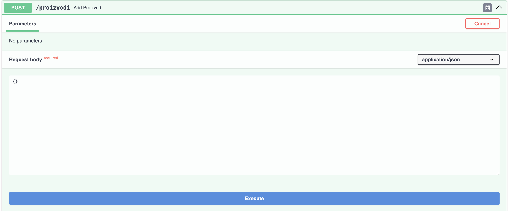
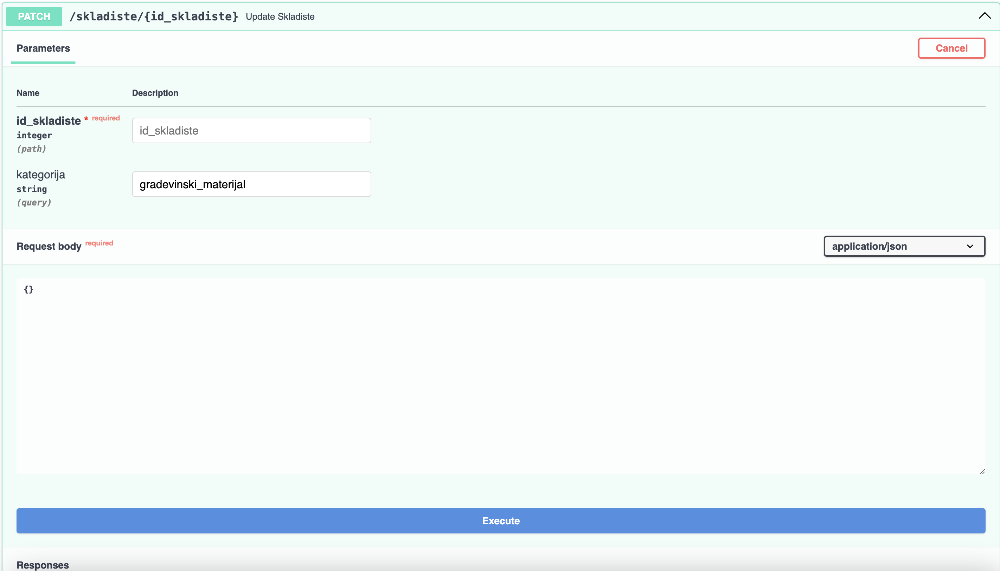
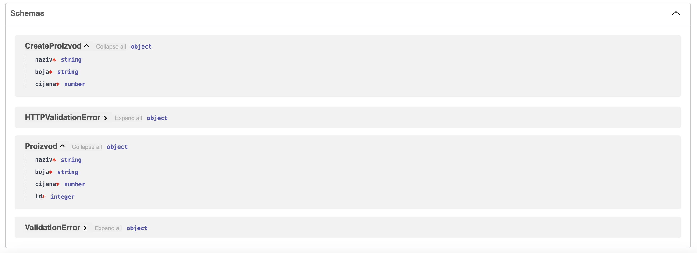

# Raspodijeljeni sustavi (RS)

**Nositelj**: doc. dr. sc. Nikola Tanković  
**Asistent**: Luka Blašković, mag. inf.

**Ustanova**: Sveučilište Jurja Dobrile u Puli, Fakultet informatike u Puli

</img>

# (6) Razvojni okvir FastAPI

</img>

<div style="float: clear; margin-right:5px;">
FastAPI je moderni web okvir za izgradnju API-ja koji se temelji na modernom Pythonu i tipovima (<i>type hints</i>). Radi se o relativnoj novom razvojnom okviru koji je prvi put objavljen 2018. godine te je od onda u aktivnom razvoju, a bilježi sve veću popularnost među Python programerima. Glavne funkcionalnosti FastAPI-ja uključuju automatsku generaciju dokumentacije, odličnu brzinu izvođenja koja je mjerljiva sa brzinom izvođenja razvojnih okvira temeljenih na Node-u i Go-u, kao i mogućnost korištenja tipova podatka za definiranje ulaznih i izlaznih očekivanih vrijednosti, validaciju podataka temeljenu na Pydantic modelima, automatsko generiranje dokumentacije itd. Konkretno u sklopu ovog kolegija, naučit ćemo kako razvijati s FastAPI-jem u svrhu implementacije mikroservisa koji se koriste u raspodijeljenim sustavima.

</div>
<br>

**🆙 Posljednje ažurirano: 11.1.2025.**

- skripta nije dovršena

## Sadržaj

- [Raspodijeljeni sustavi (RS)](#raspodijeljeni-sustavi-rs)
- [(6) Razvojni okvir FastAPI](#6-razvojni-okvir-fastapi)
  - [Sadržaj](#sadržaj)
- [1. Uvod u FastAPI](#1-uvod-u-fastapi)
  - [1.1 Instalacija](#11-instalacija)
  - [1.2 Definiranje ruta](#12-definiranje-ruta)
    - [1.2.1 Parametri ruta (eng. route parameters)](#121-parametri-ruta-eng-route-parameters)
      - [Primitivni tipovi koji podržavaju type hinting](#primitivni-tipovi-koji-podržavaju-type-hinting)
      - [Kolekcije koje podržavaju type hinting](#kolekcije-koje-podržavaju-type-hinting)
      - [Tijelo zahtjeva (eng. request body)](#tijelo-zahtjeva-eng-request-body)
    - [1.2.2 Query parametri (eng. query parameters)](#122-query-parametri-eng-query-parameters)
    - [1.2.3 Kako razlikovati route i query parametre te tijelo zahtjeva?](#123-kako-razlikovati-route-i-query-parametre-te-tijelo-zahtjeva)
- [2. Pydantic](#2-pydantic)
  - [2.1 Input/Output modeli](#21-inputoutput-modeli)
  - [2.2 Zadaci za vježbu - Osnove definicije ruta i Pydantic modela](#22-zadaci-za-vježbu---osnove-definicije-ruta-i-pydantic-modela)

# 1. Uvod u FastAPI

**FastAPI** je moderni web okvir za izgradu brzih i učinkovitih API-ja. Temelji se na Python anotacije zvane [_type hints_](https://docs.python.org/3/glossary.html#term-type-hint) kako bi omogućio lakšu validaciju dolaznih HTTP zahtjeva i odgovora što smanjuje greške tijekom razvoja i egzekucije programa te povećava sigurnost i olakšava održavanje koda. Jedna od ključnih značajki FastAPI-ja je i **automatska generacija dokumentacije** putem alata Swagger UI, ali i mogućnost korištenja Pydantic modela za validaciju složenijih podatkovnih struktura.

Po svom dizajnu, FastAPI je _non-blocking_, što znači da je sposoban obrađivati više zahtjeva istovremeno (konkurentno) bez blokiranja izvođenja glavne dretve. Kao temelj koristi [Starlette](https://www.starlette.io/) web okvir koji je lagan i brz asinkroni web okvir. Pozadinska tehnologija koja omogućuje ovakvo ponašanje je [ASGI](https://asgi.readthedocs.io/en/latest/), odnosno _Asynchronous Server Gateway Interface_. Radi se o relativnoj novoj konvenciji za razvoj web poslužitelja u Pythonu koja je zamijenila stariju WSGI konvenciju. Glavna mana je što **WSGI nije bio dizajniran za asinkrono izvođenje**.

Primjeri razvojnih okvira koji su temeljeni i prvenstveno razvijani na WSGI konvenciji uključuju [Django](https://www.djangoproject.com/) i [Flask](https://flask.palletsprojects.com/en/stable/) (iako se danas mogu učiniti asinkronim uz određene ekstenzije).

Projekt iz kolegija Raspodijeljeni sustavi moguće je napraviti koristeći FastAPI kao temeljni web okvir za izgradnju mikroservisa. U nastavku slijedi upute za instalaciju FastAPI-ja te primjere kako ga kvalitetno koristiti u praksi.


> FastAPI logotip

## 1.1 Instalacija

FastAPI je odlično dokumentiran te postoji mnoštvo resursa na internetu koji vam mogu pomoći u njegovom učenju i razvoju. Preporučuje se korištenje FastAPI dokumentacije kao primarnog izvora informacija.

> Dostupno na: [https://fastapi.tiangolo.com/learn/](https://fastapi.tiangolo.com/learn/)

Za početak, potrebno je pripremiti **virtualno okruženje**. Mi ćemo ovdje koristiti `conda` modul:

```bash
conda create --name rs_fastapi python=3.13
conda activate rs_fastapi
```

Isto možete napraviti i kroz `Anaconda Navigator` grafičko sučelje.

Nakon što smo aktivirali virtualno okruženje, instaliramo FastAPI:

```bash
pip install "fastapi[standard]"
```

Napravite novi direktorij, npr. `rs_fastapi` i u njemu izradite datoteku `main.py`:

Uključujemo FastAPI modul i definiramo instancu aplikacije:

```python
from fastapi import FastAPI

app = FastAPI()
```

FastAPI koristi [Uvicorn](https://www.uvicorn.org/) kao ASGI server. **Uvicorn** podržava HTTP/1.1 standard te WebSockets protokole. Dolazi instaliran s FastAPI-jem (ako ste ga instalirali sa `[standard]` zastavicom kao što je prikazano iznad). U tom slučaju, možete pokrenuti FastAPI poslužitelj koristeći sljedeću naredbu:

```bash
fastapi dev main.py
```

Naredba `fastapi dev` čita datoteku `main.py` i pokreće FastAPI poslužitelj koristeći _uvicorn_. U pravilu, FastAPI poslužitelj će biti pokrenut portu `8000`, ako je slobodan.

Možete otvoriti web preglednik i posjetiti http://localhost:8000 odnosno http://localhost:8000/docs kako biste vidjeli **generiranu dokumentaciju** ([Swagger UI](https://swagger.io/tools/swagger-ui/)).

- kao alternativa, možete pristupiti i [ReDoc](https://github.com/Redocly/redoc) dokumentaciji na http://localhost:8000/redoc.

**Swagger UI** i **Redoc** su alati za generiranje dokumentacije iz [OpenAPI specifikacije](https://www.openapis.org/). FastAPI generira OpenAPI specifikaciju automatski na temelju definiranih ruta i Pydantic modela, a Swagger UI i ReDoc su alati koji tu specifikaciju prikazuju na korisnički prihvatljiv način - **u obliku web stranice s interaktivnim elementima.**

Ako pokušate otvoriti dokumentaciju, vidjet ćete da trenutno nema definiranih ruta.


## 1.2 Definiranje ruta

FastAPI koristi **dekoratore** za definiranje ruta. U Pythonu, dekoratori (eng. _decorators_) su **funkcije ili klase koje proširuju funkcionalnost druge funkcije ili klase** bez promjene njene implementacije. Dekoratori omogućuju dodavanje funkcionalnosti na postojeće funkcije na čitljiviji način.

U kontekstu funkcijskog programiranja, **dekoratori su funkcije višeg reda** (eng. _higher-order functions_) koje rade sljedeće:

1. Primaju funkciju (ili klasu) kao argument
2. Dodaju neku funkcionalnost (ponašanje) toj funkciji
3. Vraćaju "modificiranu" funkciju (ili klasu)

**Dekoratori se koriste prije definiranja funkcije** kojoj želimo dodati funkcionalnost, **oznakom** `@` **prije naziva dekoratora**.

Konkretno, FastAPI koristi dekoratore za definiranje ruta. Na primjer, sljedeći kod definira jednostavnu GET rutu koja vraća JSON odgovor s porukom `"Hello, world!"`

```python
from fastapi import FastAPI

app = FastAPI()

@app.get("/") # dekorator za GET metodu na korijenskoj ruti
def read_root(): # funkcija koja se poziva kada se posjeti korijenska ruta
    return {"message": "Hello, world!"} # vraća JSON odgovor u tijelu HTTP odgovora
```

Ekvivalentan kod koji smo pisali prilikom definiranja `aiohttp` rute izgledao bi ovako:

```python
from aiohttp import web

def handle(request):
    return web.json_response({"message": "Hello, world!"})

app = web.Application()
app.router.add_get('/', handle)
```

Dakle, FastAPI koristi dekoratore za definiciju:

1. **Metode** HTTP za rute (`GET`, `POST`, `PUT`, `PATCH`, `DELETE`, itd.)
2. **Putanje** ruta (npr. `/`, `/items/{item_id}`, `/users/{user_id}/items/{item_id}`, itd.)

**_Handler_ funkciju koja se mora izvršiti pišemo neposredno ispod dekoratora.**

U FastAPI-ju možemo koristiti sljedeće dekoratore za definiranje ruta:

- `@app.get(path)` - definira GET rutu
- `@app.post(path)` - definira POST rutu
- `@app.put(path)` - definira PUT rutu
- `@app.delete(path)` - definira DELETE rutu
- `@app.patch(path)` - definira PATCH rutu
- `@app.options(path)` - definira OPTIONS rutu
- `@app.head(path)` - definira HEAD rutu

### 1.2.1 Parametri ruta (eng. route parameters)

Parametre ruta definiramo na isti način kao i u `aiohttp` biblioteci, koristeći vitičaste zagrade `{}`. Na primjer, sljedeći kod definira rutu koja očekuje `proizvod_id` kao parametar:

```python
@app.get("/proizvodi/{proizvod_id}")
def get_proizvod(proizvod_id):
    return {"proizvod_id": proizvod_id}
```

HTTP zahtjev možete poslati koristeći bilo koji alat, međutim kad već radimo s FastAPI-jem, **dobra je praksa koristiti ugrađenu interaktivnu dokumentaciju** koju generira **Swagger** ili **ReDoc**.

- otvorite http://localhost:8000/docs u web pregledniku kako biste pristupili generiranoj dokumentaciji.

Ako je kod ispravan, trebali biste vidjeti definiranu rutu u dokumentaciji: `GET /proizvodi/{proizvod_id} Get Proizvod`

- gdje je `Get Proizvod` ustvari **naziv handler funkcije** koju smo definirali, a ruta `GET /proizvodi/{proizvod_id}` je **definirana dekoratorom**.

Odaberite rutu i kliknite na `Try it out` kako biste mogli poslati HTTP zahtjev.

- u polje `proizvod_id` unesite neku vrijednost i kliknite na `Execute`.
- ukoliko je sve ispravno, trebali biste vidjeti HTTP odgovor s definiranom vrijednosti `proizvod_id`.


> Generirana FastAPI Swagger dokumentacija, dostupna na http://localhost:8000/docs

Vidimo da generirana dokumentacija nudi **pregled svih podataka koje očekuje i vraća naša ruta**, odnosno sve podatke o HTTP zahtjevu koji se očekuje te o odgovoru koji će se vratiti.


> U interaktivnoj dokumentaciji možemo vidjeti detaljan pregled HTTP odgovora koji vraća FastAPI poslužitelj

U Swagger interaktivnoj dokumentaciji možemo vidjeti sljedeće elemente HTTP odgovora:

- **Response body**: JSON odgovor koji je vraćen, u ovom slučaju: `{"proizvod_id": "3"}`
- **Response code**: HTTP statusni kod koji je vraćen, u ovom slučaju: `200 OK`
- **Response headers**: zaglavlja HTTP odgovora

Uz to možemo vidjeti i primjere ispravnog i neispravnog odgovora te definirane **Pydantic podatkovne modele** (`Schemas`), ako postoje. Više o tome u nastavku.

<hr>

Primijetite sljedeće, FastAPI je automatski **parsirao parametar `proizvod_id`** iz URL-a i proslijedio ga kao argument funkciji `get_proizvod`.

```python
@app.get("/proizvodi/{proizvod_id}")
def get_proizvod(proizvod_id):
    return {"proizvod_id": proizvod_id}
```

Ako pogledate odgovor, vidjet ćete da je vrijednost `proizvod_id` ustvari: `string`: `"proizvod_id": "3"`.

- **FastAPI automatski parsira parametre ruta u odgovarajući tip podatka**, ovisno o tipu koji je _hintan_ u Python funkciji. Kako mi nismo definirali ništa, pretpostavlja se da je tip `str`.

Ako bi htjeli naglasiti da je očekivani parametar `proizvod_id` tipa `int`, možemo to napraviti koristeći **_Python type hinting_**.

- to radimo na način da pišemo **tip podataka odvojen dvotočjem (`:`) nakon imena parametra**

_Sintaksa:_

```python
@app.get("/ruta/{parametar}")
def funkcija(parametar: tip): # type hinting
    # tijelo funkcije
```

_Primjer_: Želimo da je `proizvod_id` tipa `int`:

```python
@app.get("/proizvodi/{proizvod_id}")
def get_proizvod(proizvod_id: int): # "hintamo" da je proizvod_id tipa int
    return {"proizvod_id": proizvod_id}
```

Pošaljite opet zahtjev u dokumentaciji i vidjet ćete da je sada vrijednost `proizvod_id` tipa `int`.

> _type hinting_ u FastAPI-ju **nije samo dekorativna značajka**, već ima i praktičnu svrhu na način da odrađuje **automatsko parsiranje i validaciju podataka**.

Međutim, ako se vratimo na dokumentaciju i pošaljemo sljedeći zahtjev: `GET /proizvodi/Marko`. Vidjet ćemo da poslužitelj baca grešku jer je očekivani tip podataka `int`, a mi smo poslali `str`.


> FastAPI automatski baca grešku ako se očekivani tip podataka ne podudara s onim što je poslano

Dobili smo detaljnu grešku, sa statusnim kodom `422 Unprocessable Entity` i složenim JSON objektom HTTP odgovora koji opisuje grešku:

```json
{
  "detail": [
    {
      "type": "int_parsing",
      "loc": ["path", "proizvod_id"],
      "msg": "Input should be a valid integer, unable to parse string as an integer",
      "input": "Marko"
    }
  ]
}
```

FastAPI poslužitelj automatski obrađuje ovu grešku za nas (**ne moramo ih obrađivati ručno kao do sada**) i sadrži sve potrebne informacije o grešci, uključujući tip greške, lokaciju greške, poruku greške i ulazne podatke koji su uzrokovali grešku.

#### Primitivni tipovi koji podržavaju type hinting

- `str` - string
- `int` - cijeli broj
- `float` - decimalni broj
- `bool` - logička vrijednost
- `bytes` - niz bajtova
- `None` - nema vrijednosti

#### Kolekcije koje podržavaju type hinting

- `list` - lista
- `tuple` - uređeni par
- `set` - skup
- `frozenset` - nepromjenjivi skup
- `dict` - rječnik

<hr>

_Primjer_: Nadogradit ćemo postojeću aplikaciju tako da pronalazi odgovarajući proizvod u _in-memory_ listi proizvoda te omogućit korisniku da ga **dohvati prema imenu**. Također, dodat ćemo rutu za **dodavanje novog proizvoda** u listu.

Definirajmo nekoliko proizvoda u listi. Svaki proizvod sadrži ključeve `id`, `naziv`, `boja` i `cijena`:

```python
proizvodi = [
  {"id": 1, "naziv": "majica", "boja": "plava", "cijena": 50},
  {"id": 2, "naziv": "hlače", "boja": "crna", "cijena": 100},
  {"id": 3, "naziv": "tenisice", "boja": "bijela", "cijena": 150},
  {"id": 4, "naziv": "kapa", "boja": "smeđa", "cijena": 20}
]
```

1. **Definirat ćemo prvo rutu koja će omogućiti dohvaćanje svih proizvoda:**

```python
@app.get("/proizvodi")
def get_proizvodi(): # funkcija ne prima argumente jer nemamo parametre
  return proizvodi
```

2. **Zatim ćemo definirati rutu koja će omogućiti dohvaćanje proizvoda prema imenu**, dakle: `/proizvodi/{naziv}`:

Možemo koristiti ugrađenu Python funkciju `next()` koja će nam omogućiti pronalazak **prvog proizvoda koji zadovoljava uvjet**. Sintaksa nalikuje na _list comprehension_, ali s dodatnim parametrom `default` koji se vraća ako se ne pronađe nijedan element koji zadovoljava uvjet.

- nakon pronalaska prvog elementa koji zadovoljava uvjet, `next()` vraća taj element i **iteriranje se zaustavlja**

_Sintaksa:_

```python
next((expression for iterator in iterable if condition), default)
```

- `expression` - izraz koji se evaluira
- `iterator` - iterator koji prolazi kroz elemente
- `iterable` - kolekcija elemenata (lista, rječnik, skup, tuple, itd.)
- `condition` - uvjet koji mora biti zadovoljen
- `default` - vrijednost koja se vraća ako se ne pronađe nijedan element koji zadovoljava uvjet

Definirajmo rutu za dohvaćanje proizvoda prema imenu:

```python
@app.get("/proizvodi/{naziv}") # route parametar "naziv"
def get_proizvod_by_name(naziv: str): # očekujemo string kao naziv proizvoda (ako ne naglasimo se podrazumijeva da je str)
  # pronalazimo proizvod gdje se njegov naziv poklapa s nazivom iz parametra rute "naziv"
  pronadeni_proizvod = next((proizvod for proizvod in proizvodi if proizvod["naziv"] == naziv), None) # None ako se ne pronađe proizvod
  return pronadeni_proizvod
```

#### Tijelo zahtjeva (eng. request body)

3. **Dodavanje proizvoda u listu proizvoda** možemo odraditi definicijom POST zahtjeva na `/proizvodi`:

Tijelo HTTP zahtjeva možemo definirati kao argument funkcije te _hintamo_ da je tijelo zahtjeva tipa `dict` (rječnik) jer očekujemo JSON objekt.

**Ne navodimo tijelo zahtjeva u dekoratoru** (kao što je slučaj kod parametara rute), već ga očekujemo kao argument funkcije hintanjem `dict` ili Pydantic modela (više u nastavku).

```python
@app.post("/proizvodi") # ne definiramo tijelo zahtjeva u dekoratoru
def add_proizvod(proizvod: dict): # očekujemo JSON objekt kao proizvod u tijelu zahtjeva pa hintamo rječnik (dict)
  proizvod["id"] = len(proizvodi) + 1 # dodajemo novi ID (broj proizvoda + 1)
  proizvodi.append(proizvod) # dodajemo proizvod u listu
  return proizvod
```

<hr>

Otvorite dokumentaciju, uočit ćete sve tri definirane rute (`GET /proizvodi`, `GET /proizvodi/{naziv}`, `POST /proizvodi`). Isprobajte svaku od definiranih ruta.


> Generirana dokumentacija s tri definirane rute (`GET /proizvodi`, `GET /proizvodi/{naziv}`, `POST /proizvodi`)

Ako otvorite sučelje za rutu POST `/proizvodi`, **vidjet ćete da vam se nudi opcija za unos JSON tijela zahtjeva**, budući da nismo naveli parametre rute u dekoratoru:



> Sučelje za unos tijela zahtjeva u dokumentaciji za rutu `POST /proizvodi`

```json
{ "naziv": "šal", "boja": "plava", "cijena": 30 }
```

HTTP Odgovor će biti novi proizvod s automatski dodijeljenim ID-em:

```json
{
  "naziv": "šal",
  "boja": "plava",
  "cijena": 30,
  "id": 5 // automatski dodijeljen ID
}
```

### 1.2.2 Query parametri (eng. query parameters)

Query parametri su parametri koji se šalju u URL-u HTTP zahtjeva, nakon znaka `?`. Na primjer, u URL-u `/proizvodi?boja=plava` query parametar je `boja` s vrijednošću `plava`. Uobičajeno je koristiti query parametre za filtriranje podataka, sortiranje, paginaciju i slične operacije.

Na FastAPI poslužitelju, **query parametre** možemo definirati koristeći Python _type hinting_ na način da ih dodamo kao argumente funkcije, **bez dodavanja u URL putanju kroz dekorator**.

- **FastAPI će takve argumente automatski interpretirati kao query parametre**.

_Primjer_ definiranja rute koja očekuje query parametar `boja`:

```python
@app.get("/proizvodi") # u FastAPI-ju ne navodimo query parametre u URL putanji
def get_proizvodi_by_query(boja: str): # očekujemo query parametar "boja"
  pronadeni_proizvodi = [proizvod for proizvod in proizvodi if proizvod["boja"] == boja] # koristimo list comprehension, a ne next() jer možemo imati više proizvoda s istom bojom
  return pronadeni_proizvodi
```

Možemo definirati i više query parametara:

```python
@app.get("/proizvodi") # u FastAPI-ju ne navodimo query parametre u URL putanji
def get_proizvodi_by_query(boja: str, max_cijena: int): # očekujemo query parametre "boja" i "max_cijena"
  # koristimo list comprehension, a ne next() jer možemo imati više proizvoda s istom bojom i cijenom manjom ili jednako od max_cijena
  pronadeni_proizvodi = [proizvod for proizvod in proizvodi if proizvod["boja"] == boja and proizvod["cijena"] <= max_cijena]
  return pronadeni_proizvodi
```

Identični procesi primjenjuju se i za query parametre kao i za route parametre kada koristimo _type hinting_:

- automatsko parsiranje podataka
- automatska validacija podataka
- automatsko generiranje dokumentacije

Query parametrima možemo dodjeljivati i **zadane (_defaultne_) vrijednosti**:

```python
@app.get("/proizvodi") # u FastAPI-ju ne navodimo query parametre u URL putanji
def get_proizvodi_by_query(boja: str = None, max_cijena: int = 100): # očekujemo query parametre "boja" i "max_cijena", ali su im zadane vrijednosti None odnosno 100
  pronadeni_proizvodi = [proizvod for proizvod in proizvodi if (boja is None or proizvod["boja"] == boja) and (max_cijena is None or proizvod["cijena"] <= max_cijena)]
  return pronadeni_proizvodi
```

Svi navedeni query parametri na ovaj način postaju **opcionalni**. Ako ih ne navedemo u URL-u, poslužitelj će ih automatski postaviti na `None`.

Vidimo da se FastAPI ponaša vrlo slično kao i `aiohttp` biblioteka, ali s mnogo više **automatskih značajki** koje olakšavaju razvoj i održavanje koda. Dodatno, tu je dokumentacija koja nam već u ovoj fazi pomaže u razvoju i testiranju API-ja. Konkretno, za primjer rute iznad možemo u dokumentaciji odmah vidjeti:

- koji se query parametri očekuju (`boja`, `max_cijena`)
- koji su tipovi podataka očekivani (`string`, `integer`)
- koje su defaultne vrijednosti (`None`, `100`)


### 1.2.3 Kako razlikovati route i query parametre te tijelo zahtjeva?

U FastAPI-ju može biti zbunjujuće razlikovati route parametre, query parametre i tijelo zahtjeva budući da ne navodimo eksplicitno "što je što" već se oslanjamo na _type hinting_. **Evo kratkog pregleda**:

- **Route parametri** - **obavezno se navode u URL putanji** (dekoratoru), npr. `@app.get("/proizvodi/{proizvod_id}")`.
  - moraju imati odgovarajući **ekvivalent u deklaraciji funkcije** i to istog naziva, npr. `def get_proizvod(proizvod_id: int):`.
  - sada se može poslati sljedeći zahtjev: `GET /proizvodi/3`.
  - mogu sadržavati _type hinting_, inače se podrazumijeva `str`.
  - FastAPI automatski parsira i validira podatke iz parametra rute.
- **Query parametri** - **ne navode se u URL putanji (dekoratoru)**: `@app.get("/proizvodi")`
  - deklariraju se kao argumenti funkcije, npr. `def get_proizvodi_by_query(boja: str):`.
  - sada se može poslati sljedeći zahtjev: `GET /proizvodi?boja=plava`.
  - query parametri ako su navedeni bez zadanih vrijednosti postaju obavezni.
  - Zadane vrijednosti možemo postavi dodjeljivanjem vrijednosti u deklaraciji funkcije, npr. `def get_proizvodi_by_query(boja: str = "plava")`.
  - FastAPI automatski parsira i validira podatke iz query parametara.
- **Tijelo zahtjeva** - **ne navode se u URL putanji (dekoratoru)**, npr. `@app.post("/proizvodi")`.
  - deklariraju se kao argumenti funkcije hintanjem `dict` ili Pydantic modela, npr. `def add_proizvod(proizvod: dict):`.
  - FastAPI automatski parsira i validira podatke iz tijela zahtjeva.
  - u nastavku ćemo vidjeti kako koristiti Pydantic modele za hintanje tijela zahtjeva.

**Moguće je kombinirati sva 3 pristupa.**

_Primjerice:_ Recimo da želimo definirati rutu koja će omogućiti ažuriranje podataka o proizvodu iz skladišta gdje su proizvodi podijeljeni u kategorije.

Podaci su definirani na sljedeći način:

- `id_skladiste` - cijeli broj (route parametar)
- `kategorija` - string (query parametar)
- `proizvod` - proizvod koji ažuriramo (tijelo zahtjeva)

Odarali bi metodu PATCH budući da djelomično ažuriramo resurse (proizvode) u skladištu.

1. Definirat ćemo dekorator za PATCH metodu na `/skladiste`:

```python
@app.patch("/skladiste")
```

2. Prva filtracija odnosi se na dohvat određenog skladišta prema `id_skladiste`:

- nadograđujemo dekorator
- dodajemo ekvivalentni argument funkcije

```python
@app.patch("/skladiste/{id_skladiste}")
def update_skladiste(id_skladiste: int):
```

3. Druga filtracija odnosi se na dohvat proizvoda u određenoj kategoriji:

- dodajemo query parametar u deklaraciji funkcije, **ali ne u dekoratoru**

```python
@app.patch("/skladiste/{id_skladiste}")
def update_skladiste(id_skladiste: int, kategorija: str):
```

4. Možemo postaviti zadanu vrijednost za query parametar:

- npr. `kategorija: str = "gradevinski_materijal"`

```python
@app.patch("/skladiste/{id_skladiste}")
def update_skladiste(id_skladiste: int, kategorija: str = "gradevinski_materijal"):
```

5. Na kraju, dodajemo tijelo zahtjeva kao argument funkcije:

- hintmo da je tijelo zahtjeva tipa `dict`
- dodajemo na početak funkcije jer vrijede ista pravila kao i za zadane argumente običnih Python funkcija (zadani argumenti dolaze na kraju)

```python
@app.patch("/skladiste/{id_skladiste}")
def update_skladiste(proizvod: dict, id_skladiste: int, kategorija: str = "gradevinski_materijal"):
```

Provjerimo kako je dokumentirana definirana ruta u FastAPI dokumentaciji.



> U nastavku ćemo vidjeti kako validirati tijelo zahtjeva koristeći **Pydantic modele**.

# 2. Pydantic

**Pydantic** je najrasprostranjenija Python biblioteka za **validaciju podataka** koja se bazira na _type hintingu_ za definiranje očekivanih tipova podataka te automatski vrši validaciju podataka prema tim definicijama. Pydantic je posebno koristan u FastAPI-ju jer se može koristiti za definiranje **modela podataka** koji se koriste za validaciju dolaznih i odlaznih podataka odnosno HTTP zahtjeva i odgovora.


> Dokumentacija dostupna na: https://docs.pydantic.dev/latest/

Jedna od glavnih prednosti Pydantic-a je njegovo ponašanje u IDE razvojnim okruženjima kao što su **VS Code** ili **PyCharm**. IDE-ovi koji podržavaju Python _type hinting_ automatski će prepoznati Pydantic modele i pružiti korisne informacije o očekivanim tipovima podataka, što olakšava razvoj i održavanje koda.

Pydantic klase definiramo nasljeđivanjem `pydantic.BaseModel` klase.

Uobičajeno je Pydantic klase odvojiti o `main.py` datoteke kako bi kod bio bolje organiziran te kako bi klase mogli koristiti u više datoteka.

- **Pydantic modele ćemo definirati u zasebnoj datoteci**, npr. `models.py` ili `schemas.py`.

Napravite novu datoteku `models.py`:

Definirajte klasu `Proizvod` koja će predstavljati model podataka za proizvod koji smo prije _hintali_ kao rječnik.

- Prvo uključujemo `BaseModel` **kojeg nasljeđuju sve Pydantic klase**:

```python
# models.py

from pydantic import BaseModel
```

Pišemo definiciju klase koja nasljeđuje `BaseModel`:

```python
# models.py

class Proizvod(BaseModel):
  pass
```

Unutar definicije klase navodimo, koristeći _type-hinting_, atribute koje očekujemo za proizvod, to su:

- `id` - cijeli broj (`int`)
- `naziv` - string (`str`)
- `boja` - string (`str`)
- `cijena` - decimalni broj (`float`)

```python
# models.py

class Proizvod(BaseModel):
  id: int
  naziv: str
  boja: str
  cijena: float
```

Uključujemo ovu klasu u `main.py` datoteku:

```python
from fastapi import FastAPI

from models import Proizvod # uključujemo Pydantic model koji smo definirali
```

Međutim, kojoj je svrha ovog modela? U kojoj definiciji rute ćemo ga koristiti? **To ovdje nije jasno naglašeno.**

<hr>

_Primjerice_: Kod POST rute za dodavanje proizvoda u listu, do sad smo koristili `dict` kao tip podataka za proizvod koristeći _type hinting_.

```python
@app.post("/proizvodi")
def add_proizvod(proizvod: dict):
  proizvod["id"] = len(proizvodi) + 1
  proizvodi.append(proizvod)
  return proizvod
```

Ipak, to nije najbolji pristup budući da korisnik može poslati bilo kakav JSON objekt, odnosno objekt s proizvoljnim ključevima. Želimo ograničiti korisnika na slanje samo točno određenih ključeva u objektu, konkretno na one definirane Pydantic modelom `Proizvod`.

- jednostavno ćemo zamijeniti `dict` s `Proizvod` u definiciji rute:

```python
@app.post("/proizvodi")
def add_proizvod(proizvod: Proizvod): # zamijenili smo dict s Proizvod
  proizvod["id"] = len(proizvodi) + 1
  proizvodi.append(proizvod)
  return proizvod
```

No postoji problem. Ako pokušate poslati isti zahtjev za dodavanje novog proizvoda, vidjet ćete da će FastAPI izbaciti grešku:

`TypeError: 'Proizvod' object does not support item assignment`

Zašto dolazi do ove greške?

<details>
  <summary>Spoiler alert! Odgovor na pitanje</summary>
  <p> Pydantic generira <i>read-only</i> modele, odnosno modele koji ne podržavaju dodavanje novih ključeva u objekt nakon što je objekt inicijaliziran. Naknadnim dodavanjem ključa <code>id</code>, dobit ćemo grešku. </p>
  <code>proizvod["id"] = len(proizvodi) + 1</code>
</details>

<hr>

Problem je što **Pydantic generira _read-only_ modele**, odnosno modele koji ne podržavaju dodavanje novih ključeva (ili brisanje/ažuriranje postojećih) u objekt nakon što je objekt inicijaliziran.

Međutim, ako bolje pogledamo vidimo da je inicijalni problem što smo definirali `id` u samom modelu, a zatim _hintamo_ taj tip podataka prilikom dodavanja novog proizvoda **iako znamo da se `id` automatski dodjeljuje na poslužiteljskoj strani**, odnosno vjerojatno bazi podataka u stvarnom svijetu.

Izbacit ćemo `id` iz modela `Proizvod` budući da želimo da se on automatski dodjeljuje:

```python
# models.py

class Proizvod(BaseModel):
  naziv: str
  boja: str
  cijena: float
```

Ako bolje pogledate, problem i dalje postoji jer pokušavamo dodati `id` u objekt `proizvod`:

```python
proizvod["id"] = len(proizvodi) + 1
```

**Ulazna struktura:**

```json
{
  "naziv": "šal",
  "boja": "plava",
  "cijena": 30
}
```

**Očekivana izlazna struktura:**

```json
{
  "id": 5,
  "naziv": "šal",
  "boja": "plava",
  "cijena": 30
}
```

## 2.1 Input/Output modeli

Samim time, **uobičajena praksa je definirati više Pydantic modela za svaku strukturu**, ovisno u kojoj fazi obrade se nalazi.

**Što trebamo?** Korisnik šalje podatke bez `id`-a, a poslužitelj vraća podatke s `id`-om.

**Input Model** koji korisnik šalje uobičajeno je nazvati s prefiksom `Create`, `Update`, `In` ovisno o kojoj se CRUD operaciji radi:

```python
# models.py

class CreateProizvod(BaseModel):
  naziv: str
  boja: str
  cijena: float
```

**Output Model** koji se vraća s poslužitelja natrag korisniku uobičajeno je nazvati s prefiksom `Response` ili `Out`:

```python
# models.py

class Proizvod(BaseModel):
  id: int
  naziv: str
  boja: str
  cijena: float
```

Vratimo se na `main.py` datoteku i uključimo oba modela:

```python
# main.py
from fastapi import FastAPI

from models import CreateProizvod, Proizvod
```

Zamijenit ćemo `dict` s `CreateProizvod` u definiciji rute:

```python
@app.post("/proizvodi")
def add_proizvod(proizvod: CreateProizvod): # "ulazni proizvod" mora sadržavati naziv, boju i cijenu
  proizvod["id"] = len(proizvodi) + 1
  proizvodi.append(proizvod)
  return proizvod
```

Međutim, **sada je potrebno napraviti novu instancu klase** `Proizvod` kako bi se mogao dodati `id`:

- izdvojit ćemo generiranje `id`-a u samostalnu naredbu
- instancirati ćemo novi objekt `Proizvod` s dodijeljenim `id`-om te preostalim podacima iz `proizvod`
- **objekte Pydantic klasa instanciramo na identičan način kao i obične Python klase**

```python
@app.post("/proizvodi")
def add_proizvod(proizvod: CreateProizvod):
  new_id = len(proizvodi) + 1 # generiramo novi ID u samostalnoj naredbi
  proizvod_s_id = Proizvod(id=new_id, naziv=proizvod.naziv, boja=proizvod.boja, cijena=proizvod.cijena) # instanciramo novi objekt Proizvod s dodijeljenim ID-om
  return proizvod_s_id
```

Kod radi, ali možemo skratiti posao koristeći _unpacking sintaksu_ i pretvorbu Pydantic modela u rječnik.

**Važno!** Umjesto da navodimo svaki atribut modela `CreateProizvod` prilikom instanciranja `Proizvod`, možemo prvo **pretvoriti** Pydantic model u rječnik koristeći `model_dump()` metodu a potom raspakirati taj rječnik operatorom `**`

_Sintaksa:_

```python
rjecnik = model.model_dump() # pretvaramo Pydantic model u rječnik
```

Dakle, **kod za instanciranje objekta klase `Proizvod`** možemo skratiti na sljedeći način:

```python
@app.post("/proizvodi")
def add_proizvod(proizvod: CreateProizvod):
  new_id = len(proizvodi) + 1
  proizvod_s_id = Proizvod(id=new_id, **proizvod.model_dump()) # koristimo ** za raspakiravanje rječnika "proizvod"
  return proizvod_s_id
```

Vraćamo korisniku `proizvod_s_id` koji je tipa `Proizvod`, a ne `CreateProizvod`!

Dodatno, moguće je naglasiti da je povratna vrijednost funkcije `add_proizvod` tipa `Proizvod` unutar dekoratora koristeći `response_model` argument:

```python
@app.post("/proizvodi", response_model=Proizvod) # naglašavamo da je povratna vrijednost tipa Proizvod
def add_proizvod(proizvod: CreateProizvod):
  new_id = len(proizvodi) + 1
  proizvod_s_id = Proizvod(id=new_id, **proizvod.model_dump())
  return proizvod_s_id
```

Ovo je korisno jer FastAPI automatski vrši validaciju podataka koje vraćamo korisniku, a također i **generira dokumentaciju na temelju ove informacije**.



> Na dnu dokumentirane rute možete vidjeti **definirane Pydantic podatkovne modele** pod `Schemas` sekcijom

<hr>


> Uočite da je struktura JSON objekta koji se očekuje (prema Pydantic modelu `CreateProizvod`) odmah prikazana u dokumentaciji

## 2.2 Zadaci za vježbu - Osnove definicije ruta i Pydantic modela

1. Definirajte novu FastAPI rutu `GET /filmovi` koja će klijentu vraćati listu filmova definiranu u sljedećoj listi:

```python
filmovi = [
  {"id": 1, "naziv": "Titanic", "genre": "drama", "godina": 1997},
  {"id": 2, "naziv": "Inception", "genre": "akcija", "godina": 2010},
  {"id": 3, "naziv": "The Shawshank Redemption", "genre": "drama", "godina": 1994},
  {"id": 4, "naziv": "The Dark Knight", "genre": "akcija", "godina": 2008}
]
```

<br>

2. Nadogradite prethodnu rutu na način da će **output** biti validiran Pydantic modelom `Film` kojeg definirate u zasebnoj datoteci `models.py`.
   <br>
3. Definirajte novu FastAPI rutu `GET /filmovi/{id}` koja će omogućiti pretraživanje novog filma prema `id`-u definiranom u parametru rute `id`. Dodajte i ovdje validaciju Pydantic modelom `Film`.
   <br>
4. Definirajte novu rutu `POST /filmovi` koja će omogućiti dodavanje novog filma u listu filmova. Napravite novi Pydantic model `CreateFilm` koji će sadržavati atribute `naziv`, `genre` i `godina`, a kao output vraćajte validirani Pydantic model `Film` koji predstavlja novododani film s automatski dodijeljenim `id`-em.
   <br>
5. Dodajte query parametre u rutu `GET /filmovi` koji će omogućiti filtriranje filmova prema `genre` i `min_godina`. Zadane vrijednosti za query parametre neka budu `None` i `2000`.
